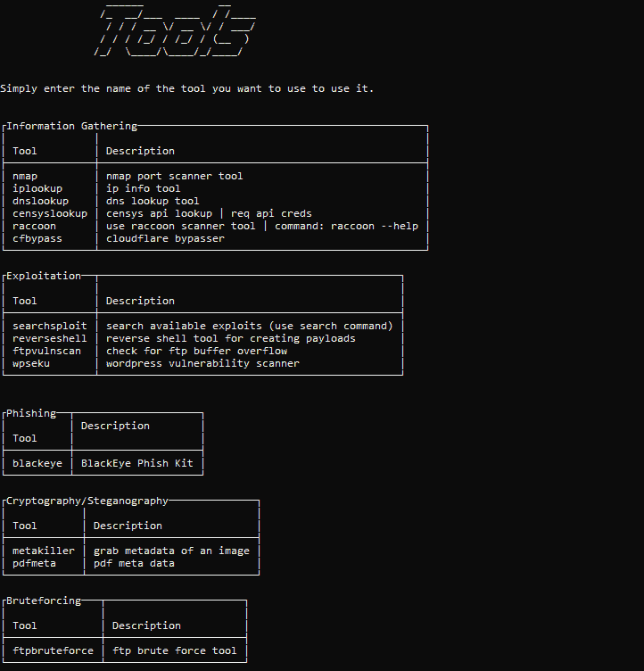
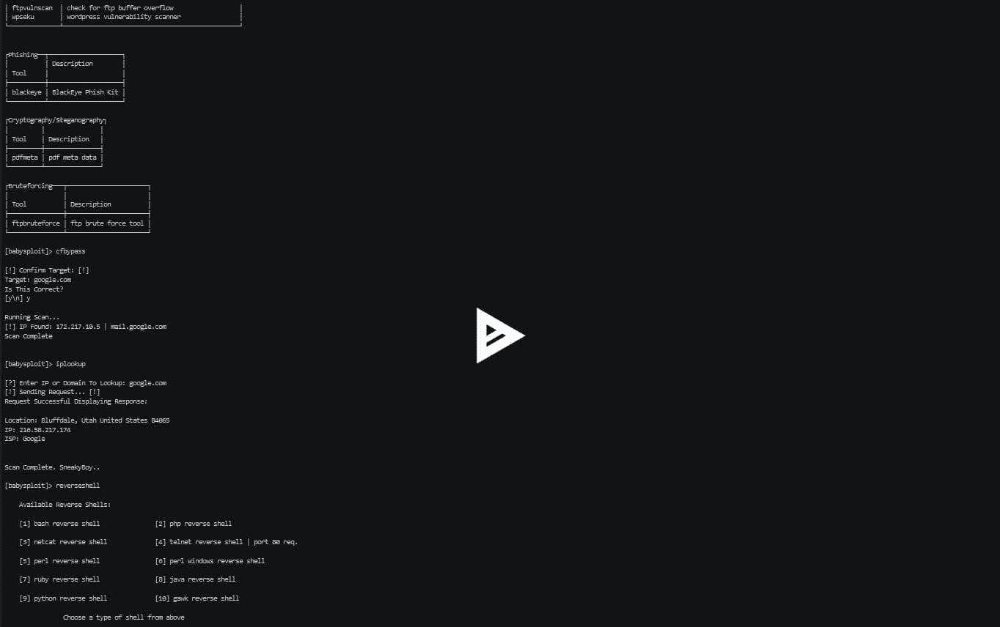

# BabySploit——用 Python 编写的初学者测试工具包/框架

> 原文：<https://kalilinuxtutorials.com/babysploit-beginner-pentesting-toolkit/>

BabySploit 是一个渗透测试工具包，旨在使学习如何使用像 Metasploit 这样更大、更复杂的框架变得容易。有了一个非常容易使用的 UI 和工具包，任何经验水平的任何人都会发现 BabySploit 的用处。下面是框架的一些截图。

## **婴儿用品安装**

BabySploit 最好在主目录之外运行，因此要在那里克隆它，请运行:

```
git clone git://github.com/M4cs/BabySploit ~/BabySploit
cd ~/BabySploit
```

克隆安装后，您必须安装一些先决条件。如果你在 Kali 上，你应该已经安装了所有这些软件，但是为了以防万一，这样做也无妨。为此，请运行以下命令:

如果您不在 Kali 上，您需要将 Kali 库添加到 APT 源列表中，然后运行 install。

```
~- From Within The BabySploit Directory -!
sudo apt-get update
sudo apt-get upgrade
sudo python3 install.py
virtualenv babysploit
source babysploit/bin/activate
pip3 install -r requirements.txt
python3 start.py

!- To Leave The Virtual Environment -!

deactivate
```

**也读 [Invisi-Shell:将你的 Powershell 脚本隐藏在众目睽睽之下(绕过所有 Powershell 安全特性)](https://kalilinuxtutorials.com/invisi-shell-hide-powershell-script/)**

## **入门**

#### **设置配置值**

BabySploit 使用 ConfigParser 来写入和读取配置。您的配置文件自动生成并位于`./babysploit/config/config.cfg`。您可以通过打开文件并用文本编辑器编辑来手动更改配置设置，也可以使用 set 命令为某个键设置新值。像这样使用 set 命令:

```
set rhost
>> Enter Value For rhost: 10
>> Config Key Saved!
```

如果在运行该命令之前，rhost 键的值为 80，那么在运行该命令之后，rhost 键的值为 10。您还可以使用 set 命令向配置中添加配置变量，该命令后面有一个新键，如下所示:

```
set newkey
>> Enter Value For newkey: hello
>> Config Key Saved!
```

在运行之前，没有名为“newkey”的键。运行此命令后，您的配置中将有一个名为“newkey”的键，直到您使用`reset`命令重置保存的配置。

#### **运行工具**

为了运行一个工具，你所要做的就是在 BabySploit 中输入工具的名称。您可以使用`tools`命令显示一个包含所有当前可用工具的菜单。如果我们运行工具，我们会得到描述:



该菜单将显示可用的工具以及每个工具的描述。要运行工具，只需在 BabySploit 中输入工具名称。例如:`ftpbruteforce`–运行 ftpbruteforce 工具。

## **视频演示**

[ ](https://asciinema.org/a/Hm2mwhJvQnGAaK4xWAn5NY9l6) [ ](https://github.com/M4cs/BabySploit)

***你可以在 [Linkedin](https://www.linkedin.com/company/gbhackers/) 、 [Twitter](https://twitter.com/GbhackerOn) 、[脸书](https://www.facebook.com/gbhackersadmin)上关注我们的日常网络安全更新，你也可以在线参加[最佳网络安全课程](https://ethicalhackersacademy.com/)以保持自我更新。***