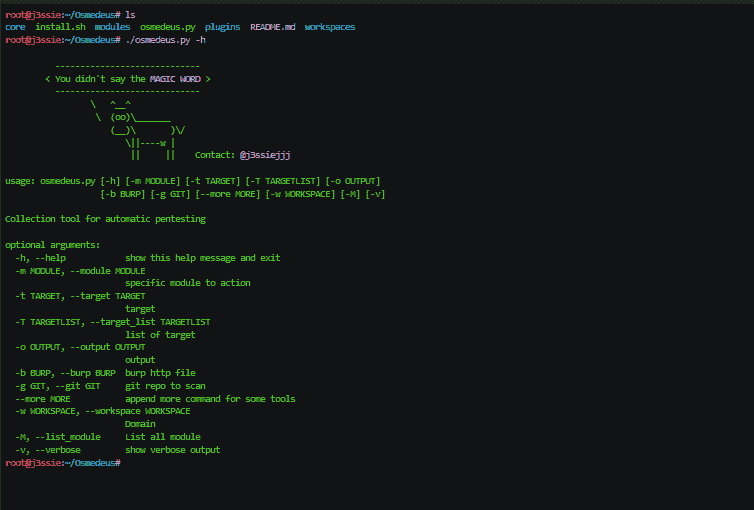

# osme deus–渗透测试中的自动侦察和扫描

> 原文：<https://kalilinuxtutorials.com/osmedeus-penetration-testing/>

Osmedeus 是渗透测试中的自动侦察和扫描。Osmedeus 允许你在 Pentesting 中自动做一些无聊的事情，比如通过运行一系列令人敬畏的工具来侦察和扫描目标。

## **Osmedeus 安装**

```
**git clone https://github.com/j3ssie/Osmedeus
cd Osmedeus
./install.sh** 
```

这个安装只关注 Kali linux。

## **如何使用**

如果你不知道你在做什么，只需输入下面的命令

```
**./osmedeus.py -t example.com** 
```

### **列出所有模块**

```
**./osmedeus.py -M** 
```

### **更新**

```
**./osmedeus.py --update** 
```

**也读 [Invisi-Shell:将你的 Powershell 脚本隐藏在众目睽睽之下(绕过所有 Powershell 安全特性)](https://kalilinuxtutorials.com/invisi-shell-hide-powershell-script/)**

## **视频演示**

[](https://asciinema.org/a/ZudWoY9mRbXaqmYqHwB6Ky6lm)

## **视频教程**

[https://www.youtube.com/watch?v=SnGPedyJvig](https://www.youtube.com/watch?v=SnGPedyJvig)

[](https://github.com/j3ssie/Osmedeus#installation) 信用: [@j3ssiejjj](https://twitter.com/j3ssiejjj)

***你可以在 [Linkedin](https://www.linkedin.com/company/gbhackers/) 、 [Twitter](https://twitter.com/GbhackerOn) 、[脸书](https://www.facebook.com/gbhackersadmin)上关注我们的日常网络安全更新，你也可以在线参加[最佳网络安全课程](https://ethicalhackersacademy.com/)以保持自我更新。***