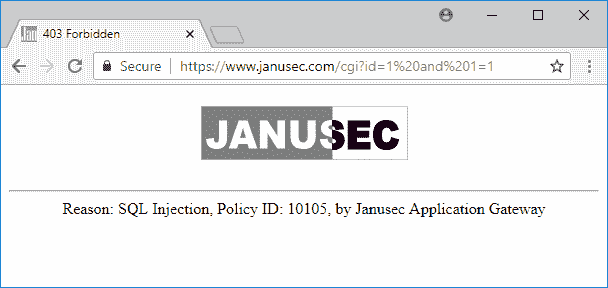
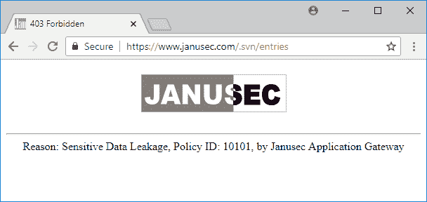

# janusec–基于 Golang 的应用安全解决方案，提供 WAF

> 原文：<https://kalilinuxtutorials.com/janusec-application-security-waf/>

Janusec 应用网关，一个应用安全解决方案，提供 WAF (web 应用防火墙)、统一 Web 管理门户、私钥保护、Web 路由和可扩展负载平衡。使用 Janusec，您可以构建安全且可伸缩的应用程序。

**也读作[Pastego——使用 GO &表达式语法](https://kalilinuxtutorials.com/pastego-scrape-parse-pastebin/)** 刮/解析 Pastebin

## **Janusec 的主要特点**

*   WAF (Web 应用防火墙)、阻塞 SQL 注入、跨站点脚本、敏感数据泄漏、CC 攻击等。
*   集团政策(与多个检查站合作)
*   验证码支持
*   统一的 Web 管理
*   HTTPS 支持，不需要代理。
*   使用私钥加密存储的证书保护
*   可扩展架构、负载平衡和多节点支持

## **要求**

*   PostgreSQL 9.3~9.6 或 10(开发和部署的主节点需要)
*   CentOS/RHEL 7，Debian 9
*   系统
*   Golang 1.9+(仅开发需要)

## **快速启动部署**

```
https://www.janusec.com/documentation/quick-start/
```

### **开发者快速入门**

> ```
> go get -u github.com/Janusec/janusec
> cd $GOPATH/src/github.com/Janusec/janusec
> ```

**用 PostgreSQL 编辑 config.json】**

> ```
> "host": "127.0.0.1",
> "port": "5432",
> "user": "janusec",
> "password": "123456",
> "dbname": "janusec"
> ```

Janusec 将自动加密密码。
**然后:**

> ```
> go build
> su (switch to root)
> ./janusec
> ```

### **网络管理**

> ```
> http://127.0.0.1:9080/ (The first address)
> ```

### **发布**

> ```
> go build
> `./release.sh` (Only support Linux Now)
> ```

发布包在下面。/dist。

## **截图**

### **SQL 注入截图**



### **敏感数据泄露截图**



[ ](https://github.com/Janusec/janusec) ** *您可以在 [Linkedin](https://www.linkedin.com/company/gbhackers/) 、 [Twitter](https://twitter.com/GbhackerOn) 、[脸书](https://www.facebook.com/gbhackersadmin)上关注我们的日常网络安全更新，您还可以在线参加[最佳网络安全课程](https://ethicalhackersacademy.com/)以保持自我更新。***