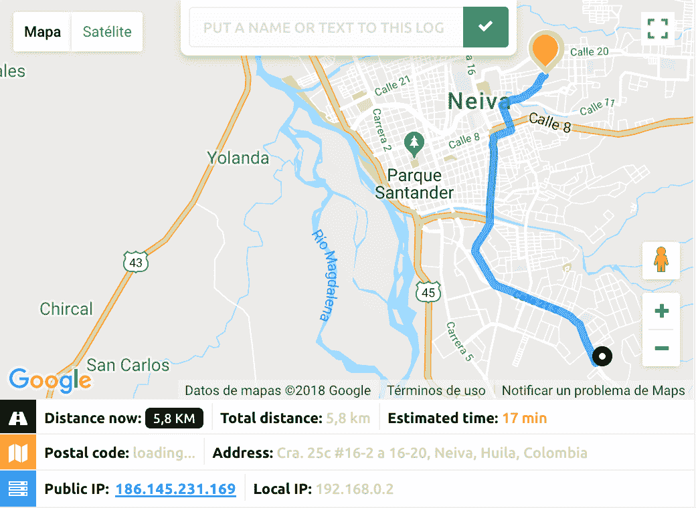
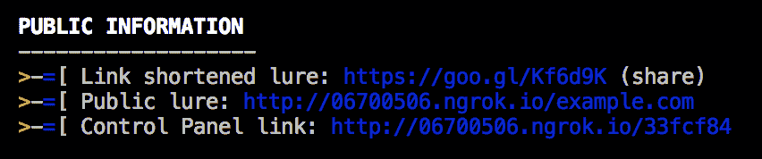
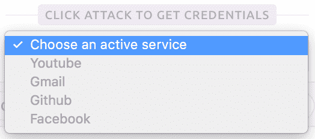
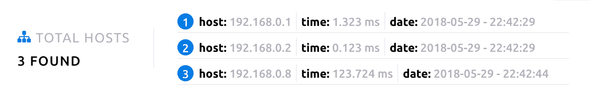
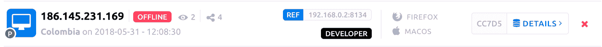

# trape——互联网上的人物跟踪系统

> 原文：<https://kalilinuxtutorials.com/trape-track-people-internet/>

Trape 是一个 **OSINT** 分析和研究工具，它允许人们实时跟踪和执行智能**社会工程**攻击。

它创建的目的是告诉世界大型互联网公司如何在用户不知情的情况下，通过浏览器获取机密信息，如网站或服务的会话状态以及对用户的控制，但它的发展目标是帮助**政府**组织、公司和**研究人员**追踪网络罪犯。

**也可以理解为 [SSH 审计器——扫描网络上的弱 SSH 密码](https://kalilinuxtutorials.com/ssh-auditor-scan-weak-ssh-passwords/)**

## **陷阱利益**

*   **定位器优化:**追踪你和你追踪的目标之间的路径。每次你移动时，路径会被更新，通过这种方式，目标的位置会通过浏览器中的旁路悄悄获得，使你不至于跳过受害者一方、目标或个人的位置请求许可，同时保持定位器中 **99%** 的精度。



*   **接近:**当你接近目标时，Trape 会告诉你。


*   **REST API:** 生成一个 API(随机或自定义)，通过这个你可以远程控制和监控互联网上的其他网站，获取所有访问者的流量。


*   **进程挂钩:**管理目标浏览器中的社交工程攻击或进程。
    *   **几种:**您可以实时发起任何域或服务的网络钓鱼攻击，并发送恶意文件来危害目标的设备。
    *   **注入 JS:** 您保持 JavaScript 代码实时自由运行，因此您可以管理一个**键盘记录器**或您自己的 JS 自定义函数的执行，这些函数将反映在目标浏览器中。
    *   **语音:**保持在目标浏览器中播放的音频创建过程，通过这种方式，您可以使用西班牙语和英语的不同语音执行个性化消息。
*   **公网隧道:** Trape 有自己的 **API** ，链接到[ngrok.com](https://ngrok.com)，允许公网隧道的自动管理；通过这种方式，您可以将在本地执行的 trape 服务器的内容发布到互联网上，以管理钩子或公开攻击。



*   **点击攻击获取凭证:**自动获取目标凭证，识别您在社交网络或互联网服务上的连接可用性。



*   **网络:**可以获取用户的网络信息。
    *   **速度:**查看目标的网络速度。(Ping、下载、上载、键入连接)
    *   **主机或设备:**在这里您可以自动扫描目标网络中连接的所有设备。



*   **个人资料:**目标行为的简要概述和关于您设备的重要附加信息。

——**GPU**——**能量**

## **30 个会话识别**

会话识别是 trape 最有趣的吸引人的地方之一，因为作为研究人员，您可以远程知道目标连接到什么服务。


*   **可用性:您**可以删除日志，并查看针对每个目标运行的每个流程或操作的警报。



## **如何使用**

首先卸载工具。

```
git clone https://github.com/jofpin/trape.git
cd trape
python trape.py -h
```

如果不起作用，尝试安装位于文件 **requirements.txt** 中的所有库

```
pip install -r requirements.txt
```

### **执行示例**

```
Example: python trape.py --url http://example.com --port 8080
```

### **帮助和选项**

```
user:~$ python trape.py --help
usage: python trape.py -u <> -p <> [-h] [-v] [-u URL] [-p PORT]
                                              [-ak ACCESSKEY] [-l LOCAL]
                                              [--update] [-n] [-ic INJC]

optional arguments:
  -h, --help            show this help message and exit
  -v, --version         show program's version number and exit
  -u URL, --url URL     Put the web page url to clone
  -p PORT, --port PORT  Insert your port
  -ak ACCESSKEY, --accesskey ACCESSKEY
                        Insert your custom key access
  -l LOCAL, --local LOCAL
                        Insert your home file
  -n, --ngrok           Insert your ngrok Authtoken
  -ic INJC, --injectcode INJC
                        Insert your custom REST API path
  -ud UPDATE, --update UPDATE
                        Update trape to the latest version
```

*   在此选项中，您可以添加用于实时克隆的 url，这是一个诱饵。
*   **端口**在这里你插入端口，你将在这里运行 **trape 服务器**。
*   **accesskey** 你为**陷板**输入一个自定义密钥，如果不插入它会生成一个**自动密钥**。
*   **injectcode** trape 包含一个 **REST API** 可以在任何地方播放，使用这个选项你可以定制要包含的文件名，如果没有，生成一个随机的名字暗示一个令牌。
*   **local** 使用这个选项你可以调用一个本地的 **HTML 文件**，这是对
*   **url** 选项用于在陷阱中运行本地诱饵。
*   **ngrok** 在这个选项中你可以输入一个令牌，来运行当时的一个进程。这将替换配置中保存的令牌。
*   **版本**可以看到 trape 的版本号。
*   **更新**选项，特别升级到**陷阱**的最新版本。
*   **帮助**它用于从可执行文件中查看上述所有选项。

## **免责声明**

此工具已发布教育目的，以教导人们如何坏人可以跟踪他们或监视他们或从他们的凭据获取信息，我们不负责使用或范围可能有人民通过这个项目。

我们完全相信，如果我们告诉人们事物是多么脆弱，我们就能让互联网成为一个更安全的地方。

[ ](https://github.com/jofpin/trape) **功劳:**  **穆比诺**

***你可以在 [Linkedin](https://www.linkedin.com/company/gbhackers/) 、 [Twitter](https://twitter.com/GbhackerOn) 、[脸书](https://www.facebook.com/gbhackersadmin)上关注我们的日常网络安全更新，你也可以在线参加[最佳网络安全课程](https://ethicalhackersacademy.com/)以保持自我更新。***