# MC extractor–英特尔、AMD、VIA 和飞思卡尔微码提取工具

> 原文：<https://kalilinuxtutorials.com/mcextractor-microcode-extraction-tool/>

MCExtractor 是一款解析英特尔、AMD、VIA 和飞思卡尔处理器微码二进制文件的工具。最终用户可以使用它来查找所有相关的微码信息，如 CPUID、平台、版本、日期、版本、大小、校验和等。

它能够将英特尔微码容器(dat，inc，h，txt)转换为用于 BIOS 集成的二进制映像，检测新的/未知的微码，检查微码运行状况、更新/过期状态等。

MCExtractor 还可以用作具有多种结构的研究分析工具，它允许对所有文档化或未文档化的微码报头进行完全解析和信息显示。

此外，借助其庞大的数据库，MCExtractor 能够对所有支持的微码进行唯一分类，并检查尚未存储在微码库中的任何微码。

**也可理解为[Ache——用于特定领域搜索的网络爬虫](https://kalilinuxtutorials.com/ache-web-crawler-domain/)**

## **MCExtractor 特性**

*   支持 1995 年及以后的所有当前和传统微码
*   一次扫描所有英特尔、AMD、VIA 和飞思卡尔微码
*   通过校验和验证所有提取的微码的完整性
*   检查所有英特尔、AMD 和威盛微代码是最新的还是过时的
*   将英特尔容器(dat，inc，txt，h)转换为二进制图像
*   基于 CPUID 按需搜索所有微码
*   按需显示微码报头结构和详细信息
*   根据健全性检查忽略大多数误报
*   支持已知的特殊、固定或修改的微码
*   能够快速向数据库添加新的微码条目
*   能够检测英特尔生产/生产前发布标签
*   能够通过拖放或输入路径分析多个文件
*   能够根据名称和内容忽略提取的重复项
*   报告在微码库中找不到的所有微码
*   具有命令行参数，以增强功能和协助研究
*   具有用户友好的消息和对意外代码错误的正确处理
*   在漂亮的表格中显示结果，用彩色文本强调重点
*   GNU GPL v3 许可的开源项目，注释辅助代码

## **如何使用 MCExtractor**

有两种方法可以使用 MCExtractor，MCE 可执行文件和命令提示符。MCE 可执行文件允许您拖放一个或多个固件并逐个查看，或者递归扫描整个目录。要手动调用 MCExtractor，可以在命令提示符下使用-skip 作为参数。

#### **MC 提取器可执行文件**

要使用 MC 提取器，请选择一个或多个文件，并将它们拖放到其可执行文件中。您还可以通过直接运行 MCE 或先将一个或多个文件放入其中来输入某些可选参数。请记住，由于操作系统的限制，一次可以删除的文件数量是有限制的。如果后者是一个问题，您总是可以使用-mass 参数递归地扫描整个目录，如下所述。

#### **MC 提取器参数**

有各种参数可以增强或修改 MC 提取器的默认行为:

*   -?:显示帮助和用法屏幕
*   -skip:跳过欢迎和选项屏幕
*   -exit:跳过按 enter 键退出提示
*   -redir:启用控制台重定向支持
*   -mass:扫描给定目录中的所有文件
*   -info:显示微码标头
*   -add:向数据库添加新的输入微码
*   -dbname:根据数据库名称重命名输入文件
*   -cont:提取英特尔容器(dat，inc，h，txt)
*   -search:根据 CPUID 搜索微码
*   -last:根据用户输入显示最新状态
*   -repo:从输入构建微码库

#### **MC 提取器错误控制**

在操作过程中，MC Extractor 可能会遇到可能触发注释、警告和/或错误的问题。注释(黄色/绿色)提供了有关该特定固件特征的有用信息。警告(紫色)通知用户可能导致系统不稳定的问题。当遇到意外或问题时，会显示错误(红色)。

## **下载 MC 提取器**

MC 提取器由两个文件组成，可执行文件(MCE.exe 或 MCE)和数据库(MCE.db)。一个已经建立/冻结/编译的二进制文件由我提供，仅用于 Windows(图标由阿尔弗雷多·埃尔南德斯设计)。

因此，**您不需要在 Windows** 下手动构建/冻结/编译 MC Extractor。相反，从[发布的](https://github.com/platomav/MCExtractor/releases)标签下载最新版本，标题应该是“MC Extractor v1。X.X”。如果顶部有 DB 版本，您可能需要向下滚动一点。

后者可用于更新与最新可执行版本捆绑在一起的过时数据库，标题应为“DB rXX”。要提取已经建立/冻结/编译的档案，你需要使用支持 RAR5 压缩的程序。

#### **兼容性**

MC Extractor 应该可以在所有支持 Python 3.6 的 Windows、Linux 或 macOS 操作系统上运行。计划使用已经构建/冻结/编译的二进制文件的 Windows 用户必须确保**他们已经安装了最新的 Windows 更新，其中包括所有必需的“通用 C 运行时(CRT)”库。**

#### **代码先决条件**

要运行 MC Extractor 的 python 脚本，您需要安装以下第三方 Python 模块:

*   Colorama

    ```
    pip3 install colorama
    ```

*   表

    ```
    pip3 install [https://github.com/platomav/PTable/archive/boxchar.zip](https://github.com/platomav/PTable/archive/boxchar.zip)
    ```

#### **用 PyInstaller 构建/冻结/编译**

PyInstaller 可以在所有三个支持的平台上构建/冻结/编译 MC Extractor，它运行简单并且经常更新。

1.  确保安装了 Python 3.6.0 或更新版本:

    ```
    python --version
    ```

2.  使用 pip 安装 PyInstaller:

    ```
    pip3 install pyinstaller
    ```

3.  使用 pip 安装 colorama:

    ```
    pip3 install colorama
    ```

4.  使用 pip 安装 PTable:

    ```
    pip3 install [https://github.com/platomav/PTable/archive/boxchar.zip](https://github.com/platomav/PTable/archive/boxchar.zip)
    ```

5.  构建/冻结/编译 MC 提取器:

    ```
    pyinstaller --noupx --onefile MCE.py
    ```

在 dist 文件夹中，您应该可以找到最终的 MCE 可执行文件。

## **图片**

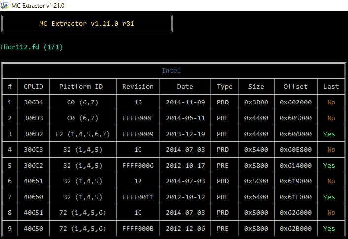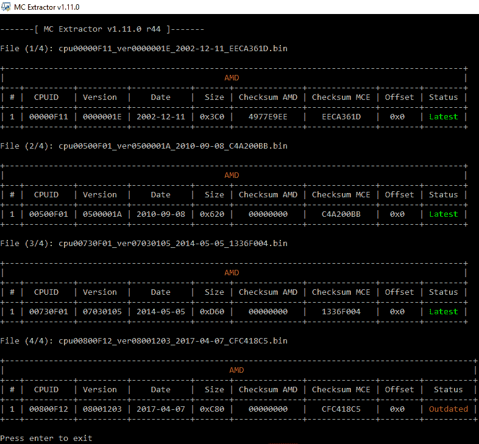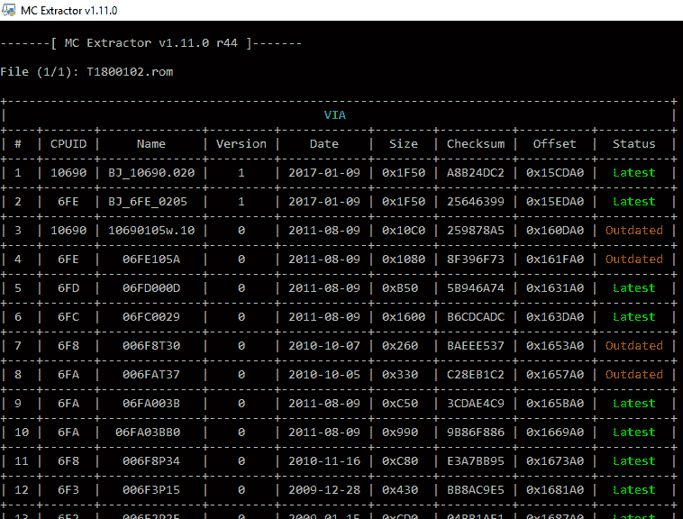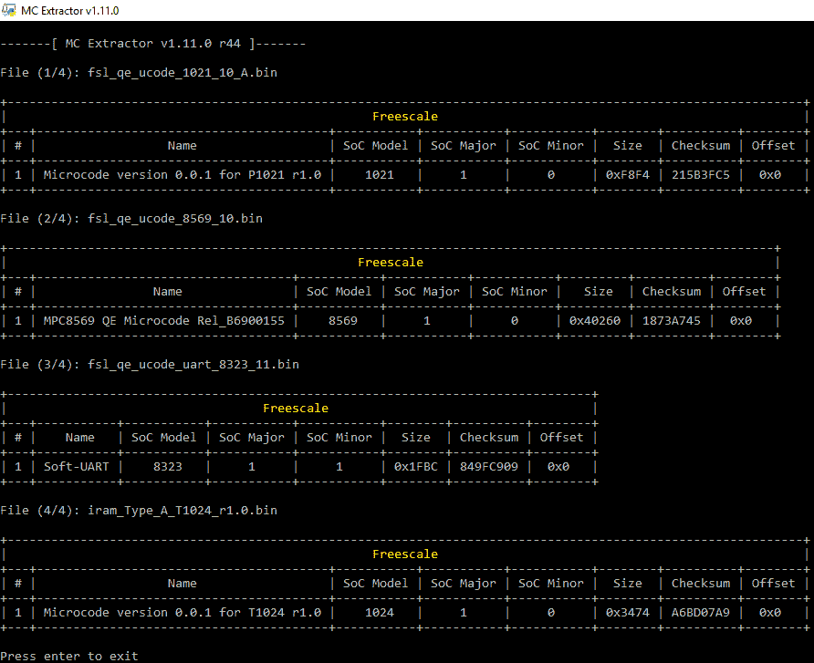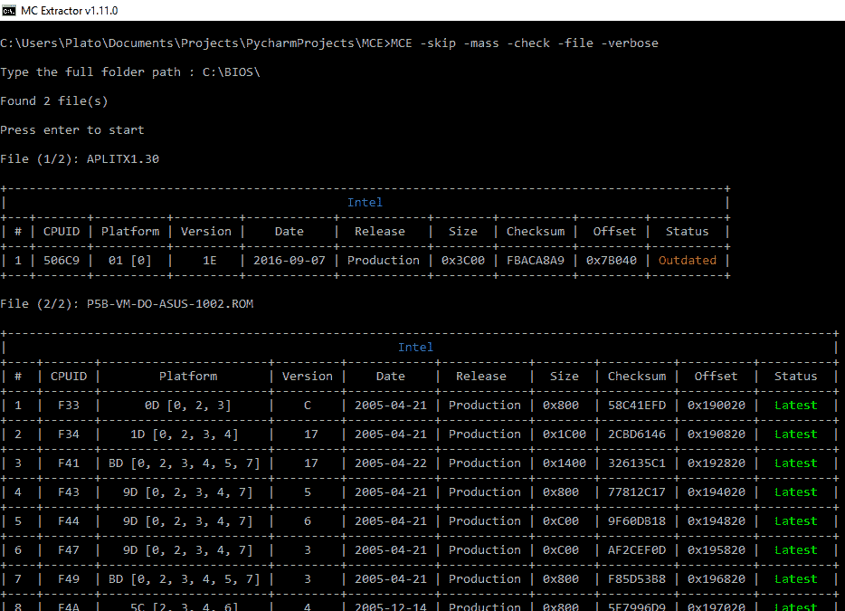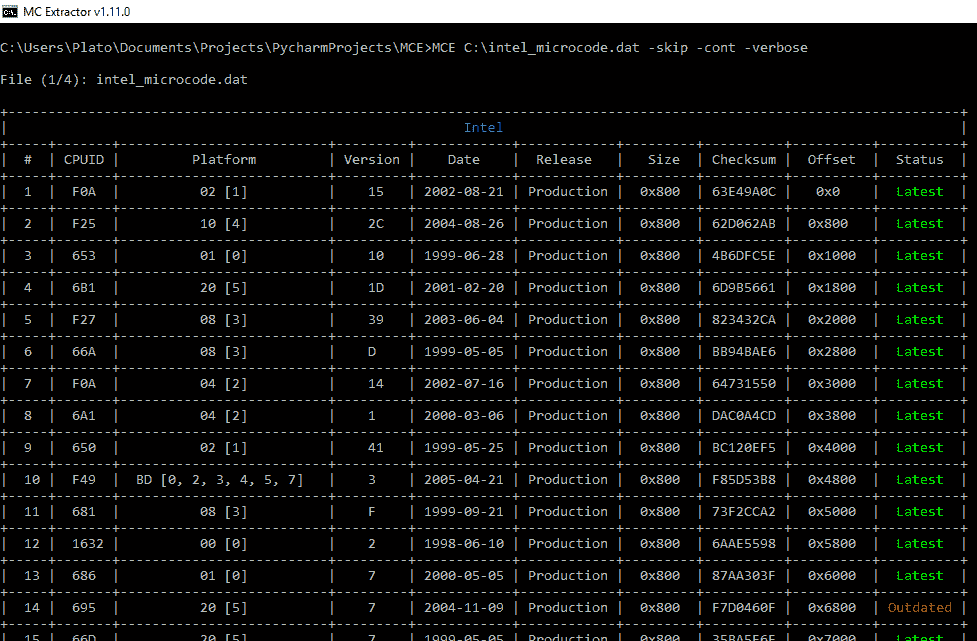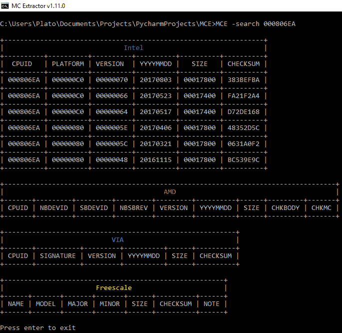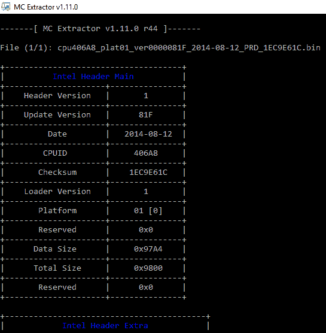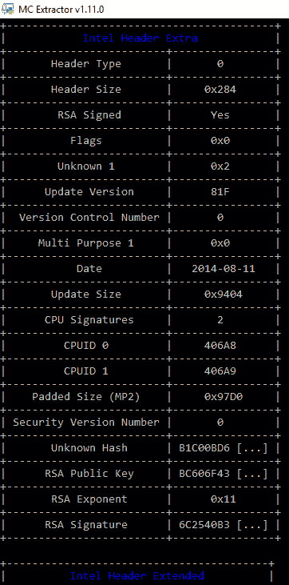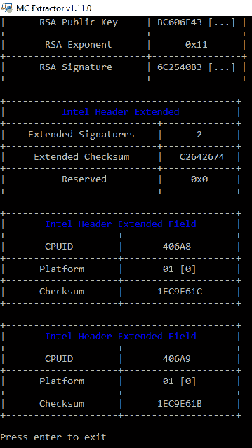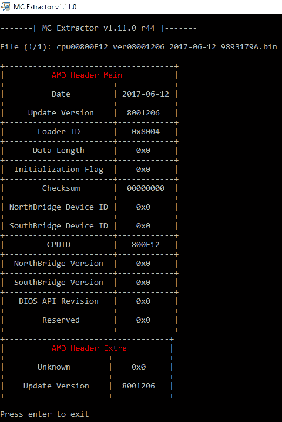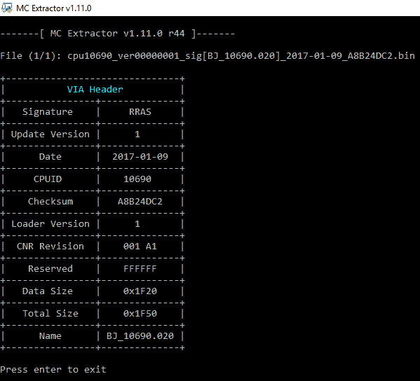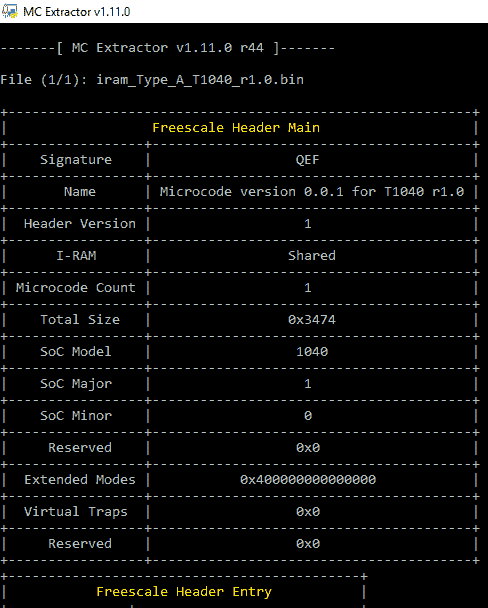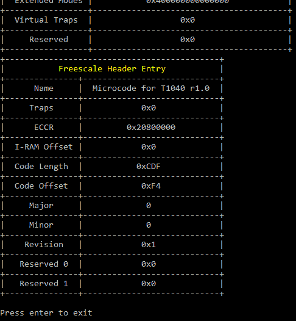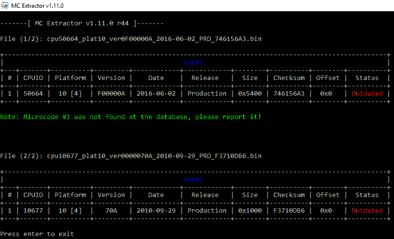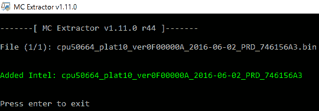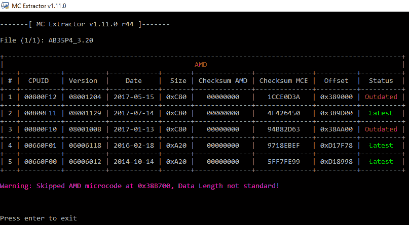

[ ](https://github.com/platomav/MCExtractor) ** *您可以在 [Linkedin](https://www.linkedin.com/company/gbhackers/) 、 [Twitter](https://twitter.com/GbhackerOn) 、[脸书](https://www.facebook.com/gbhackersadmin)上关注我们的日常网络安全更新，您还可以在线参加[最佳网络安全课程](https://ethicalhackersacademy.com/)以保持自我更新。***