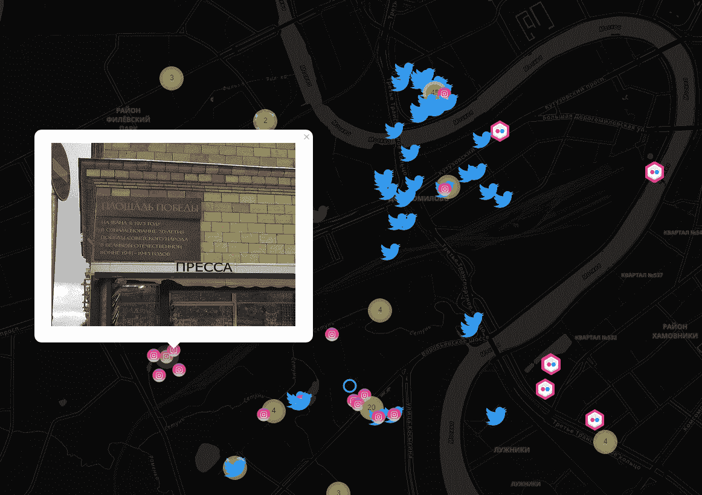

# kamer ka–从 Shodan 构建摄像机的交互式地图

> 原文：<https://kalilinuxtutorials.com/kamerka-map-cameras-shodan/>

Kamerka 是一个从 Shodan 构建交互式摄像机地图的工具。该脚本基于您的坐标创建一个相机、打印机、推文和照片的地图。一切都清楚地呈现在互动地图的形式与图标和弹出窗口。

## **卡梅尔卡要求**

*   在 Python 2 中用编写
*   Shodan +付费订阅
*   地质公园
*   薄层
*   彩色光
*   InstagramAPI–凭证而不是 API 密钥
*   推特
*   flickrapi
*   树枝

`**pip install -r requirements.txt**`

**将您的 API 键放在第 85-99 行**

要使用 Instagram 模块，您必须向 InstagramAPI.py 文件添加额外的方法。

```
**def geosearchLocation(self, lat, lon):
        return self.SendRequest('location_search/?latitude=' + str(lat)+'&longitude='+str(lon)+'&rank_token=' + self.rank_token)**
```

**也读作[NodeJsScan——node . js 应用的静态安全代码扫描器](https://kalilinuxtutorials.com/nodejsscan-static-security-code-scanner/)**

## **用途**

```
**root@kali:~/# python kamerka.py -h
Fail to import moviepy. Need only for Video upload.
usage: kamerka.py [-h] [--lat LAT] [--lon LON] [--radius RADIUS] [--dark]
             [--twitter] [--camera] [--flickr] [--instagram] [--printer]

              o#######o
            o###########o
            o#############o
            #################
            ######  \########o
           #;^ _^,/---\#####!
           ,` /^_ .-~^~-.__\#
          /    ^\/,,@@@,, ;|
         |      \!!@@@@@!! ^,
        #.    .\; '9@@@P'   ^,
        ###./^ ----,_^^      /@-._
                      ^--._,o@@@@@@
                         ^;@@@@@@@@@
                           ^-;@@@@
ꓘamerka 2.0 (FIST) - Build interactive map of cameras, tweets and photos
medium.com/@woj_ciech github.com/woj-ciech

python kamerka.py -h
Example: python kamerka.py --lat 37.235 --lon 115.811111 --dark --twitter --camera --printer

optional arguments:
  -h, --help       show this help message and exit
  --radius RADIUS  Radius in km (Default 3)
  --dark           Dark Theme
  --twitter        Twitter module
  --camera         Camera module
  --flickr         Flickr module
  --instagram      Instagram module
  --printer        Printer module

Required arguments:
  --lat LAT        Latitude
  --lon LON        Longitude** 
```

```
`root@kali:~/#python kamerka.py --lat 37.8368723 --lon -122.2645793 --camera --flickr --instagram --twitter --printer` 
```



[ ](https://github.com/woj-ciech/kamerka) **信用: [@xrxz](https://github.com/xrxz) ， [@42B](https://github.com/42B) 和** [**@paoloo**](https://github.com/paoloo) 

***你可以在 [Linkedin](https://www.linkedin.com/company/gbhackers/) 、 [Twitter](https://twitter.com/GbhackerOn) 、[脸书](https://www.facebook.com/gbhackersadmin)上关注我们的日常网络安全更新，你也可以在线参加[最佳网络安全课程](https://ethicalhackersacademy.com/)以保持自我更新。***