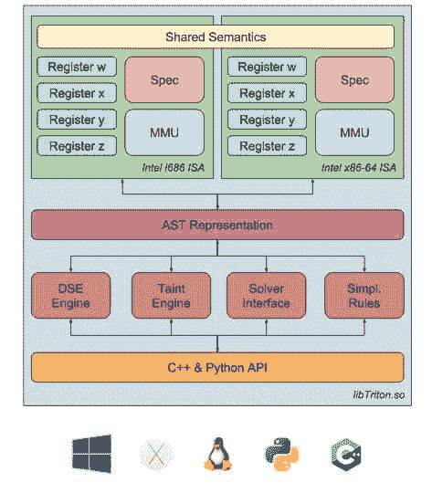

# triton–动态二进制分析(DBA)框架

> 原文：<https://kalilinuxtutorials.com/triton-dynamic-binary-analysis/>

Triton 是一个动态二进制分析(DBA)框架。它提供了内部组件，如动态符号执行(DSE)引擎、污点引擎、x86 和 x86-64 指令集语义的 AST 表示、SMT 简化过程、SMT 解算器接口，以及最后但同样重要的 Python 绑定。



基于这些组件，您能够构建程序分析工具、自动化逆向工程和执行软件验证。因为它还是一个年轻的项目，所以如果它还不可靠，请不要责怪我们。[开放议题](https://github.com/JonathanSalwan/Triton/issues)或[拉动请求](https://github.com/JonathanSalwan/Triton/pulls)总比巨魔好=)。

**也读作 [瘴气 Python 中的逆向工程框架](https://kalilinuxtutorials.com/miasm-reverse-engineering-framework/)**

### 支持

*   **IRC** : #qb_triton@freenode
*   **邮件**:quarkslab com 上的 triton

### 引用 Triton

```
@inproceedings{SSTIC2015-Saudel-Salwan,
  author    = {Florent Saudel and Jonathan Salwan},
  title     = {Triton: A Dynamic Symbolic Execution Framework},
  booktitle = {Symposium sur la s{\'{e}}curit{\'{e}} des technologies de l'information
               et des communications, SSTIC, France, Rennes, June 3-5 2015},
  publisher = {SSTIC},
  pages     = {31--54},
  year      = {2015},
}
```

[](https://github.com/JonathanSalwan/Triton)

***你可以在 [Linkedin](https://www.linkedin.com/company/gbhackers/) 、 [Twitter](https://twitter.com/GbhackerOn) 、[脸书](https://www.facebook.com/gbhackersadmin)上关注我们的日常网络安全更新，你也可以在线参加[最佳网络安全课程](https://ethicalhackersacademy.com/)以保持自我更新。***