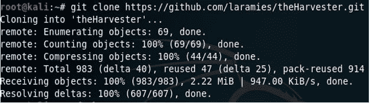
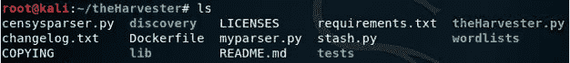
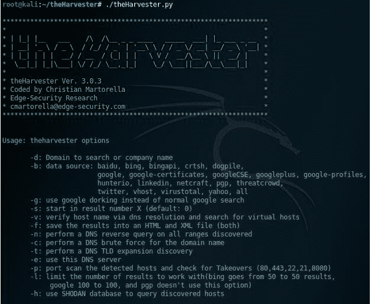
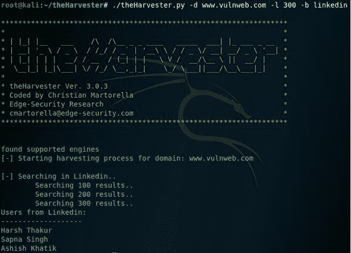

# harvester——收集电子邮件地址、子域和主机的工具

> 原文：<https://kalilinuxtutorials.com/theharvester-email-address/>

“Harvester Tool”是一个简单有效的工具，可以从不同的公共来源(例如:Google、LinkedIn)收集电子邮件地址、员工姓名、主机名、子域名、IP 地址和虚拟主机

## 我们如何做到这一点？–主服务器

git 克隆 https://github.com/laramies/theHarvester.git

打开文件克隆到的目录:

**也可阅读[m creator-编码反向外壳生成器，具有绕过 AV 的](https://kalilinuxtutorials.com/mcreator-encoded-reverse-shell-generator/)T3 的技术**

运行 python 文件[使用。/或“python ”,同时执行 python 文件]

**例子:**

从一个域(-d www.vulnweb.com)获取，限制结果为 300 (-l 300)，使用 LinkedIn (-b LinkedIn)

从一个域(-d www.vulnweb.com)获取，将结果限制为 300 (-l 300)，使用 Google (-b google)

***你可以在 [Linkedin](https://www.linkedin.com/company/gbhackers/) 、 [Twitter](https://twitter.com/GbhackerOn) 、[脸书](https://www.facebook.com/gbhackersadmin)上关注我们的日常网络安全更新，你也可以在线参加[最佳网络安全课程](https://ethicalhackersacademy.com/)以保持自我更新。***