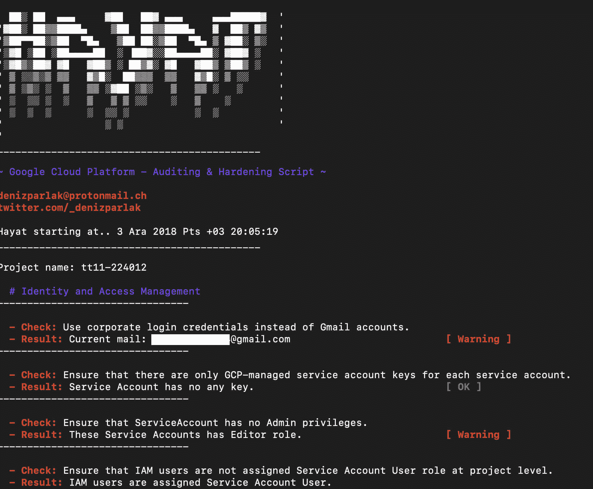

# hayat——谷歌云平台&审计和强化脚本

> 原文：<https://kalilinuxtutorials.com/hayat/>

Hayat 工具用于谷歌云平台审计和强化脚本。

## Hayat 是什么意思？

老实说，我很难找到一个独特的名字。“Hayat”是一个土耳其词，在英语中是“生命”的意思，也是我侄女的名字。你准备好见她了吗？

Hayat 是用于 Google 云平台服务的审计和强化脚本，例如:

*   身份和访问管理
*   记录和监控
*   建立工作关系网
*   虚拟计算机
*   储存；储备
*   云 SQL 实例
*   不可思议的群集

暂时如此。

**也可理解为[kamer ka——从 Shodan](https://kalilinuxtutorials.com/kamerka-map-cameras-shodan/)T5 建立摄像机的交互地图**

## **身份&门禁管理**

*   确保使用公司登录凭据，而不是 Gmail 帐户。
*   确保每个服务帐户只有 GCP 管理的服务帐户密钥。
*   确保 ServiceAccount 没有管理员权限。
*   确保没有在项目级别为 IAM 用户分配服务帐户用户角色。

## **记录和监控**

*   确保为所有日志条目配置了接收器。

## **联网**

*   确保项目中不存在默认网络。
*   确保项目不存在旧网络。
*   确保为云 DNS 启用了 DNSSEC。
*   确保 RSASHA1 不用于云 DNS DNSSEC 中的密钥签名密钥。
*   确保 RSASHA1 不用于云 DNS DNSSEC 中的区域签名密钥。
*   确保限制从互联网访问 RDP。
*   确保 VPC 网络中的所有子网都启用了专用 Google 访问。
*   确保 VPC 网络中的每个子网都启用了 VPC 流日志。

## **虚拟机**

*   确保实例未配置为使用对所有云 API 具有完全访问权限的默认服务帐户。
*   确保为虚拟机实例启用了“阻止项目范围的 SSH 密钥”。
*   确保为项目启用了 oslogin。
*   确保没有为虚拟机实例启用“启用连接到串行端口”。
*   确保实例上未启用 IP 转发。

## **存储**

*   确保云存储桶不可匿名或公开访问。
*   确保为云存储桶启用了日志记录。

## **云 SQL 数据库服务**

*   确保云 SQL 数据库实例要求所有传入连接使用 SSL。
*   确保云 SQL 数据库实例不对外开放。
*   确保 MySql 数据库实例不允许任何人使用管理权限进行连接。
*   确保 MySQL 数据库实例不允许来自任何主机的 root 登录。

## **增压器**

*   确保在 Kubernetes 引擎集群上将 Stackdriver 日志记录设置为 Enabled。
*   确保在 Kubernetes 引擎集群上将 Stackdriver Monitoring 设置为 Enabled。
*   确保在 Kubernetes 引擎集群上将传统授权设置为 Disabled。
*   确保在 Kubernetes 引擎集群上将主授权网络设置为启用。
*   确保 Kubernetes 集群配置有标签。
*   确保 Kubernetes web UI / Dashboard 已禁用。
*   确保为 Kubernetes 集群启用了`Automatic node repair`。
*   确保在 Kubernetes 引擎集群节点上启用了自动节点升级。
*   确保对 Kubernetes 引擎集群节点映像使用容器优化的操作系统(cos)。
*   确保在 Kubernetes 引擎集群上禁用基本身份验证。

## **用途**

```
git clone [https://github.com/DenizParlak/Hayat.git](https://github.com/DenizParlak/Hayat.git) && cd Hayat && chmod +x hayat.sh && ./hayat.sh
```

您可以使用特定的功能，例如，如果您只想扫描 Kubernetes 集群:

```
./hayat.sh --only-kubernetes
```

## **截图**

 

[ ](https://github.com/DenizParlak/hayat#identity--access-management) ** *您可以在 [Linkedin](https://www.linkedin.com/company/gbhackers/) 、 [Twitter](https://twitter.com/GbhackerOn) 、[脸书](https://www.facebook.com/gbhackersadmin)上关注我们的日常网络安全更新，您还可以在线参加[最佳网络安全课程](https://ethicalhackersacademy.com/)以保持自我更新。***