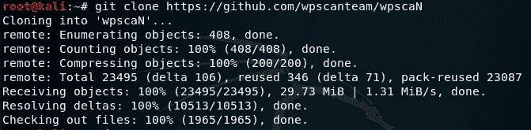
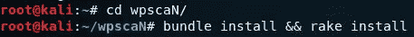
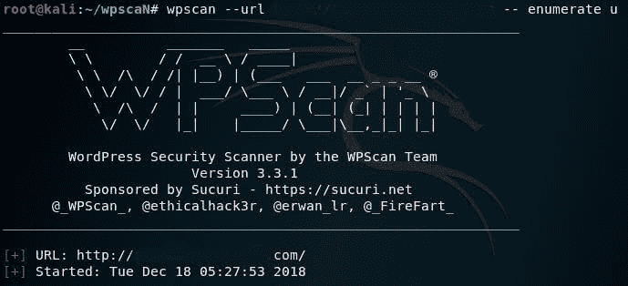
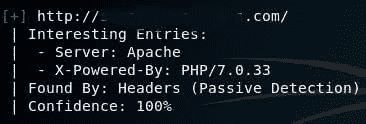
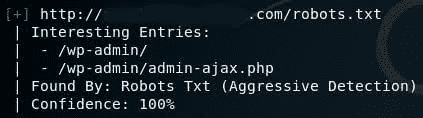
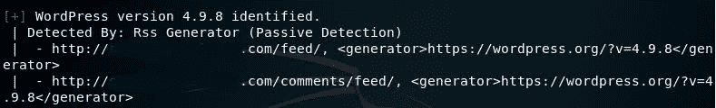
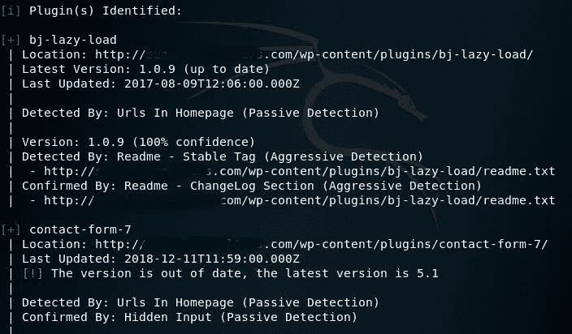
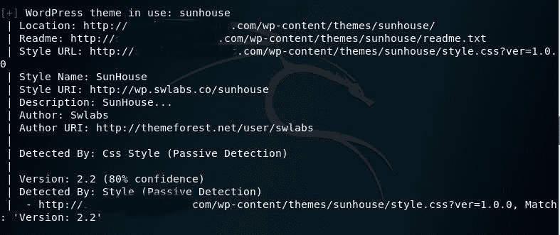
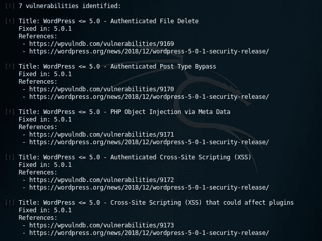

# wps can–检查漏洞并发现安全问题

> 原文：<https://kalilinuxtutorials.com/wpscan-checks-vulnerabilities/>

**WPScan** 有效地**扫描**你的 WordPress 网站，检查核心版本、插件、主题等的漏洞，帮助**发现**安全问题。

```
Firstly, install WPScan!
Installation can be done through github
git clone https://github.com/wpscanteam/wpscanN
```



```
Go to the directory where you have downloaded wpscan and 
install the bundle files.
bundle install && rake install
```



现在，我们可以使用 WPScan 了！
**wps can–URL http://target . TLD–enumerate u**
根据需要使用命令。
就像在，

**u=用户信息**
p =插件 T5**t =主题**

这个基本命令将扫描您的网站，并识别活动主题和其他暴露的易受攻击的信息



**暴露网站的 web 服务器类型**



WordPress 站点的管理登录页面



**曝光的 WordPress 版本**



**网站中易受攻击的插件**将被获取，描述其各种类别，从最易受攻击的[带有红色感叹号]到未更新的插件。也就是说，每一个易受攻击的信息都会被显示出来。



**脆弱的主题**



您可以查看针对您的网站专门确定的漏洞列表:



您可以彻底扫描您的网站，以检查漏洞并隔离它们！

***你可以在 [Linkedin](https://www.linkedin.com/company/gbhackers/) 、 [Twitter](https://twitter.com/GbhackerOn) 、[脸书](https://www.facebook.com/gbhackersadmin)上关注我们的日常网络安全更新，你也可以在线参加[最佳网络安全课程](https://ethicalhackersacademy.com/)以保持自我更新。***