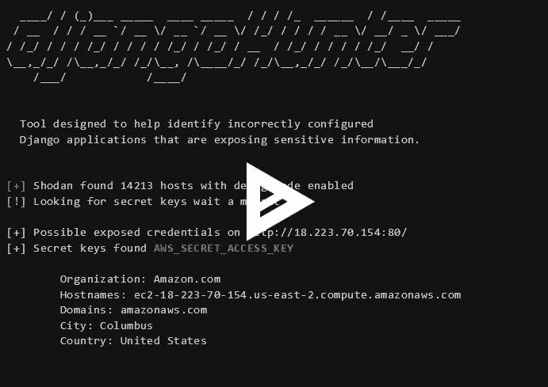

# DjangoHunter:识别配置不正确的 Django 应用程序的工具

> 原文：<https://kalilinuxtutorials.com/djangohunter-django-applications/>

Djangohunter 是一个工具，旨在帮助识别暴露敏感信息的配置不正确的 Django 应用程序。

## **DjangoHunter 用法**

```
`**Usage: python3 djangohunter.py --key {shodan}
Dorks: 'DisallowedHost', 'KeyError', 'OperationalError', 'Page not found at /'**` 
```

## **要求**

*   肖丹
*   皮菲莱
*   要求
*   美丽的声音

**`pip -r install requirements`**

**又读 [Scannerl:模块化分布式指纹识别引擎](https://kalilinuxtutorials.com/scannerl-fingerprinting-engine/)**

## **视频教程**

## [](https://asciinema.org/a/210648) **免责声明**

代码示例是出于教育目的而提供的。只有通过研究恶意行为者可用的攻击技术，才能建立足够的防御。在大多数司法管辖区，未经事先许可对目标系统使用此代码是非法的。作者不对因误用这些信息或代码而造成的任何损失负责。

[](https://github.com/6IX7ine/djangohunter)