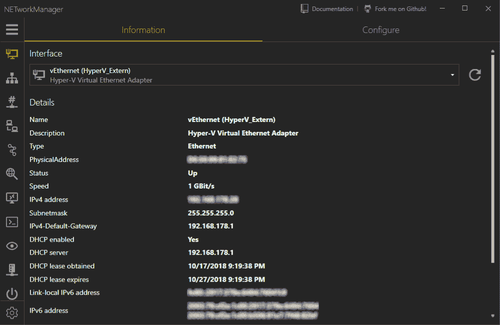

# 网络管理器——管理网络和解决网络问题的强大工具

> 原文：<https://kalilinuxtutorials.com/networkmanager-manage-troubleshoot/>

网络管理器是一个管理网络和解决网络问题的强大工具。让我们来看看该工具上的功能，这些功能可以帮助我们管理连接的网络，并帮助我们解决与网络相关的问题。

*   网络接口–信息，配置
*   IP 扫描仪
*   端口扫描器
*   砰
*   Traceroute
*   DNS 查找
*   远程桌面
*   油灰(需要油灰)
*   TightVNC(需要 TightVNC)
*   SNMP–获取、遍历、设置(v1、v2c、v3)
*   局域网唤醒
*   HTTP 标题
*   Whois
*   子网计算器–计算器、子网划分、超网划分
*   查找–OUI，端口
*   连接
*   听众
*   ARP 表

**亦作:** [MEC : massExploitConsole 为并发剥削](https://kalilinuxtutorials.com/mec-massexploitconsole/)

#### **支持的语言**

*   英语
*   德国人
*   俄语
*   西班牙语

#### **网络管理器系统依赖于**

*   Windows 7/Server 2008 R2 版或更高版本
*   。NET 框架 4.6
*   RDP 8.1

[**Download**](https://github.com/BornToBeRoot/NETworkManager)