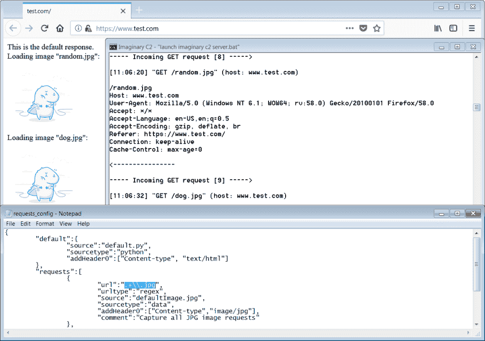
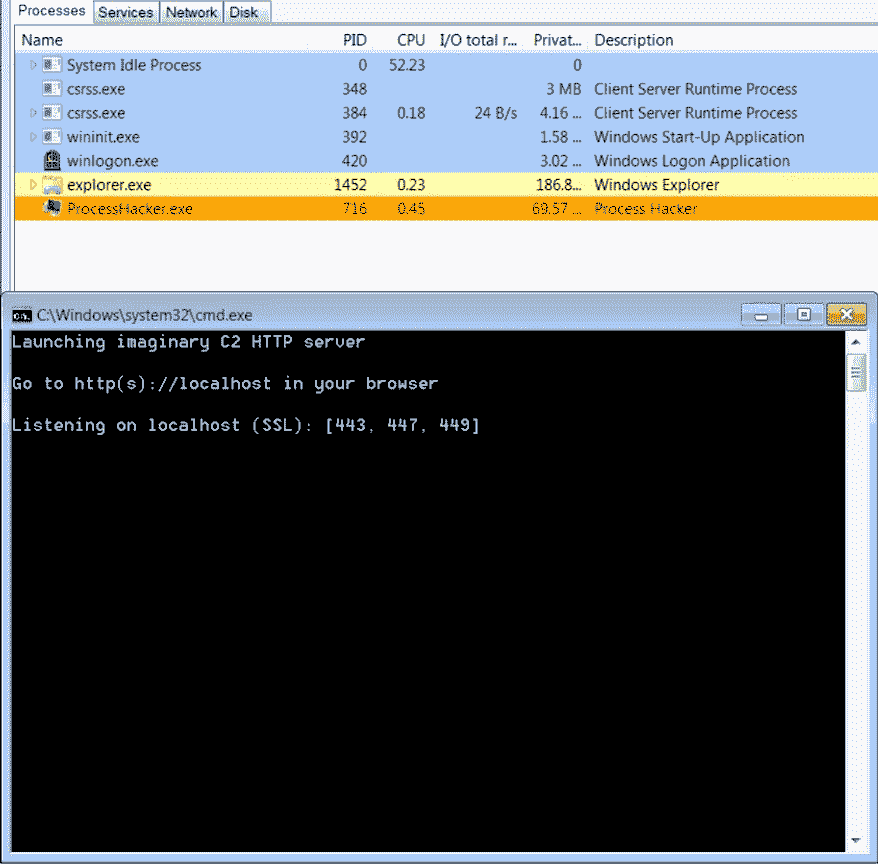

# ImaginaryC2:Python 工具有助于恶意软件网络行为分析

> 原文：<https://kalilinuxtutorials.com/imaginaryc2-network-analysis-malware/>

**ImaginaryC2** 是一个 python 工具，旨在帮助恶意软件的行为(网络)分析。它托管一个 HTTP 服务器，该服务器捕获针对选择性选择的域/IP 的 HTTP 请求。

此外，该工具旨在使重放捕获的命令和控制响应/服务有效载荷变得容易。

通过使用该工具，分析师可以为恶意软件提供一致的网络响应。此外，分析师可以捕获和检查向在分析时离线的域/IP 发出的 HTTP 请求。

#### **重放数据包捕获**

虚构的 C2 提供了两个脚本来将数据包捕获(PCAPs)或 Fiddler 会话存档转换成可以被虚构的 C2 解析的**请求定义**。

通过这些脚本，用户可以提取 HTTP 请求 URL 和域，以及 HTTP 响应。通过这种方式，可以快速重放给定 HTTP 请求的 HTTP 响应。

#### 技术细节想象 C2

**需求**:假想 C2 需要 Python 2.7 和 Windows。
**模块:**目前，假想的 C2 包含三个模块和两个配置文件:

| 文件名 | 功能 |
| --- | --- |
| 1.假想 _c2.py | 托管 python 的简单 HTTP 服务器。主模块。 |
| 2.redirect_to_imaginary_c2.py | 改变 Windows 的主机文件和 Windows(IP)路由表。 |
| 3.unpack _ fiddler _ archive . py & unpack _ pcap . py | 从数据包捕获中提取 HTTP 响应。将相应的 HTTP 请求域和 URL 添加到配置文件中。 |
| 4.重定向配置文件 | 包含需要重定向到本地主机(到 python HTTP 服务器)的域和 IP。 |
| 5.请求 _ 配置. txt | 包含带有相应数据源的 URL 路径定义。 |

**请求定义**:请求配置中定义的每个(HTTP)请求由两个参数组成:

**参数 1:** *HTTP 请求 URL 路径*(又名 urlType)

| 价值 | 意义 |
| --- | --- |
| 固定的；不变的 | 将 URL 路径定义为文字字符串 |
| 正则表达式 | 定义要在 URL 路径上匹配的正则表达式模式 |

**参数 2:** *HTTP 响应源*(又名 sourceType)

| 价值 | 意义 |
| --- | --- |
| 数据 | 想象中的 C2 会用磁盘上一个文件的内容来响应 |
| 大蟒 | 想象中的 C2 将运行一个 python 脚本。python 脚本的输出定义了 HTTP 响应。 |

#### **样**

[**Download**](https://github.com/felixweyne/imaginaryC2)