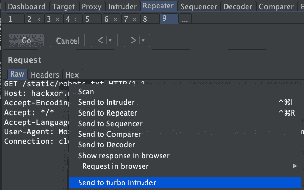
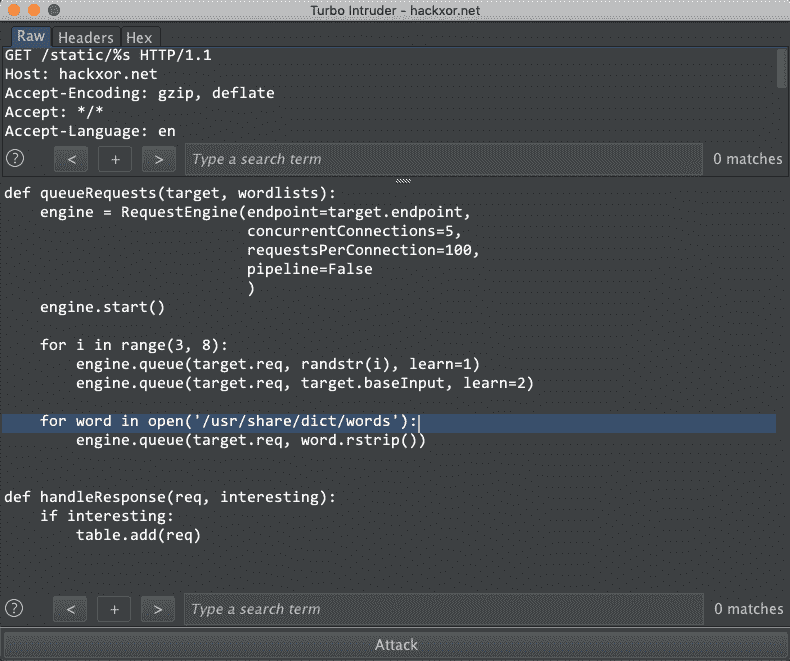

# Burp 套件扩展–Turbo 入侵者对 Web 应用程序执行安全测试

> 原文：<https://kalilinuxtutorials.com/burp-extension-turbo-intruder/>

**Turbo intrusor**是一个 **Burp Suite 扩展**，它是一个执行 web 应用程序安全测试的集成平台。它发送许多 HTTP 请求，然后分析输出结果。

它被强调为打嗝入侵者，因为它具有高速、持续和复杂的特性。

## **以下特征使其与众不同:**

**快速–**Turbo intrusor 使用从零开始手工编码的 HTTP 堆栈，同时考虑到速度。因此，在许多目标上，它甚至可以远远超过流行的异步 Go 脚本。

**可扩展**–Turbo intrusor 可以实现平坦的内存使用，支持可靠的多日攻击。它也可以通过命令行在无头环境中运行。

**灵活**–使用 Python 配置攻击。这使得能够处理复杂的需求，如签名请求和多步攻击序列。此外，自定义 HTTP 堆栈意味着它可以处理破坏其他库的格式错误的请求。

**便捷**–钻孔结果可通过先进的差分算法自动过滤，该算法由反斜杠驱动的扫描仪改编而来。

另一方面，它不可否认地更难使用，并且网络堆栈不像 core Burp 那样可靠和经得起考验。

## **如何使用涡轮入侵者？**

使用扩展器选项卡下的 BApp 商店将 Turbo Intruder 安装到 Burp 套件中。

### **程序:**

突出显示你要注射的区域，然后右击“发送到涡轮入侵者”

您将看到一个包含 Python 代码片段的窗口:

您会注意到您突出显示的请求区域已被替换为“% s”——这是您的有效负载将被放置的地方。首先，你可能只想把“/usr/share/dict/words”改成一个更合适的单词表。除此之外，对于简单的用例，默认脚本应该开箱即用。

### **命令行用法:**

有时，你可能会发现你想从服务器上运行涡轮入侵者。为了支持无头使用，它可以直接从 jar 启动，没有打嗝。

您可能会发现最简单的方法是像往常一样在 Burp 中开发您的脚本，然后在服务器上保存并启动它，如下所示:

**java -jar turbo.jar**

例:**Java-jar turbo . jar resources/examples/basic . py resources/examples/request . txt https://example.net:443 foo**