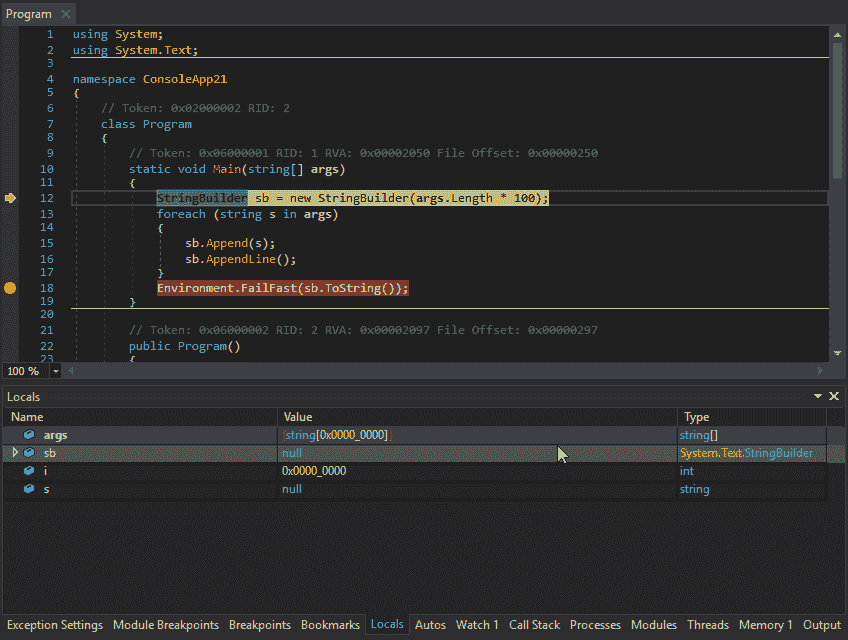
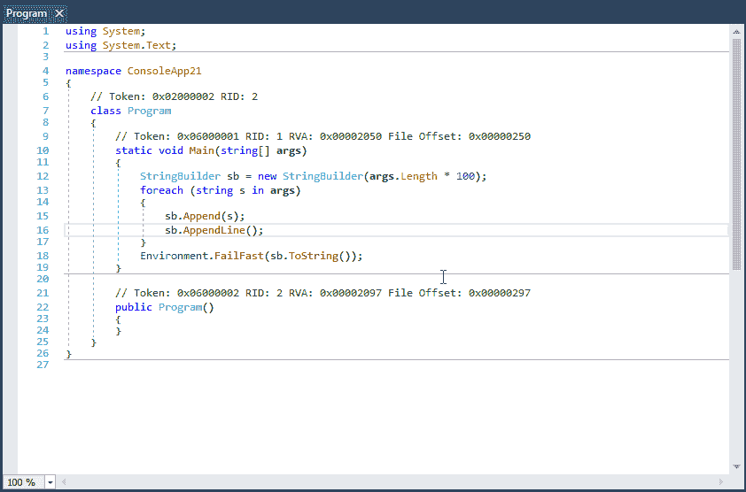

# DNSpy。NET 调试器和汇编编辑器

> 原文：<https://kalilinuxtutorials.com/dnspy-debugger-assembly-editor/>

DNSpy 是一个调试器。NET 程序集编辑器。即使您没有任何可用的源代码，也可以使用它来编辑和调试程序集。

想说谢谢吗？单击页面顶部的星号。或者叉 dnSpy 发个 PR！

下面的图片展示了 dnSpy 的运行情况。它显示了 dnSpy 编辑和调试一个. NET EXE 文件，而不是源代码。

**也可阅读:**[remot 3d——一个为大型奔跑者设计的简单工具](https://kalilinuxtutorials.com/remot-3d-tool-large-pentesters/)

#### **DNSpy 特性**

*   调试。NET 框架，。NET 核心和 Unity 游戏程序集，不需要源代码
*   在 C#或 Visual Basic 或 IL 中编辑程序集，并编辑所有元数据
*   明暗主题
*   可扩展，写你自己的扩展
*   高 DPI 支持(支持每台显示器的 DPI)
*   更多信息，请参见下文

dnSpy 使用 ILSpy 反编译引擎和 Roslyn (C# / Visual Basic)编译器以及许多其他开源库，更多信息见下文。

#### **调试器**

*   调试[。NET 框架](https://www.future-processing.com/software-services/net-software-development/)，。NET 核心和 Unity 游戏程序集，不需要源代码
*   设置断点并单步执行任何程序集
*   本地人，手表，汽车窗户
*   变量窗口支持将变量(如解密的字节数组)保存到磁盘或在十六进制编辑器(内存窗口)中查看它们
*   对象 id
*   可以同时调试多个进程
*   模块加载时中断
*   跟踪点和条件断点
*   导出/导入断点和跟踪点
*   调用堆栈、线程、模块、进程窗口
*   抛出异常时中断(第一次机会)
*   变量窗口支持计算 C# / Visual Basic 表达式
*   可以调试动态模块(但由于 CLR 的限制，不能调试动态方法)
*   输出窗口记录各种调试事件，默认情况下显示时间戳🙂
*   可以调试在运行时自行解密的程序集，dnSpy 将使用内存中的映像。您还可以强制 dnSpy 始终使用内存中的映像，而不是磁盘文件。
*   公共 API，您可以编写一个扩展或使用 C#交互式窗口来控制调试器

#### **装配编辑**

*   所有元数据都可以编辑
*   使用 IntelliSense 在 C#或 Visual Basic 中编辑方法和类，不需要源代码
*   在 C#或 Visual Basic 中添加新的方法、类或成员
*   用于低级 IL 方法体编辑的 IL 编辑器
*   可以编辑低级元数据表。这在内部使用十六进制编辑器。

#### **十六进制编辑器**

*   点击反编译代码中的一个地址，进入十六进制编辑器中的 IL 代码
*   与上面相反，在十六进制编辑器的 IL 主体中按 F12 键，转到反编译的代码或位的其他高级表示。找出一个补丁修改了哪个语句是很棒的。
*   亮点。NET 元数据结构和 PE 结构
*   工具提示显示关于所选的更多信息。NET 元数据/ PE 字段
*   转到位置，文件，RVA
*   转到。NET 元数据标记、方法体、#Blob / #Strings / #US 堆偏移量或#GUID 堆索引
*   跟随引用(Ctrl+F12)

#### **其他**

*   BAML 反编译程序
*   蓝色、浅色和深色主题(以及深色高对比度主题)
*   书签
*   C#交互式窗口可用于编写 dnSpy 脚本
*   在程序集中搜索类、方法、字符串等
*   分析类和方法的使用，寻找调用者等
*   多个选项卡和选项卡组
*   引用被突出显示，使用 Tab / Shift+Tab 移动到下一个引用
*   转到入口点和模块初始值设定项命令
*   转到元数据标记或元数据行命令
*   代码工具提示(C#和 Visual Basic)
*   导出到项目

#### **dnSpy 使用的其他开源库列表**

*   ILSpy 反编译器引擎(C#和 Visual Basic 反编译器)
*   Roslyn (C#和 Visual Basic 编译器)
*   dnlib(。也可以读取模糊程序集的. NET 元数据读取器/编写器)
*   VS MEF(MEF 越快，启动越快)
*   ClrMD(对 CorDebug API 不提供的低级调试信息的访问)

信用:[点击这里](https://github.com/0xd4d/dnSpy/blob/master/dnSpy/dnSpy/LicenseInfo/CREDITS.txt)

[**Download**](https://github.com/0xd4d/dnSpy)