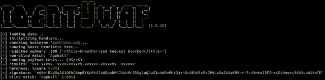
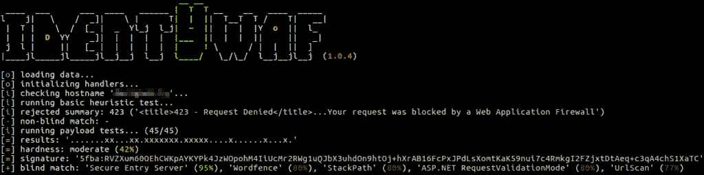
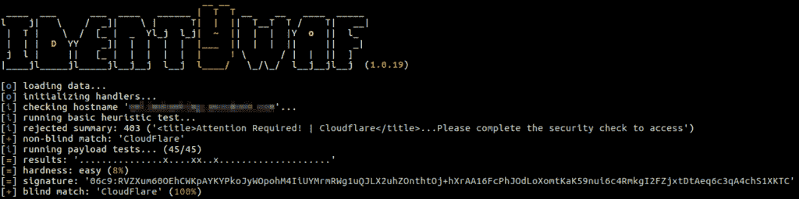
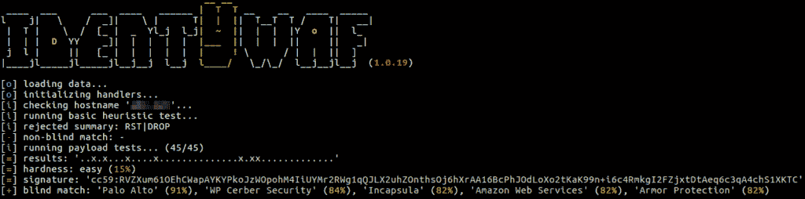

# 盲晶圆识别工具

> 原文：<https://kalilinuxtutorials.com/identywaf-identification-tool/>

**identYwaf** 是一个识别工具，可以基于盲推理识别网页防护类型(即 waf)。

通过检查由一组预定义的攻击性(非破坏性)有效载荷引起的响应来进行盲推断，其中这些有效载荷仅用于触发其间的网络保护系统(例如`**http://<host>?aeD0oowi=1 AND 2>1**`)。

目前它支持 70 多种不同的保护产品(如`**aeSecure**` **、**、`**Airlock**`、、`**CleanTalk**`、**、**、`**CrawlProtect**`、、**、**、`**MalCare**`、**、**、`**ModSecurity**`、**、**、`**Palo Alto**`、**、**、`**UrlScan**`、**、**、`**Wallarm**`、**、**))，同时知识库也在不断扩大。****

**另请阅读:**H[8 mail–电子邮件攻击和密码泄露追踪](https://kalilinuxtutorials.com/h8mail-email-password-breach/)

**安装**

你可以点击[这里](https://github.com/stamparm/identYwaf/archive/master.zip)下载最新的 zipball。

最好是，您可以通过克隆 Git 存储库来下载它:

**git 克隆–深度 1 https://github.com/stamparm/identYwaf.git**

它可以在任何平台上使用从 2.6.x 到 3.7.x 的任何 Python 版本。

**用途**

```
$ python identYwaf.py 
                                    __ __ 
 ____  ___      ___  ____   ______ |  T  T __    __   ____  _____ 
l    j|   \    /  _]|    \ |      T|  |  ||  T__T  T /    T|   __|
 |  T |    \  /  [_ |  _  Yl_j  l_j|  ~  ||  |  |  |Y  o  ||  l_
 |  | |  D  YY    _]|  |  |  |  |  |___  ||  |  |  ||     ||   _|
 j  l |     ||   [_ |  |  |  |  |  |     ! \      / |  |  ||  ] 
|____jl_____jl_____jl__j__j  l__j  l____/   \_/\_/  l__j__jl__j  (1.0.62)

Usage: python identYwaf.py [options] <host|url>

Options:
  --version           Show program's version number and exit
  -h, --help          Show this help message and exit
  --delay=DELAY       Delay (sec) between tests (default: 0)
  --timeout=TIMEOUT   Response timeout (sec) (default: 10)
  --proxy=PROXY       HTTP proxy address (e.g. "http://127.0.0.1:8080")
  --random-agent=R..  Use random HTTP User-Agent header value
  --string=STRING     String to search for in rejected responses
```

**截图**

[**Download**](https://github.com/stamparm/identYwaf)