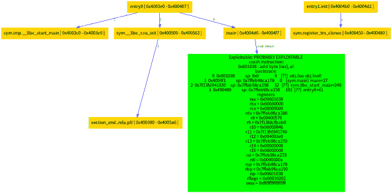

# BeeBug:检查可利用性的工具

> 原文：<https://kalilinuxtutorials.com/beebug-checking-exploitability/>

BeeBug 是一个可以用来验证程序崩溃是否可被利用的工具。该工具在巴塞罗那 r2con 2018 上首次亮相。一些实现的功能包括:

*   libc 上的堆栈溢出
*   程序计数器崩溃
*   撞上树枝
*   写入内存时崩溃
*   堆漏洞
*   读取访问冲突(一些可利用的情况)
*   帮助分析碰撞(图形视图)

**又读:** [博尔特:跨站请求伪造扫描仪](https://kalilinuxtutorials.com/bolt/)

**依赖关系**

*   R2 管道
*   pydot
*   graphviz
*   pyqtgraph

**安装**

~ $ wget https://github.com/radare/radare2/archive/2.7.0.tar.gz
~ $ tar xzvf 2.7.0.tar.gz
~ $ CD radar 2-2 . 7 . 0/
~/radar 2-2 . 7 . 0 $。/configure–prefix =/usr
~/radar 2-2 . 7 . 0 $ make-j8
~/radar 2-2 . 7 . 0 $ sudo make install
apt-get install graphviz
pip 3 install-r requirements . txt

**用途**

**帮助**

$ python3。/beebug.py -h
用法:bee bug . py[-h][-t TARGET][-a TARGET args][-f FILE][-g GRAPH][-I]
[-r REPORT _ FILE][-v]
可选参数:
-h，–帮助显示此帮助信息并退出
-t TARGET，–TARGET TARGET
目标程序以分析
-a TARGETARGS，–TARGET args 目标 ARGS
目标程序的参数
-1

**简单用法**

python3。/bee bug . py-t tests/Crash _ on _ PC
进程以 PID 7691 开始…
文件 dbg:///home/invictus 1306/Documents/r2conf/bee bug/bee bug/tests/Crash _ on _ PC 以读写模式重新打开
= attach 7691 7691
子进程以信号 11 停止
[+]信号 11 errno = 0 addr = 0x 00601038 code = 2 ret = 0
PC 上的崩溃？]obj . foo obj . foo 0
1 0x 4004 f1 sp:0x 7 ffdfa 75 D8 e 8 0[sym . main]main+27
2 0x7f 2669d 00830 sp:0x 7 ffdfa 75d 908 32[？？]r11+240
3 0x7f 266 a0ba 7 CB sp:0x 7 ffd fa 75d 998 144[？？]sym . dl _ rtld _ di _ ser info+29051
4 0x 400409 sp:0x 7 ffd fa 75d 9 c 8 48[？？] entry0+41
寄存器
rax = 0x 00601038
rbx = 0x 000000000
rcx = 0x 00000000
RDX = 0x 7 ffd fa 75 d9 F8
r8 = 0x 00400570
r9 = 0x7f 266 A0 baab 0
r10 = 0x 000000846
r11 = 0x7f 26699

**图形生成**

**蟒 3。/beebug . py-t tests/crash _ on _ PC-g crash _ on _ PC
……
$ display crash _ on _ PC . png**

**鸣谢:安德里亚·辛多尼**

[**Download**](https://github.com/invictus1306/beebug)