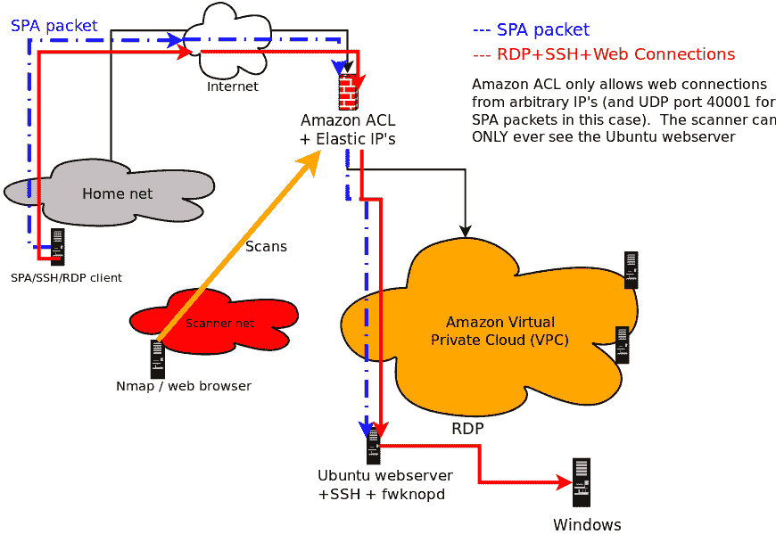
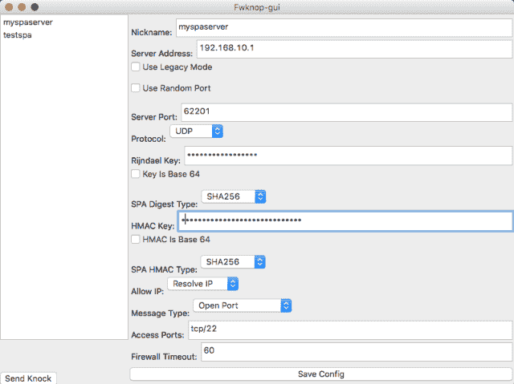

# Fwknop:单一数据包授权端口敲门

> 原文：<https://kalilinuxtutorials.com/fwknop-packet-authorization-port-knocking/>

Fwknop 实现了一种称为单包授权(SPA)的授权方案，用于强服务隐藏。

SPA 只需要一个加密的、不可重放的、并通过 HMAC 认证的数据包，就可以以默认丢弃过滤的方式传递对隐藏在防火墙后的服务的访问。

SPA 的主要应用是使用防火墙来阻止所有连接到 SSH 等服务的尝试，以使漏洞(0 天代码和未打补丁的代码)的利用更加困难。

因为没有开放的端口，所以任何被 SPA 隐藏的服务自然不能用 Nmap 扫描。

fwknop 项目支持四种不同的防火墙:iptables、firewalld、PF 和 ipfw，跨 Linux、OpenBSD、FreeBSD 和 Mac OS X。

它还支持定制脚本，因此 fwknop 可以支持其他基础设施，如 ipset 或 nftables。

SPA 本质上是下一代端口敲门(PK ),但解决了 PK 的许多限制，同时保留了其核心优势。

PK 限制包括一般难以防止重放攻击，非对称密码和 HMAC 方案通常不可能被可靠地支持。

对 PK 服务器发起 DoS 攻击非常容易，只需在 PK 服务器遍历网络时将一个额外的数据包伪装成 PK 序列(从而使 PK 服务器相信客户机不知道正确的序列)。

SPA 解决了所有这些缺点。同时，SPA 将服务隐藏在默认丢弃防火墙策略之后，被动获取 SPA 数据(通常通过 libpcap 或其他方式)，并为 SPA 数据包身份验证和加密/解密实施标准加密操作。

fwknop 生成的 SPA 数据包在“先加密后验证”模式中利用 HMAC 进行验证加密。虽然 HMAC 的使用目前是可选的(通过`**--use-hmac**`命令行开关启用)，但强烈推荐使用，原因有三:

1.  在没有 HMAC 的情况下，除非使用 GnuPG，否则不可能使用 fwknop 进行加密的强认证，但是即使这样，仍然应该应用 HMAC。
2.  加密后应用的 HMAC 可以防止密码分析 CBC 模式填充 oracle 攻击，例如 Vaudenay 攻击和相关的欺骗(例如最近针对 SSL 的“Lucky 13”攻击)。
3.  fwknopd 守护程序验证 HMAC 所需的代码比解密 SPA 数据包所需的代码简单得多，因此没有正确 HMAC 的 SPA 数据包甚至不会通过解密例程发送。

上面的最后一个原因是为什么即使 SPA 包是用 GnuPG 加密的，仍然应该使用 HMAC，因为 SPA 数据不是通过 libgpgme 函数发送的，除非 HMAC 首先检查。

GnuPG 和 libgpgme 是相对复杂的代码体，因此限制潜在攻击者通过 HMAC 操作与这些代码进行交互的能力有助于保持更强的安全性。

为 SPA 通信生成 HMAC 除了需要普通加密密钥外，还需要一个专用密钥，两者都可以通过`**--key-gen**`选项生成。

fwknop 使用 Rijndael 块密码或通过 GnuPG 和相关的非对称密码加密 SPA 数据包。

如果选择对称加密方法，那么通常加密密钥在客户端和服务器之间共享(详情见`/etc/fwknop/access.conf`文件)。

用于 Rijndael 加密的实际加密密钥是通过标准 PBKDF1 密钥派生算法生成的，并且设置了 CBC 模式。如果选择 GnuPG 方法，那么加密密钥是从 GnuPG 密钥环中获得的。

**也可阅读:** [汽车协议安全分析工具包-canalyzat 0 r](https://kalilinuxtutorials.com/security-analysis-toolkit-for-car-protocols-canalyzat0r/)

**用例**

使用单一数据包授权(SPA)或其安全性受到挑战的同类端口敲门(PK)的用户通常访问在部署了 SPA/PK 软件的同一系统上运行的 SSHD。

也就是说，主机上运行的防火墙对所有传入的 SSH 连接采用默认丢弃策略，因此无法扫描 SSHD，但 SPA 守护程序会重新配置防火墙，以临时授予被动认证的 SPA 客户端访问权限:

fwknop 支持上述内容，但还更进一步，并充分利用 NAT(用于 iptables/firewalld 防火墙)。

毕竟，*重要的是*防火墙通常是网络之间的网关，而不仅仅是部署在独立的主机上。

NAT 通常用在这种防火墙上(至少对于 IPv4 通信而言),以提供对 RFC 1918 地址空间上的内部网络的互联网访问，并且还允许外部主机访问内部系统上托管的服务。

因为 fwknop 与 NAT 集成，所以外部互联网上的用户可以利用 SPA 通过防火墙访问内部服务。

虽然这在现代传统网络上有很多应用，但它也允许 fwknop 支持云计算环境，如亚马逊的 AWS:

*   

“亚马逊 AWS 云环境上的 SPA 使用情况”。

**用户界面**

官方跨平台 fwknop 客户端用户界面 *fwknop-gui* ( [下载](https://incomsystems.biz/fwknop-gui/)、 [github](https://github.com/jp-bennett/fwknop-gui) )由乔纳森·本内特开发。

支持大多数主要的客户端 SPA 模式，包括 NAT 请求、HMAC 和 Rijndael 密钥(尚不支持 GnuPG)、fwknoprc 节保存等等。

目前 fwknop-gui 运行在 Linux、Mac OS X 和 Windows 上——这是来自 OS X 的截图:

**“fwknop-gui on Mac OS X” Similarly, an updated** [**Android client**](https://github.com/jp-bennett/Fwknop2) **is** [**available**](https://incomsystems.biz/fwknop-gui/android.php) **as well.**

**特性**

以下是 fwknop 项目支持的功能的完整列表:

*   在 Linux 上围绕 iptables 和 firewalld 防火墙、在*BSD 和 Mac OS X 上围绕 ipfw 防火墙以及在 OpenBSD 上围绕 PF 实施单一数据包授权。
*   fwknop 客户端运行在 Cygwin 下的 Linux、Mac OS X、*BSD 和 Windows 上。另外还有一个 [Android app](https://github.com/jp-bennett/Fwknop2/releases) 生成 SPA 包。
*   支持 Rijndael 和 GnuPG 方法对 SPA 数据包进行加密/解密。
*   支持 Rijndael 和 GnuPG 的 HMAC 认证加密。操作顺序是先加密后认证，以避免各种密码分析问题。
*   通过对有效的传入 SPA 数据包进行 SHA-256 摘要比较，可以检测和阻止重放攻击。也支持其他摘要算法，但 SHA-256 是默认算法。
*   SPA 数据包通过 libpcap 被动地从网络中嗅探。fwknopd 服务器还可以从由单独的以太网嗅探器(如使用`tcpdump -w <file>`)写入的文件中、从 iptables ULOG pcap 写入器中或直接通过`--udp-server`模式中的 UDP 套接字获取包数据。
*   对于 iptables 防火墙，fwknop 添加的接受规则将被添加到自定义 iptables 链中，并从自定义 iptables 链中删除(在可配置的超时之后),以便 fwknop 不会干扰系统上可能已加载的任何现有 iptables 策略。
*   支持通过验证的 SPA 通信的入站 NAT 连接(目前仅支持 iptables 防火墙)。这意味着 fwknop 可以被配置为创建 DNAT 规则，这样您就可以从开放的互联网访问运行在 RFC 1918 IP 地址上的内部系统上的服务(比如 SSH)。SNAT 规则也得到支持，它实际上将 fwknopd 变成了一个 [SPA 认证网关](https://www.cipherdyne.org/blog/2015/04/nat-and-single-packet-authorization.html)，以便从内部网络访问互联网。
*   fwknop 服务器支持多个用户，可以通过/etc/fwknop/access.conf 文件为每个用户分配他们自己的对称或非对称加密密钥。
*   通过[https://www.cipherdyne.org/cgi-bin/myip](https://www.cipherdyne.org/cgi-bin/myip)自动解析外部 IP 地址(当 fwknop 客户端从 NAT 设备后面运行时，这很有用)。由于在这种模式下，每个 SPA 数据包中的外部 IP 地址都是加密的，因此可以防止中间人(MITM)攻击，即线内设备截获 SPA 数据包，并仅从不同的 IP 转发该数据包以获取访问权限。
*   [端口随机化](https://www.cipherdyne.org/blog/2008/06/single-packet-authorization-with-port-randomization.html)支持 SPA 数据包的目的端口以及通过 iptables NAT 功能建立后续连接的端口。后者适用于转发到内部服务的连接，以及授予运行 fwknopd 的系统上的本地套接字的访问权限。
*   与 Tor 集成(如本 [DefCon 14](http://www.cipherdyne.org/fwknop/docs/talks/dc14_fwknop_slides.pdf) 演示中所述)。请注意，因为 Tor 使用 TCP 进行传输，所以通过 Tor 网络发送 SPA 包需要通过已建立的 TCP 连接发送每个 SPA 包，所以从技术上来说，这打破了“单个包授权”的“单一”方面。然而，在某些部署中，Tor 提供的匿名优势可能超过这一考虑。
*   为 SPA 通信实现了一个版本化的协议，因此很容易扩展该协议以提供新的 SPA 消息类型，同时保持与旧的 fwknop 客户端的向后兼容性。
*   支持代表有效 SPA 数据包执行 shell 命令。
*   fwknop 服务器可以配置为对入站 SPA 数据包设置多种限制，这些限制超出了加密密钥和重放攻击检测所实施的限制。即包龄、源 IP 地址、远程用户、对所请求端口的访问等等。
*   与 fwknop 捆绑在一起的是一个全面的测试套件，它发布了一系列测试，旨在验证 fwknop 的客户端和服务器部分是否正常工作。这些测试包括在本地环回接口上嗅探 SPA 数据包，建立临时防火墙规则，根据测试配置检查是否有适当的访问，并解析 fwknop 客户端和 fwknopd 服务器的输出，以获得每个测试的预期标记。测试套件的输出可以很容易地匿名化，以便与第三方进行交流和分析。
*   fwknop 是第一个将端口敲门和被动操作系统指纹集成在一起的程序。然而，除了端口敲门之外，单个包授权提供了许多安全好处，因此端口敲门操作模式通常不被推荐。

**建筑工程**

这个发行版使用 GNU autoconf 来设置构建。请查看安装文件，了解使用 autoconf 的一般基础知识。

有一些特定于 fwknop 的“配置”选项。它们是(摘录自。/configure–help):

–disable-client 不构建 fwknop 客户端组件。默认情况下是构建客户端。
–disable-server 不构建 fwknop 服务器组件。默认是构建服务器。
–带-gpgme 支持使用 libgpgme 进行 gpg 加密–带-gpgme-prefix = GPGME 安装位置的 PFX 前缀(可选)
–带-gpg=/path/to/gpg 指定 GPGME 将使用的 gpg 可执行文件的路径【默认=检查路径】
–带-firewalld=/path/to/firewalld 指定防火墙可执行文件的路径
–带-iptables=/path/to/iptables 指定 iptables 可执行文件的路径

**例子:**

。/configure–disable-client–with-firewall d =/bin/firewall-cmd
。/configure–disable-client–with-iptables =/sbin/iptables–with-firewall d = no

[**Download**](https://github.com/mrash/fwknop)