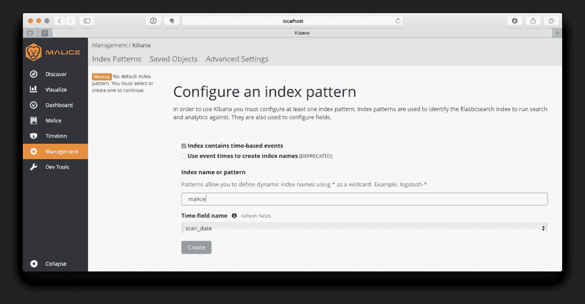
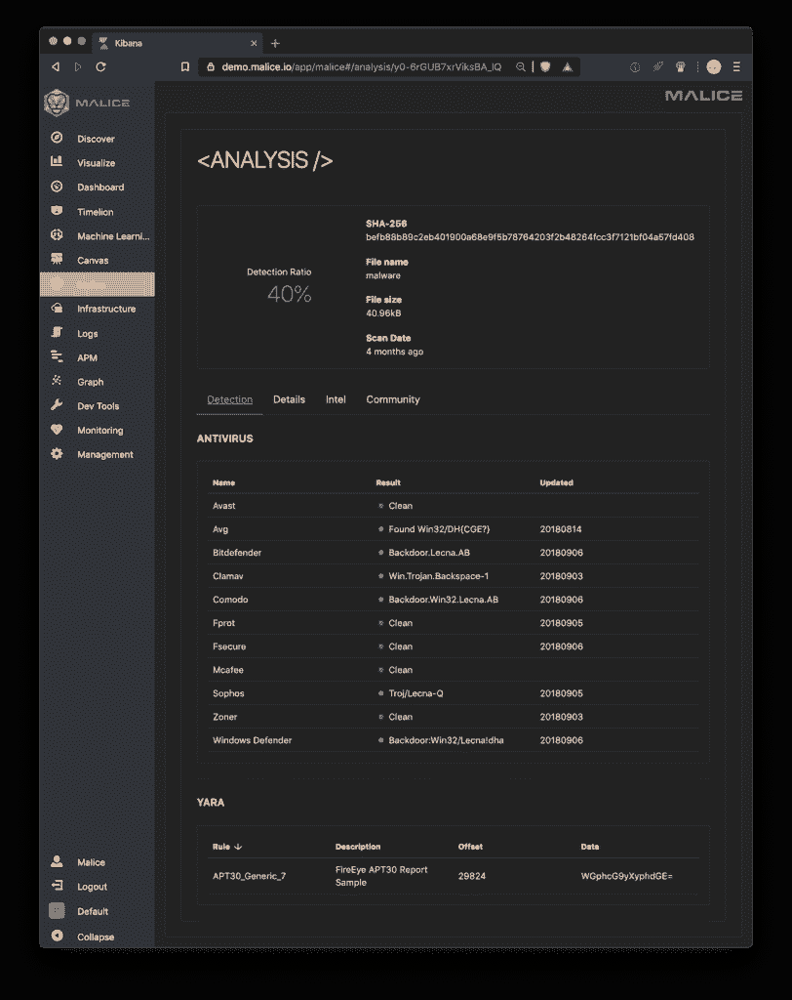

# 恶意:VirusTotal 想要成为——现在是 100%的潮人

> 原文：<https://kalilinuxtutorials.com/malice-virustotal-wanna/>

恶意任务是成为 VirusTotal 的免费开源版本，任何人都可以在任何规模上使用，从独立的研究人员到财富 500 强公司。

**尝试一下**

DEMO:[DEMO . malice . io](http://demo.malice.io)
用户名: malice
**密码:** ecilam

**也可阅读:** [CIRTKit:计算机事件响应团队的工具](https://kalilinuxtutorials.com/cirtkit-computer-incident-response/)

**安装**

$ brew 安装 maliceio/tap/malicie

用法:malicie[OPTIONS]COMMAND[arg…]
开源恶意软件分析框架
版本:0.3.11
作者:
black top-【https://github.com/blacktop】
选项:
–DEBUG，-D 启用调试模式[$ malicie _ DEBUG]
–help，-h show help
–Version，-v print Version
命令:
scan 扫描文件
观看观看文件夹
查找查找文件哈希

**扫描一些恶意软件**

$恶意扫描 evil.malware

**注意:**第一次运行时，恶意软件会下载所有默认插件，这可能需要一段时间才能完成。

Malice 会将结果输出为一个 markdown 表，可以通过管道传输或复制到 results.md 中，在 Github 上看起来会很棒

**启动恶意软件的网页界面**

$恶意麋鹿

您可以打开 Kibana UI 并在这里查看扫描结果:http://localhost(假设您使用的是 Docker for Mac)

*   键入恶意作为索引名称或模式，然后单击创建。
*   现在点击恶意标签，看看吧！！！

**入门(Docker 中的 Docker)**

**安装/更新所有插件**

dock run–RM-v/var/run/docker . sock:/var/run/docker . sock malice/engine 插件更新–全部

**扫描文件**

docker run–RM-v/var/run/docker . sock:/var/run/docker . sock \
-v`pwd`:/malicies/samples \
-e malicies _ VT _ API = $ malicies _ VT _ API \
malicies/引擎扫描样本

[**Download**](https://github.com/maliceio/malice)