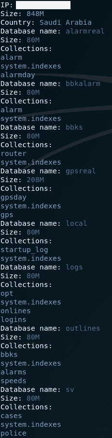
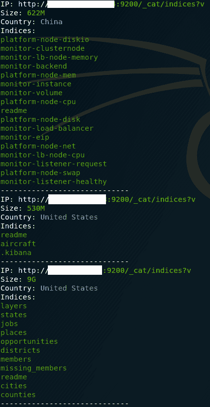

# LeakLooker:使用 Shodan 查找开放数据库

> 原文：<https://kalilinuxtutorials.com/leaklooker-open-databases-shodan/>

LeakLooker 可用于查找开放的 MongoDB、CouchDB 和 Elasticsearch 数据库，它还包括 Kibana 实例。脚本解析来自 Shodan 的结果，排除空的和受损的数据库。一切都以可点击的方式排序和呈现。

**要求**

*   python3
*   Shodan 付费计划，除了 Kibana 搜索

**把你的 Shodan API 密匙放在第 65 行**

pip3 安装 shodan
pip3 安装 colorama
pip3 安装 hurry.filesize

**也可阅读:** [CIRTKit:计算机事件响应团队的工具](https://kalilinuxtutorials.com/cirtkit-computer-incident-response/)

**用途**

root @ kali:~/# python leak looker . py-h
leak looker–查找开放数据库
https://medium.com/@woj_ciech https://github.com/woj-ciech/
用法:leak looker . py[-h][–elastic][–couch db][–MongoDB][–Kibana]
[–FIRST][–LAST LAST]
leak looker
可选参数:
-h，–帮助显示此帮助消息并退出
–elastic Elasti 搜索(默认值:False)
–couch db couch db(t

**例子**

root @ kali:~/# python leak looker . py–MongoDB–couch db–ki Bana–Elastic–前 12 位–后 14 位
[…]
———————————Elastic–第 12 页———————————
找到 25069 个结果
IP:http://xxx.xxx.xxx.xxx:9200/_cat/indices?v
大小:1G
国家:法兰西
指数:
监测-基巴纳-6-2019 . 01 . 08
[…]
IP:http://yyy.yyy.yyy.yyy:9200/_cat/indices?v
大小:144G
国家:中国
指数:
转利
hx_person
[…]
————————————couch db——第 12 页——————————
找到 5932 个结果
IP:http://xxx.xxx.xxx:5984/_utils
国家:澳洲
new _ fron _ db
test _ db
IP:http://yyy.yyy.yyy.yyy:5984/_utils
国家:美国
_ Replicator
_ users
backup _ 2018 09 17
backup _ db【T28 system . indexes
IP:yyy . yyy . yyy . yyy
大小:544M
国家:乌克兰
数据库名称:本地
大小:32M
集合:
启动 _ 日志
数据库名称:ace_stat
大小:256M
集合:
统计 _ 分钟
系统. indexes
统计 _ 小时
统计 _ 每日
[…】 _g=()
国家:德国
IP:http://yyy.yyy.yyy.yyy:5601/app/kibana#/discover?_g=()
国家:美国
IP:http://zzz.zzz.zzz.zzz:5601/app/kibana#/discover?_g=()
国家:英国

**截图**

**免责声明**

该工具仅用于教育目的。我对造成的任何损害不负任何责任。

[**Download**](https://github.com/woj-ciech/LeakLooker)