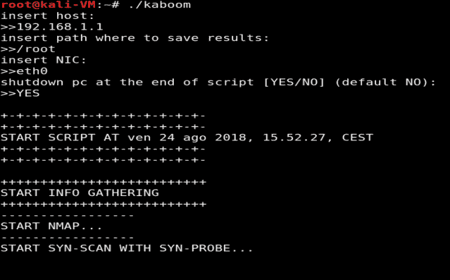
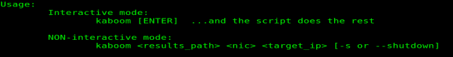
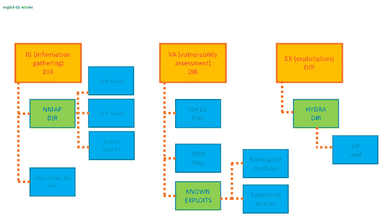

# Kaboom:自动化渗透测试的脚本

> 原文：<https://kalilinuxtutorials.com/kaboom-penetration-test/>

Kaboom 是一个自动化渗透测试的脚本。它为 pentest 的每个阶段执行几项任务:

*   信息收集[nmap-unicornscan]
    *   TCP 扫描
    *   UDP 扫描
*   漏洞评估[nmap-nikto-dir b-searchsploit-msfconsole]
    它测试几种服务:
    *   服务器信息块
    *   嘘
    *   simple network management protocol 简单网络管理协议
    *   简单邮件传输协议
    *   文件传输协议（File Transfer Protocol 的缩写）
    *   一般的文件传输协议
    *   ms-sql
    *   关系型数据库
    *   rdp
    *   超文本传送协议（Hyper Text Transport Protocol 的缩写）
    *   https
    *   更多…它找到 CVE，然后在 exploit-db 或 Metasploit db 上搜索它们。
*   剥削[海德拉]
    *   强力 ssh

**也可阅读: [Pftriage : Python 工具&库，帮助在恶意软件筛选期间分析文件&分析](https://kalilinuxtutorials.com/pftriage-python-malware-analysis/)**

**用途**

它支持两种模式:

*   交互模式:
    kaboom[ENTER]…剩下的由脚本完成

*   非交互模式:
    kaboom<results _ path>NIC>target _ IP>[-s or–shut down]

如果您使用关机选项，它将在任务结束时关闭机器。

如果你想看这个帮助:
kaboom -h(或–help)

**目录层级**

它以这种方式保存命令的结果:

**免责声明**

作者不承担任何责任，也不对该程序造成的任何误用或损害负责。

分发它是希望它有用，但没有任何保证；甚至没有对适销性或特定用途适用性的暗示担保。更多细节请参见 GNU 通用公共许可证。

[**Download**](https://github.com/Leviathan36/kaboom)