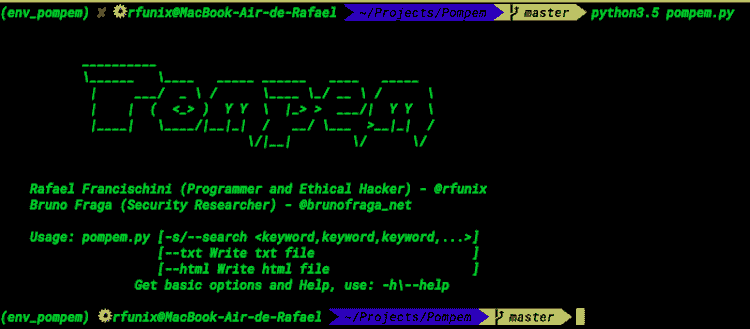
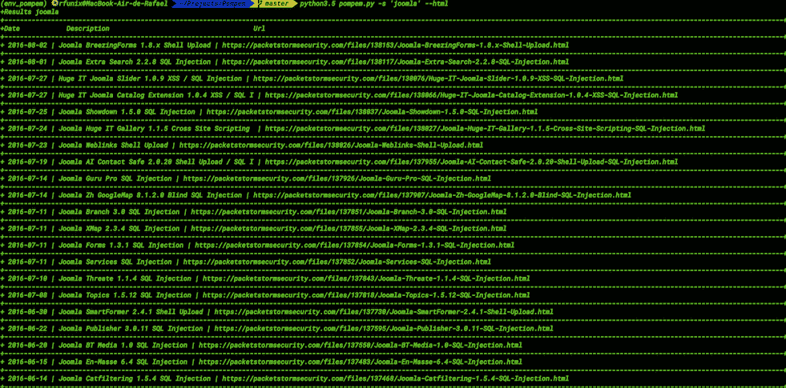
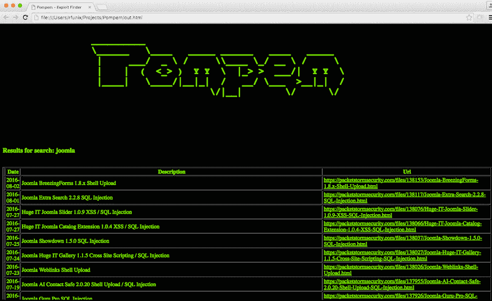

# Pompem:利用数据库漏洞的工具

> 原文：<https://kalilinuxtutorials.com/pompem-exploits-vulnerability-database/>

Pompem 是一个开源工具，旨在自动搜索最重要的数据库中的漏洞和弱点。

用 Python 开发，有一个高级搜索系统，帮助 pentesters 和道德黑客的工作。

在当前版本中，它在 PacketStorm security、CXSecurity、ZeroDay、vulneraners、国家漏洞数据库、WPScan 漏洞数据库中执行搜索。

**又读:** [PF_RING:高速数据包处理框架](https://kalilinuxtutorials.com/pf_ring/)

**截图**



**源代码**

你可以点击这里下载最新的[球](https://github.com/rfunix/Pompem/archive/v0.2.0.tar.gz)或者点击这里下载最新的[球](https://github.com/rfunix/Pompem/archive/v0.2.0.zip)。

您也可以直接从它的 Git 库下载它:

**$ git 克隆 https://github.com/rfunix/Pompem.git**

**依赖关系**

它可以在任何平台上与 Python 3.5 一起开箱即用，并且需要以下软件包:

```
Requests 2.9.1+
```

**安装**

只需一个命令即可启动并运行:

**$ pip 3.5 install-r requirements . txt**

使用 virtualenv 会让你受益匪浅，它会隔离为每个项目安装的包。如果你没用过，简单查一下[这个教程](http://docs.python-guide.org/en/latest/dev/virtualenvs)。

**用途**

要获得关于项目的基本选项和信息列表:

**$ python3.5 pompem.py -h**

**选项:
-h，–帮助显示此帮助信息并退出
-s，–搜索文本进行搜索
–txt 写 txt 文件
–html 写 html 文件**

使用示例:

$ python 3.5 pompem . py-s WordPress
$ python 3.5 pompem . py-s Joomla–html
$ python 3.5 pompem . py-s“Internet Explorer，Joomla，WordPress”——html
$ python 3.5 pompem . py-s FortiGate–txt
$ python 3.5 pompem . py-s ssh，ftp，mysql

[**Download**](https://github.com/rfunix/Pompem)