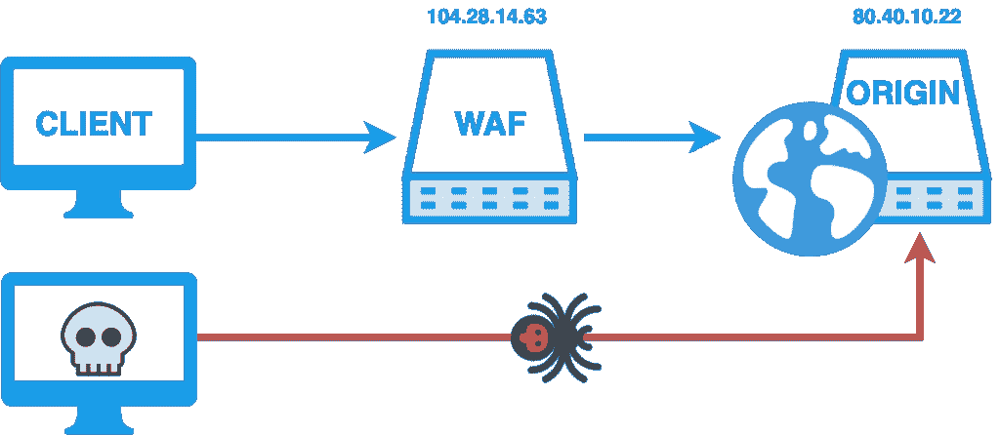
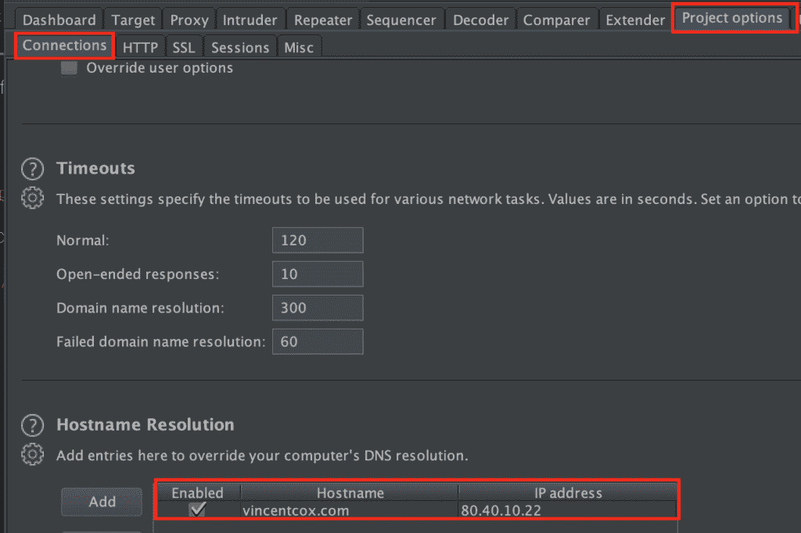

# WAF 旁路:基于 DNS 历史记录的防火墙旁路脚本

> 原文：<https://kalilinuxtutorials.com/waf-bypass-firewall-bypass-script/>

基于 DNS 历史记录的防火墙绕过脚本。该脚本将搜索 DNS A 历史记录，并检查服务器是否回复该域。对 bug 赏金猎人来说很方便。

该脚本将尝试查找:

*   防火墙后服务器的直接 IP 地址，如 Cloudflare、Incapsula、SUCURI …
*   旧服务器仍然运行相同的(不活跃和无人维护)网站，没有收到积极的交通，因为一个 DNS 记录不指向它。因为它是当前活动版本的过时且未经维护的网站版本，所以很容易受到各种攻击。找到 SQL 注入和访问旧网站的数据库，并滥用这些信息在当前和活动的网站上使用可能更容易。

这个脚本(ab)使用 DNS 历史记录。该脚本将搜索旧的 DNS A 记录**和**，检查服务器是否回复该域。

根据可能的源服务器和防火墙的 HTML 响应的相似性，它还输出一个置信度。

该脚本还获取子域名的 IP，因为我自己的经验告诉我，子域名的 IP 有时指向主域名的来源。

**又念:** [Pwndb:搜索泄露的凭据](https://kalilinuxtutorials.com/pwndb-search-leaked-credentials/)

**用途**

像这样使用脚本:

`**bash bypass-firewalls-by-DNS-history.sh -d example.com**`

*   `**-d --domain**`:要绕过的域
*   `**-o --outputfile**`:输出带有 IP 的文件
*   `**-l --listsubdomains**`:额外覆盖的子域列表
*   `**-a --checkall**`:检查晶片旁路的所有子域

**晶片旁路解释**

为了说明我们定义的 WAF 旁路，请看下面的方案。

一个普通的访问者连接到一个网站。最初的请求是一个 DNS 请求，询问网站的 IP，因此客户端的浏览器知道将 HTTP 请求发送到哪里。

对于 cloudflare 或其他公共 WAF 后面的站点，回复包含 WAF 本身的 IP 地址。您的 HTTP 流量基本上通过 WAF 流向原始 web 服务器。

WAF 阻止恶意请求并防止(D)DoS 攻击。但是，如果攻击者知道原始 web 服务器的 IP**和**原始 web 服务器接受来自整个互联网的 HTTP 流量，攻击者可以执行 WAF 旁路:让 HTTP 流量直接到达原始 web 服务器，而不是通过 WAF。

这个脚本试图找到原始 IP，这样您就可以直接连接到原始 web 服务器。像 SQL 注入或 SSRF 这样的攻击不会被过滤掉，并且可以成功地被过滤掉，相反，如果中间有一个 WAF 可以阻止这类攻击。

**进一步开发**

当您找到旁路时，您有两种选择:

*   编辑您的主机文件，这是一个系统范围的解决方案。你可以在`/etc/hosts` (Linux/Mac)或`c:\Windows\System32\Drivers\etc\hosts` (Windows)找到你的主机文件。添加这样一个条目:`80.40.10.22 vincentcox.com`。
*   打嗝套件:

从这一刻起，您的 HTTP 流量直接到达原始 web 服务器。您可以像往常一样执行渗透测试，而您的请求不会被 WAF 阻止。

**如何防范这种脚本？**

*   如果您使用防火墙，请确保只接受通过防火墙的流量。拒绝所有直接来自互联网的流量。例如:Cloudflare 有一个 IP 的[列表，您可以通过 iptables 或 UFW 将其加入白名单。拒绝所有其他流量。](https://www.cloudflare.com/ips/)
*   首先要确保没有旧的服务器还在接受连接并且不可访问

**这个剧本是给谁看的？**

该脚本方便用于:

*   安全审计员
*   网站管理员
*   **臭虫赏金猎人**
*   我猜是\_(ツ)_/的黑帽匠

致谢:[文森特·考克斯](https://twitter.com/vincentcox_be)

[**Download**](https://github.com/vincentcox/bypass-firewalls-by-DNS-history)