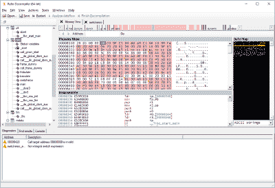
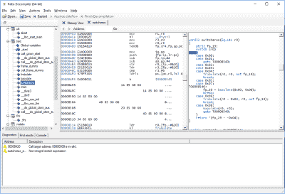

# Reko:一个通用的反编译器

> 原文：<https://kalilinuxtutorials.com/reko/>

Reko (瑞典语:“体面的，乐于助人的”)是一个 C#项目，包含一个机器代码二进制文件的反编译器。这个项目在 GNU 通用公共许可证下是免费的。

该项目由前端，核心反编译器引擎和后端组成，以帮助它实现其目标。在编写本书时，已经有了一个命令行、一个 Windows GUI 和一个 ASP.NET 前端。

反编译器引擎从前端以单独的可执行文件或反编译器项目文件的形式接收输入。

Reko 项目文件包含关于二进制文件的附加信息，有助于反编译过程或格式化输出。然后，反编译器引擎继续分析输入的二进制文件。

Reko 的目标是在最少用户干预的情况下支持各种处理器架构和可执行文件格式的反编译。

请注意，许多软件许可证禁止对其机器代码二进制文件进行反编译或其他逆向工程。仅当您拥有反编译二进制文件的合法权利时(例如，如果二进制文件是您自己的),才使用这个反编译程序。)

**也可阅读: [SecLists:安全测试人员的安全评估伙伴](https://kalilinuxtutorials.com/seclists-security-testers/)**

**安装 Reko**

**Windows 用户**

必须首先在您的计算机上安装以下必备软件:

**。NET 框架 4 . 7 . 2(https://www . Microsoft . com/NET/download/dot NET-Framework-runtime)**

从上面提到的地方下载一个 MSI 文件，然后简单地运行安装程序。

**非 Windows 用户**

必须首先在您的计算机上安装以下必备软件:

**单声道版本 5 . 14 . 0(https://download.mono-project.com/archive/5.14.0/)**

**注意:**我们无法用 mono 的最新版本 5.16.0 测试 Reko，因为该版本中的一个 bug 使其无法构建。这已在 mono/mono#11663 中报告。

安装 mono 后，您可以直接从集成构建服务器下载二进制文件，或者从源代码构建 Reko(参见下面的 Hacking)。

**文档**

为了熟悉 Reko 的各种功能，您可以阅读[用户指南](https://github.com/uxmal/reko/blob/master/doc/guide/reko.md)。如果你对这个项目的内部工作方式感兴趣，请查看 wiki。

**获得支持**

您可以在问题跟踪器上报告您遇到的任何问题或询问任何与 Reko 相关的问题。你也可以试试 Reko Gitter.im 聊天室。Reko 是由志愿者在业余时间的努力建成的，因此相应地调整您的响应时间预期。

**黑客攻击**

要构建 reko，从克隆 https://github.com/uxmal/reko.开始您可以使用 IDE 或命令行来构建解决方案文件 Reko-decompiler.sln

如果您是 IDE 用户，请使用 Visual Studio 2017 或更高版本，或者 MonoDevelop 或更高版本。如果您希望使用命令行进行构建，请使用命令

**msbuild Reko-decompiler . SLN**

(前提是您已经安装了 msbuild)。构建 Reko 所需的所有外部依赖项都包含在外部目录中。

注意:如果您仍然无法编译，请告诉我们，以便我们帮助您解决问题。

如果您对贡献代码感兴趣，请查看探索领域的路线图。Wiki 有更多关于 Reko 项目内部运作的信息。请查阅风格指南。

**与 WiX 相关的警告和错误**

如果没有在开发计算机上安装 WiX 工具集，在 Visual Studio 或 MonoDevelop 中加载解决方案时会收到警告或错误。

您可以安全地忽略这些警告；WiX 工具集仅在制作 MSI 安装程序包时使用，在 MonoDevelop 中甚至不受支持。

如果你已经能够编译这个项目，你就不需要构建一个安装程序:构建过程会将所有必要的文件复制到如果你想用 WiX 工具链构建一个 MSI 安装程序，你可以在这里下载:[http://wixtoolset.org/releases/](http://wixtoolset.org/releases/)

如何启动 Reko？

解决方案文件夹驱动程序包含充当用户界面的可执行文件:目录 WindowsDecompiler 包含 Windows 用户的 GUI 客户端；MonoDecompiler 包含 Mono 用户的 GUI 客户端；CmdLine 是命令行驱动程序。

[**Download**](https://github.com/uxmal/reko)