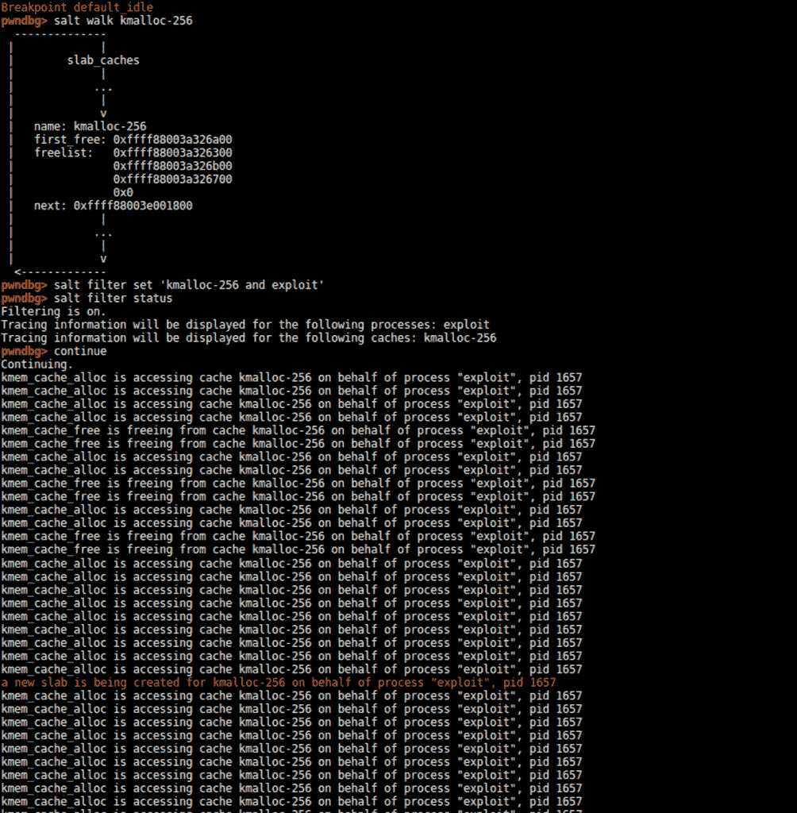

# Linux 内核的 SALT-SLUB 分配器跟踪器

> 原文：<https://kalilinuxtutorials.com/salt/>

欢迎来到 **salt** ，一个逆向学习内核堆内存管理的工具。这对于开发漏洞、调试您自己的内核代码，以及更重要的是，使用内核堆分配并了解其内部工作方式是非常有用的。

这个工具有助于跟踪分配和现代 linux 内核中 SLUB 分配器的当前状态。

它被写成一个 gdb 插件，它允许你*跟踪*和*记录*内存分配和*通过进程名或缓存过滤*它们。该工具还可以转储活动缓存列表并打印相关信息。

这个库还包括一个 *playground* 可加载内核模块，它可以随意触发分配和取消分配，既可以作为调试工具，也可以作为更好地理解分配器如何工作的学习工具。

**也读:[牛肉:浏览器开发框架项目](https://kalilinuxtutorials.com/beef-browser-exploitation-framework/)**

以下是命令的完整列表:

salt help
可能的命令:
filter —通过添加以下参数之一来管理过滤功能
enable —启用过滤。仅显示关于已过滤进程的信息
禁用—禁用过滤。将显示所有进程的信息。
状态—显示当前过滤参数
添加进程/缓存—添加一个或多个过滤条件
移除进程/缓存—移除一个或多个过滤条件
设置—指定复杂过滤规则。支持的语法是“盐过滤器集(缓存 1 或缓存 2)和(进程 1 或进程 2)”。可能会接受一些变化。建议使用“盐过滤器状态”进行检查。对于更简单的规则，使用“盐过滤器添加”。
记录——通过添加以下参数之一
on——启用记录来管理记录功能。关于过滤过程的信息将被添加到历史记录中
关-禁用记录。
显示—显示记录的历史
清除—删除记录的历史
跟踪—重置所有过滤器并为特定进程配置过滤
遍历—浏览所有活动缓存并打印相关信息
遍历 _html —浏览所有活动缓存并以 html 格式生成相关信息
遍历 _json —浏览所有活动缓存并以 json 格式生成相关信息
帮助—显示此消息

这里你可以看到盐的作用:

**鸣谢:** [**亚尼克**](http://www.s3.eurecom.fr/~yanick/) **，** [**法比奥**](http://www.s3.eurecom.fr/~pagabuc/) **，** [**伊曼纽**](https://twitter.com/invano) **，** [**达里奥**](https://twitter.com/_DarioNisi) **，** [**马略**](http://s3.eurecom.fr/~muench/)

[**Download**](https://github.com/PaoloMonti42/salt)