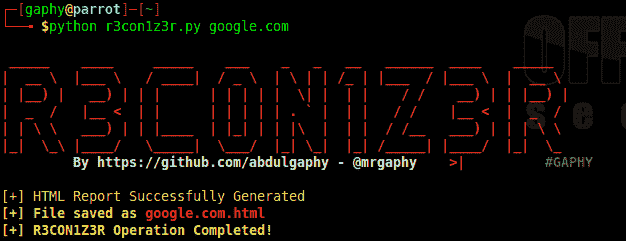

# R3Con1Z3R:一个轻量级的 Web 信息收集工具，具有直观的特性

> 原文：<https://kalilinuxtutorials.com/r3con1z3r/>

R3con1z3r 是一个轻量级的 Web 信息收集工具，具有用 python 编写的直观特性。它提供了一个强大的环境，在这个环境中，基于开源智能(OSINT)的网络足迹可以快速而彻底地进行。

足迹是道德黑客的第一阶段，它收集关于目标的所有可能的信息。

R3con1z3r 是一款具有内置功能的被动侦察工具，包括:HTTP 标头标志、Traceroute、Whois 足迹、DNS 信息、同一服务器上的站点、Nmap 端口扫描器、反向目标和网页上的超链接。

在提供了必要的输入之后，该工具生成 HTML 格式的输出。

**也读作:[SQL scanner——用 Charles 自动 SQL 注入&SQLmap API](https://kalilinuxtutorials.com/sqliscanner-automatic-sql-injection/)**

**截图**

**安装**

r3con1z3r 支持 Python 2 和 Python 3。

$ git 克隆 https://github.com/abdulgaphy/r3con1z3r.git
$ CD R3 con 1 z 3 r
$ pip 安装-r 要求. txt

对于 Linux 用户是可选的

$ sudo chmod +x r3con1z3r.py

**模块**

r3con1z3r 只依赖于 sys 和 requests python 模块。

python 3:$ pi P3 install-r requirements . txt

对于 Windows 上的着色:pip 安装 win_unicode_console colorama

**用途**

python 3 R3 con 1 z 3 r . py[domain.com]

**例题**

在所有操作系统(Linux、Windows、Mac OS X、Android 等)上运行，即 Python 2 环境

python R3 con 1 z 3r . py google.com

要在 python3 环境中运行:

python 3 R3 con 1 z3r . py facebook.com

仅作为可执行 Unix 运行

。/R3 con 1 z 3r . py google.com

[**Download**](https://github.com/abdulgaphy/r3con1z3r)