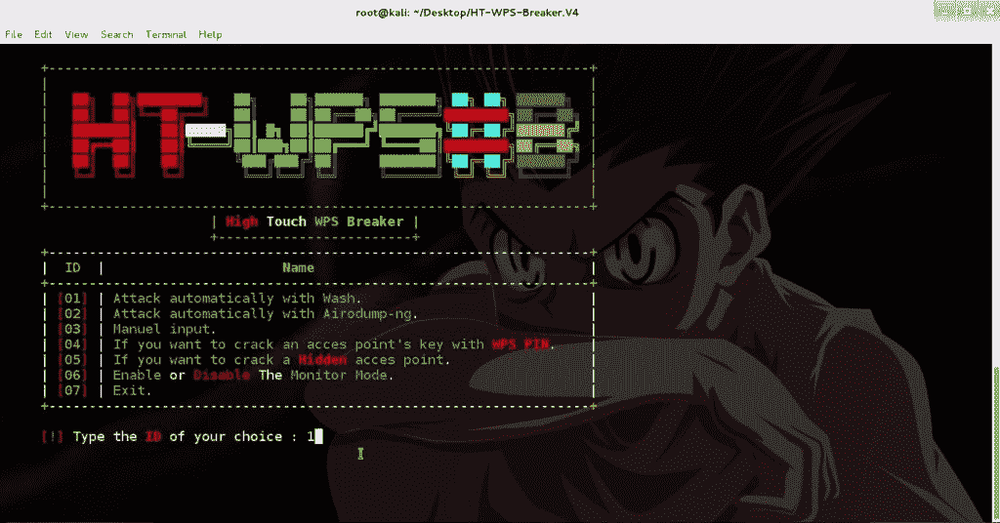
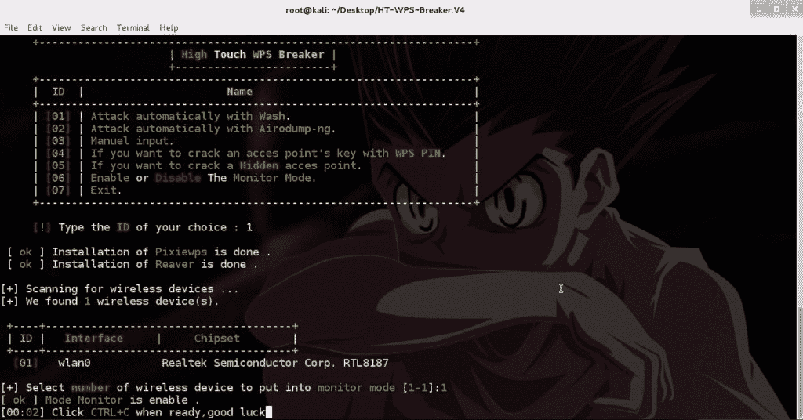
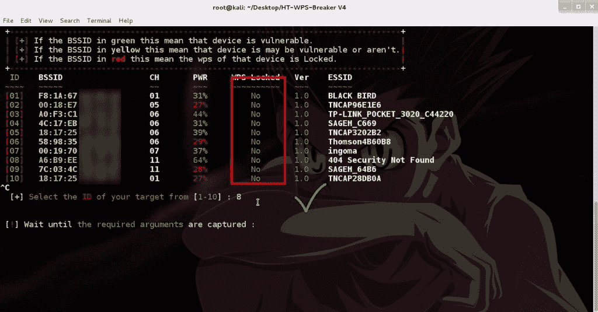
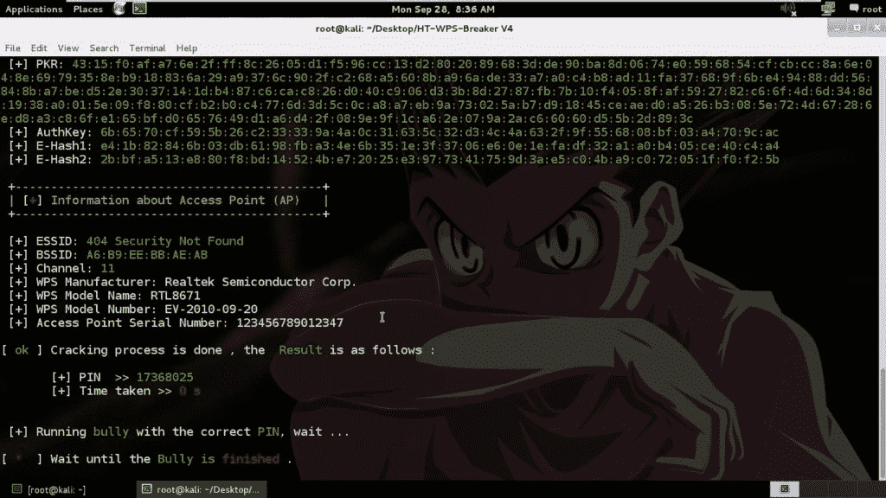
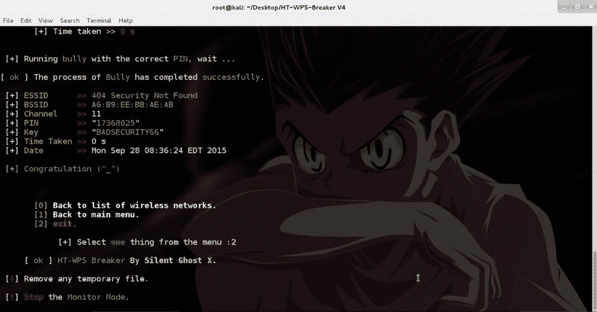

# 高温 WPS 断路器:高接触 WPS 断路器

> 原文：<https://kalilinuxtutorials.com/ht-wps-breaker/>

High Touch **HT-WPS-BREAKER** 是一个基于 bash 脚本语言的小工具，它可以帮助你提取许多易受攻击路由器的 wps pin 并获取密码，在最后我要注意的是 HT-WPS Breaker 在其进程中使用了这些工具:

*   " Piexiewps "
*   “掠夺者”
*   “恶霸”
*   “Aircrack 套件”
*   “洗”

和一些命令，以自动的方式做它的工作，我希望你喜欢我的工具。

**也读作:[电负性:识别错误配置的工具&电子应用中的安全反模式](https://kalilinuxtutorials.com/electronegativity-misconfigurations/)**

**预览**

**下面是如何让脚本工作的方法**

**下面是如何让脚本工作的方法**

*   将 HT-WPS-Breaker.zip 复制到桌面。
*   打开终端。
*   键入以下命令:
    *   cd 桌面
    *   解压缩 HT-WPS-Breaker.zip
    *   CD HT-WPS-破碎机
    *   chmod +x HT-WB.sh
    *   。/HT-WB.sh 或 bash HT-WB.sh

[**Download**](https://github.com/SilentGhostX/HT-WPS-Breaker)