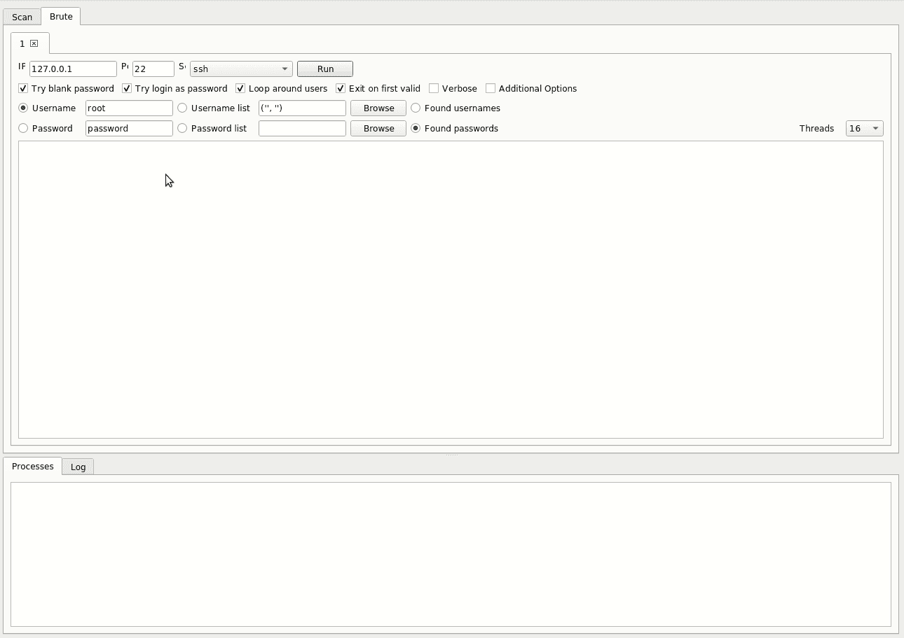

# Legion:一个开源、易于使用、超级可扩展和半自动的网络渗透测试工具

> 原文：<https://kalilinuxtutorials.com/legion-penetration-testing/>

Legion 是 SECFORCE 的 Sparta 的一个分支，是一个开源、易于使用、超级可扩展和半自动的网络渗透测试框架，有助于发现、侦察和利用信息系统。

**特性**

*   使用 NMAP、whataweb、nikto、Vulners、Hydra、SMBenum、dirbuster、sslyzer、webslayer 等软件进行自动侦察和扫描(包含近 100 个自动计划脚本)
*   易于使用的图形界面，带有丰富的上下文菜单和面板，允许 pentesters 快速查找和利用主机上的攻击媒介
*   模块化功能允许用户轻松定制 Legion 并自动调用自己的脚本/工具
*   高度可定制的舞台扫描，用于忍者般的 IPS 规避
*   自动检测 CPE(通用平台枚举)和 CVE(通用漏洞和暴露)
*   项目结果和任务的实时自动保存

**也可阅读-[计算器:Windows](https://kalilinuxtutorials.com/calculator-windows/)T3 附带的一个简单而强大的计算器**

**斯巴达的显著变化**

*   从 Python 2.7 重构到 Python 3.6，消除了过时和无人维护的库
*   升级到 PyQT5，响应速度更快，错误更少，GUI 更直观，包括以下特性:
    *   任务完成估计
    *   一键式扫描 IP、主机名和 CIDR 子网列表
    *   能够清除结果、重新扫描主机和删除主机
    *   格兰 NMAP 扫描选项
*   支持主机名解析和扫描 vhosts/sni 主机
*   修改流程排队和执行例程，以提高应用程序的可靠性和性能
*   通过依赖关系解析和安装例程简化安装
*   实时项目自动保存，以便在发生一些错误，你不会失去任何进展！
*   Docker 容器部署选项
*   由高度活跃的开发团队提供支持

**演示**

**安装**

**传统方法**

假设使用 Ubuntu、Kali 或 Parrot Linux 并安装 Python 3.6。其他依赖项应该会自动安装。在终端内:

**git 克隆 https://github.com/GoVanguard/legion.git
CD 军团
sudo chmod+x start legion . sh
sudo。/startLegion.sh**

**DOCKER 方法**

假设安装了 Docker 和 Xauthority。在终端内:

**git 克隆 https://github . com/go vanguard/legion . git
CD legion/docker
sudo chmod+x run it . sh
sudo。/runIt.sh**

**信用:** [**担保**](https://govanguard.io)

[**Download**](https://github.com/GoVanguard/legion/)