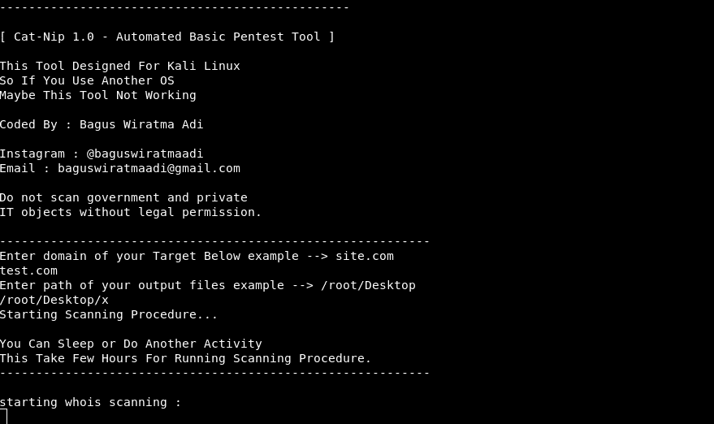
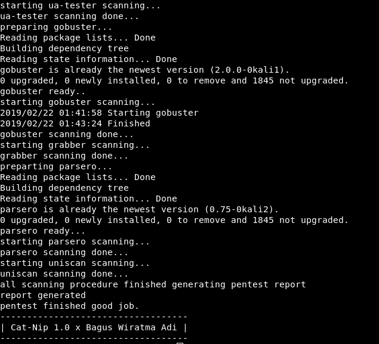
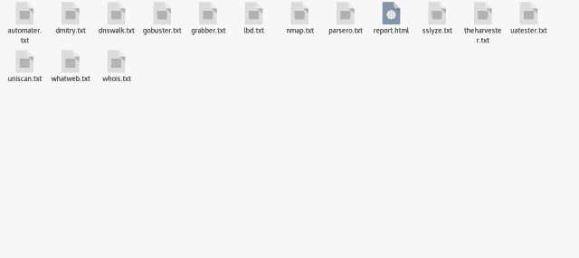
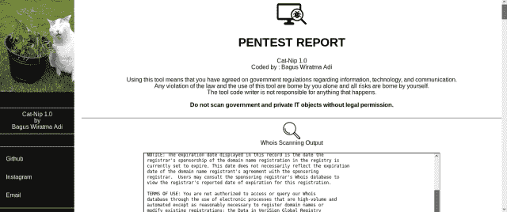
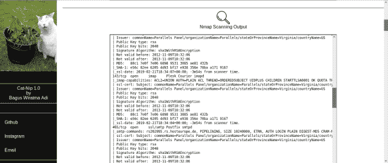

# Catnip:自动化基本 Pentest 工具——为 Kali Linux 设计

> 原文：<https://kalilinuxtutorials.com/catnip-pentest-kali-linux/>

猫薄荷工具将使您的基本 pentesting 任务，如信息收集，审计和报告，所以这个工具将做每一项任务完全自动化。

**使用指南**

下载/克隆猫咬

**~# git 克隆 https://github.com/baguswiratmaadi/catnip**

进入猫夹方向

**~# cd 猫薄荷**

允许猫咬

**~# chmod 777 catnip.sh**

跑猫步

**~#。/catnip.sh**

**用猫夹自动执行的测试工具**

*   Whois Lookup(是查找)
*   DNSmap
*   Nmap
*   德米特里
*   Theharvester
*   负载平衡检测器
*   分析
*   自动售货机
*   Ua 测试仪
*   Gobuster
*   强夺者
*   句法分析程序
*   Uniscan
*   和更多工具

**也可阅读-[军团:开源、易用、超级可扩展的&半自动网络渗透测试工具](https://kalilinuxtutorials.com/legion-penetration-testing/)**

**工具预览**

**Output Result**

**HTML 格式的报告**

**免责声明**

*   未经法律许可，请勿扫描政府和私人 IT 对象。
*   自担风险

[**Download**](https://github.com/baguswiratmaadi/catnip)