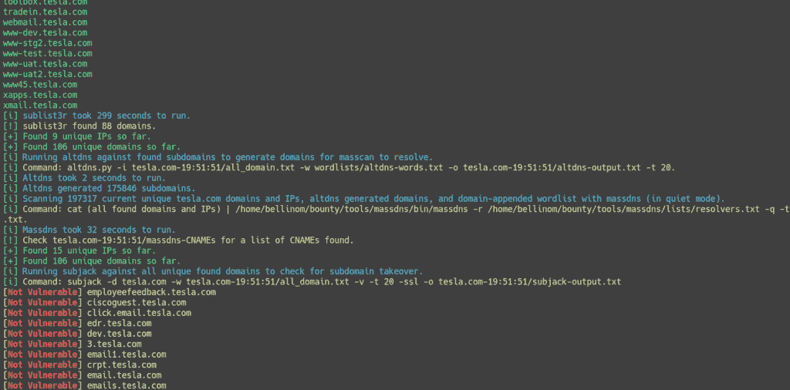
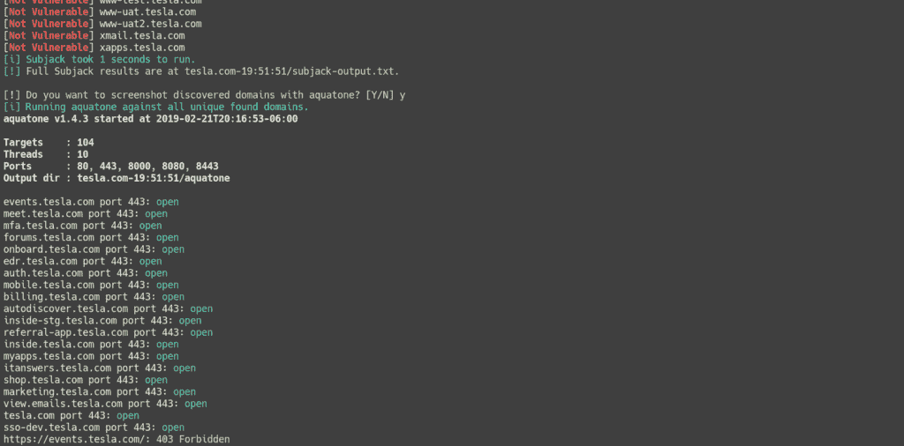
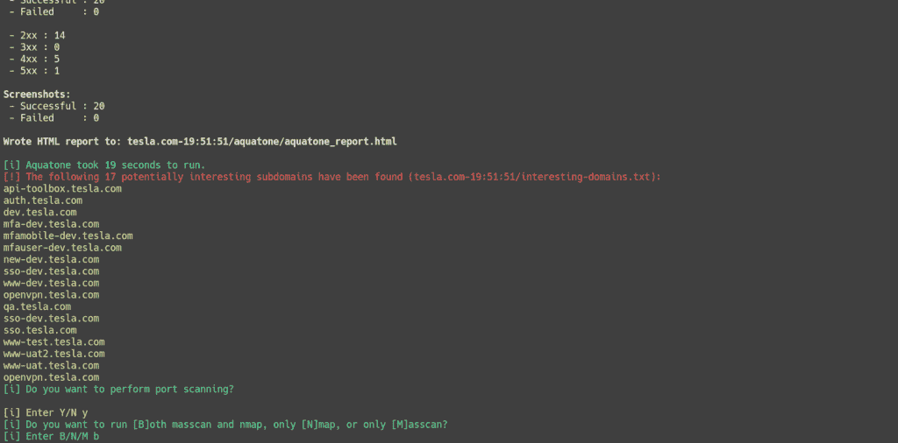
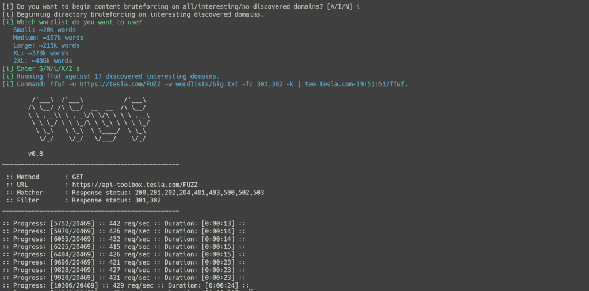
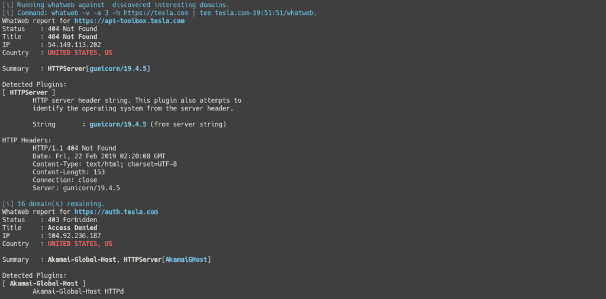
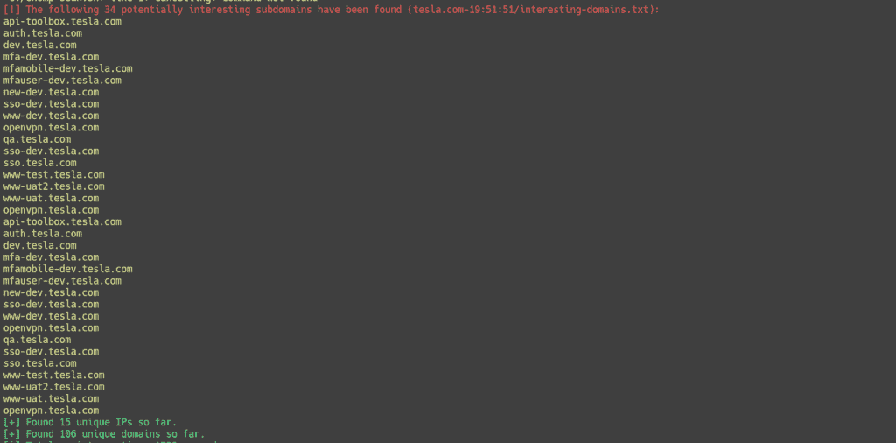

# Chomp-Scan:一个脚本化的工具管道，用于简化 Bug 奖励/渗透测试侦察阶段

> 原文：<https://kalilinuxtutorials.com/chomp-scan/>

Chomp-Scan 是一个脚本化的工具管道，用于简化 bug 奖励/渗透测试侦察阶段，因此您可以专注于 chomp bug。

Chomp Scan 是一个 Bash 脚本，它集合了最快和最有效的工具(以我的观点/经验来看),用于执行漫长且有时乏味的侦察过程。

不再需要查找单词列表和试图记住何时开始扫描以及输出在哪里。Chomp Scan 可以专注于潜在感兴趣的子域名列表，让您节省时间并专注于高价值的目标。它甚至可以在运行结束时通过 Notica 通知你！

新的 Chomp 扫描现在集成了[通知](https://notica.us)，允许你在脚本完成时收到通知。只需访问 Notica 并获得一个唯一的 URL 参数，例如 notica.us/?xxxxxxxx.

通过`-n`标志将参数传递给 Chomp Scan，在电脑或手机的浏览器标签中保持 Notica 页面打开，当 Chomp Scan 完成运行时，您将收到一条消息。不再经常检查/忘记检查那些长时间运行的扫描。

包括了一个有趣的单词列表，如 *dev、test、uat、staging、*等。，并标记包含这些术语的域。这样，如果你愿意，你可以先关注感兴趣的领域。该列表可以定制以满足您自己的需求，或者通过`-X`标志替换为不同的文件。

Chomp 扫描在多种模式下运行。新的[配置文件](https://github.com/SolomonSklash/chomp-scan/wiki/Configuration-File)是运行扫描的推荐方式，因为它允许对工具和设置进行最细粒度的控制。

包括标准 CLI 模式，其功能与任何其他 CLI 工具相同。如果您不想查找参数或担心设置多个参数，可以使用引导式交互模式和非交互模式。

**也可阅读:[cute it——IP 混淆器使一个恶意的 IP 变得更可爱一点](https://kalilinuxtutorials.com/cuteit-ip-obfuscator/)**

**配置文件**

Chomp Scan 现在提供了一个配置文件选项，可以更精确地控制要运行的工具，而且没有传递大量 CLI 参数那么麻烦。可以通过传递`-L`标志来使用它。一个[示例配置](https://github.com/SolomonSklash/chomp-scan/blob/master/config)文件作为模板包含在此 repo 中，完整的配置文件细节可在[配置文件](https://github.com/SolomonSklash/chomp-scan/wiki/Configuration-File) wiki 页面获得。

**Wordlists**

使用了各种各样的单词表，用于子域强制和内容发现。丹尼尔·米斯勒的[秒列表](https://github.com/danielmiessler/SecLists)被大量使用，杰森·哈德克斯的[列表](https://gist.github.com/jhaddix)也是如此。通过传入自定义单词列表或使用内置的命名参数列表之一，可以使用不同的单词列表。更多细节见[词汇表](https://github.com/SolomonSklash/chomp-scan/wiki/Wordlists)维基页面。

**安装**

克隆这个 repo 并运行附带的`installer.sh`脚本。确保在运行安装程序后在您的终端中运行`source ~/.profile`,以便将 Go 二进制路径添加到您的＄PATH 变量中。

然后运行 Chomp 扫描。如果您正在使用 zsh、fish 或其他 shell，请确保`~/go/bin`位于您的路径中。更多细节，请参见[安装](https://github.com/SolomonSklash/chomp-scan/wiki/Installation)维基页面。

**用途**

Chomp 扫描总是运行子域枚举，因此通过`-u`标志需要一个域。域不应包含方案，例如 http://或 https://。默认情况下，总是使用 HTTPS。这可以通过传递`-H`标志更改为 HTTP。单词列表是可选的，如果没有提供，则使用内置的短列表(20k 单词)。

其他扫描阶段是可选的。内容发现可以采用可选的单词列表，否则默认为内置的短(22k 单词)列表。

扫描的最终结果存储在输出目录的三个文本文件中。所有找到的唯一域，无论是否解析，都存储在`all_discovered_domains.txt`中，所有发现的唯一 IP 都存储在`all_discovered_ips.txt`中。

所有解析为 IP 的域都存储在`all_resolved_domains.txt`中。从 v4.1 开始，这些域用于生成感兴趣的域列表和所有域列表，然后可以用于内容发现和信息收集。

**Chomp-Scan . sh-u example.com-a d short-cC large-p-o path/to/directory
Chomp 扫描的用法:
-u domain
(必选)要扫描的域名。这不应该包括方案，例如 https://或 http://。
-L 配置文件
(可选)配置文件的路径。这可以用来对运行什么工具提供更细粒度的控制。
-d 单词列表
(可选)用于子域枚举的单词列表。可以使用三种内置列表，短列表、长列表和大列表，以及自定义单词列表的路径。默认值为 short。
-c
(可选)启用内容发现阶段。如果没有提供，此选项的单词列表默认为 short。
-C 单词表
(可选)用于内容发现的单词表。可以使用五个内置列表，small、medium、large、xl 和 xxl，以及自定义单词列表的路径。默认值为小。
-s
(可选)使用 Aquatone 启用截图。
-i
(可选)启用信息收集阶段，使用 subjack、CORStest、S3Scanner、bfac、whatweb、wafw00f 和 nikto。
-p
(可选)使用 masscan(以 root 用户身份运行)和 nmap 启用端口扫描阶段。
-I
(可选)启用交互模式。这允许您交互式地选择某些工具选项和输入。这不能与-D.
-D
(可选)启用默认非交互模式一起运行。该模式使用预先选择的默认值，不需要用户交互或选项。这不能与-I.
选项一起运行:子域枚举单词列表:short。
内容发现词表:小。
Aquatone 截图:是的。端口扫描:是。
信息收集:是。
要扫描的域:所有发现的唯一域。
-b 词表
(可选)设置自定义域名黑名单文件。
-X 单词表
(可选)设置自定义兴趣单词表。
-o 目录
(可选)设置自定义输出目录。它必须存在并且是可写的。
-a
(可选)使用所有唯一发现的域进行扫描，而不是感兴趣的域。这不能与-A.
-A
(可选，默认)一起使用仅扫描感兴趣的发现域，而不是所有发现的域。这不能与-a.
-H
(可选)使用 HTTP 而不是 HTTPS 连接到站点。
-h
(可选)显示该帮助页面。**

**未来**

Chomp Scan 仍在积极开发中，因为我自己用它来查找 bug，所以我打算在遇到新的特性和工具时继续添加它们。欢迎新的工具建议、反馈和请求。可能增加的内容:

*   HTML 报告的生成，类似于 aquatone 所提供的

**截图**

*   
*   
*   
*   
*   
*   

[**Download**](https://github.com/SolomonSklash/chomp-scan)