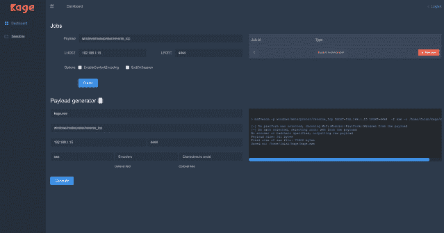
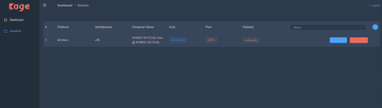
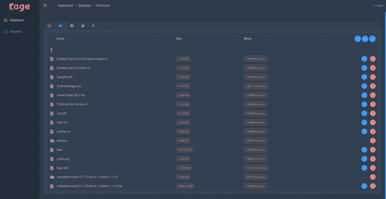

# kage–Metasploit 仪表和会话处理程序的图形用户界面

> 原文：<https://kalilinuxtutorials.com/kage-metasploit-session-handler/>

**Kage (ka-geh)** 是一个受 AhMyth 启发的工具，专为 Metasploit RPC Server 设计，用于与 meterpreter 会话交互并生成有效负载。
目前只支持`windows/meterpreter` & `android/meterpreter`

**先决条件**

*   Metasploit-framework 必须安装在您的路径中:
    *   Msfrpcd
    *   Msfvenom
    *   Msfdb

**也可阅读-[军团:开源、易用、超级可扩展的&半自动网络渗透测试工具](https://kalilinuxtutorials.com/legion-penetration-testing/)**

**安装**

你可以从[这里](https://github.com/WayzDev/Kage/releases)安装 Kage 二进制文件。

对于从源代码运行应用程序的开发人员:

**下载源代码** git 克隆 https://github.com/WayzDev/Kage.git
**安装依赖项并运行 kage** cd Kage
yarn #或 npm 安装
yarn run dev #或 npm run dev
**构建项目** yarn run build

```
electron-vue officially recommends the yarn package manager as it handles dependencies much better and can help reduce final build size with yarn clean.

```

**截图**

*   
*   
*   
*   

**视频教程**

[https://player.vimeo.com/video/319338721?dnt=1&app_id=122963](https://player.vimeo.com/video/319338721?dnt=1&app_id=122963)

**免责声明**

我将不对由于使用该工具而造成的任何直接或间接损害负责，它仅用于教育目的。

**鸣谢:**[**@ iFalah**](https://twitter.com/ifalah_)

**[**Download**](https://github.com/WayzDev/Kage)**