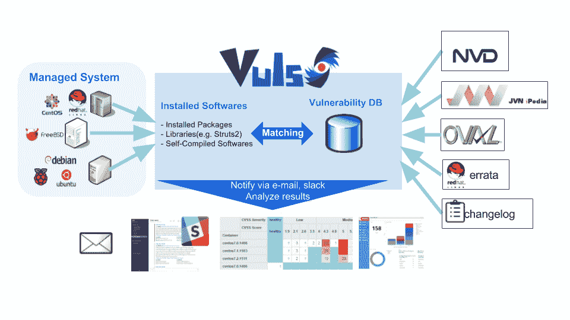
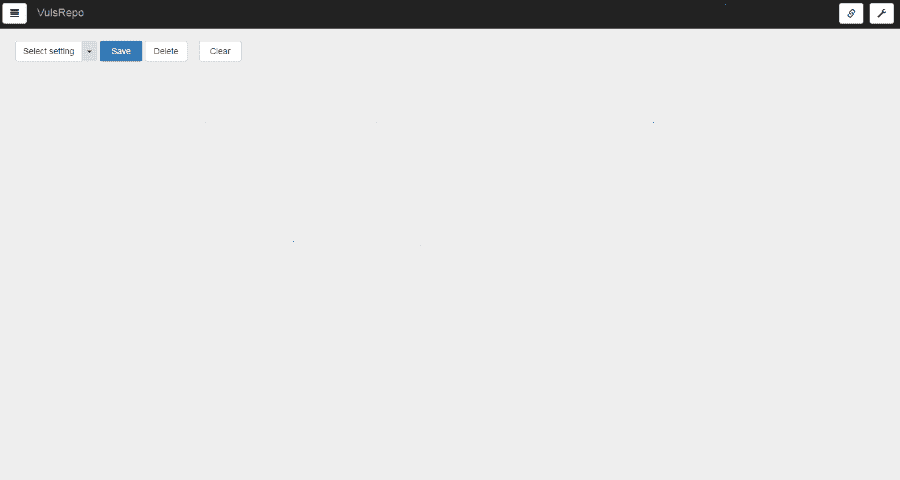
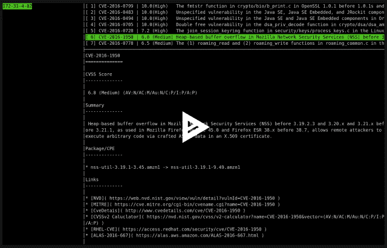
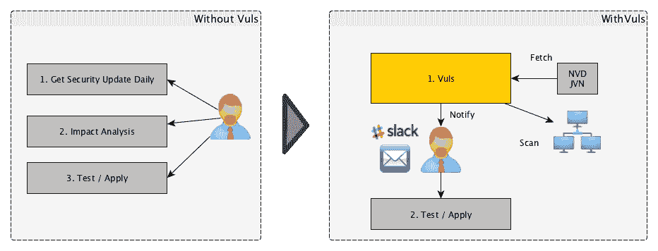
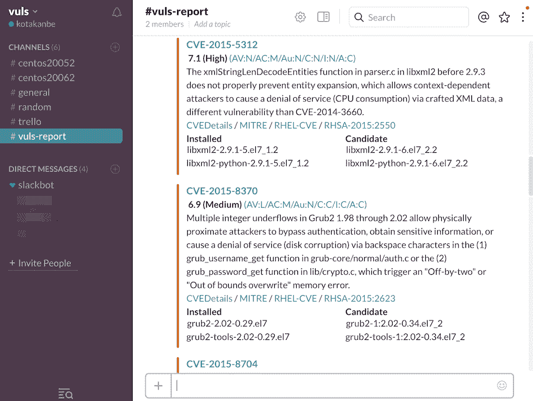

# Vuls:用于 Linux/FreeBSD 的漏洞扫描器，无代理，用 Go 编写

> 原文：<https://kalilinuxtutorials.com/vuls-vulnerability-scanner/>

Vuls 是一个针对 Linux/FreeBSD 的漏洞扫描器，无代理，用 golang 编写。

*   

*   

**也可阅读-[Turbinia:数字取证工具的自动化和规模化](https://kalilinuxtutorials.com/turbinia-digital-forensics-tools/)**

对于系统管理员来说，必须每天执行安全漏洞分析和软件更新可能是一种负担。为了避免生产环境中的停机，系统管理员通常选择不使用软件包管理器提供的自动更新选项，而手动执行更新。这导致了以下问题。

*   系统管理员必须时刻注意 NVD(国家漏洞数据库)或类似数据库中任何新漏洞。
*   如果服务器上安装了大量软件，系统管理员可能无法监控所有软件。
*   执行分析以确定受新漏洞影响的服务器的成本很高。在分析过程中忽略一两个服务器的可能性是存在的。

Vuls 是为解决上述问题而创建的工具。它具有以下特点。

*   通知用户与系统相关的漏洞。
*   通知用户受影响的服务器。
*   漏洞检测是自动完成的，以防止任何疏忽。
*   使用 CRON 或其他方法定期生成报告。管理脆弱性。

*   

我们有一个松散的团队。[加入 slack 团队](http://goo.gl/forms/xm5KFo35tu)推特: [@vuls_en](https://twitter.com/vuls_en)

**快速扫描和深度扫描**

**快速扫描**

*   无根权限扫描，无依赖性
*   扫描目标服务器上几乎没有负载
*   没有互联网接入的离线模式扫描。(红帽、CentOS、OracleLinux、Ubuntu、Debian)

**快速根扫描**

*   以 root 权限扫描
*   扫描目标服务器上几乎没有负载
*   使用 yum-ps 检测受更新影响的进程(RedHat、CentOS、Oracle Linux 和 Amazon Linux)
*   使用 debian-goodies (Debian 和 Ubuntu)的 checkrestart 检测之前更新过但没有重启的进程
*   没有互联网接入的离线模式扫描。(RedHat、CentOS、OracleLinux、Ubuntu、Debian)

深度扫描

*   以 root 权限扫描
*   分析 Changelog Changelog 有版本更改的历史记录。安全问题修复后，会列出相关的 CVE ID。通过解析 changelog 并分析服务器上已安装的软件版本和该软件的最新版本之间的更新，可以创建一个需要修复的所有漏洞的列表。
*   有时在扫描目标服务器上加载

**远程扫描和本地扫描**

**远程扫描**

*   用户只需要设置一台通过 SSH 连接到其他目标服务器的机器

**本地扫描**

*   如果不希望中央 Vuls 服务器通过 SSH 连接到每个服务器，可以在本地扫描模式下使用 Vuls。

**动态分析**

*   可以通过 SSH 连接并执行命令来获取服务器的状态。
*   Vuls 会在扫描目标服务器更新内核等时发出警告。但不能重启它。

**扫描非操作系统包的漏洞**

*   [基于通用平台枚举(CPE)的扫描](https://vuls.io/docs/en/usage-scan-non-os-packages.html#how-to-search-cpe-name-by-software-name)
    *   NW 设备、中间件、编程语言库和漏洞框架
*   与 [GitHub 安全警报](https://vuls.io/docs/en/usage-scan-non-os-packages.html#usage-integrate-with-github-security-alerts)集成
*   与 [OWASP 相关性检查](https://vuls.io/docs/en/usage-scan-non-os-packages.html#usage-integrate-with-owasp-dependency-check-to-automatic-update-when-the-libraries-are-updated-experimental)集成

**杂项**

*   无损检验
*   在 AWS 上扫描之前，不需要*预授权*
    *   Vuls 与持续集成配合得很好，因为测试可以每天运行。这使您可以非常快速地找到漏洞。
*   配置文件模板的自动生成
    *   使用 CIDR 自动检测服务器集，生成配置文件模板
*   可以发送电子邮件和延期通知(支持日语)
*   扫描结果可在附件软件、终端上的 TUI 查看器或 Web UI 上查看( [VulsRepo](https://github.com/usiusi360/vulsrepo) )。

* * *

【Vuls 不做的事

*   Vuls 不会更新易受攻击的软件包。

**信用:kotakanbe**

[**Download**](https://github.com/future-architect/vuls)