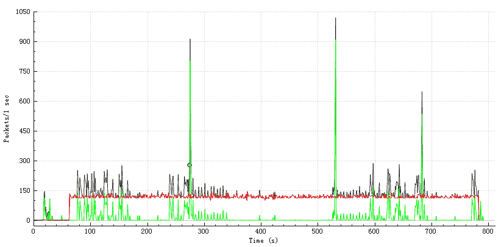
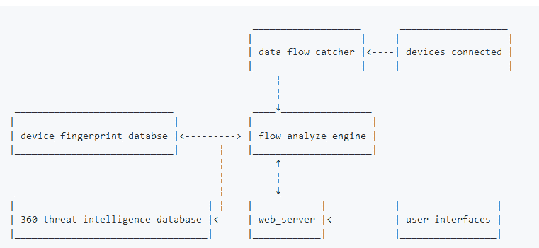

# 物联网家庭卫士:物联网设备中恶意行为检测工具

> 原文：<https://kalilinuxtutorials.com/iot-home-guard/>

物联网家庭卫士是一个帮助人们发现智能家居设备中的恶意软件的项目。

对于用户来说，该项目可以帮助检测受损的智能家居设备。对于安全研究人员来说，它在网络分析和恶意行为检测中也很有用。

2018 年 7 月，我们完成了第一个版本。随着用户体验的改善和可识别设备数量的增加，我们将在 2018 年 10 月前完成第二版。

第一代是基于 Raspberry Pi 的硬件设备，带有无线网络接口控制器。我们将在第二代定制新的硬件。

在必要的环境配置之后，可以用笔记本电脑中的软件部分来设置该系统。软件部分可在 software_tools/中获得。

**另请阅读-[你应该使用 PDF 而不是 Word 的 7 个理由](https://kalilinuxtutorials.com/pdf-over-word/)**

**原理证明**

我们的方法基于对恶意网络流量的检测。植入恶意软件的设备将与远程服务器通信，触发远程外壳或向服务器发送音频/视频。

下图显示了植入窥探恶意软件的设备的网络流量。

*   **红线:**设备和远程间谍服务器之间的流量。
*   **绿线:**设备正常通行。
*   **黑线:**TCP 流量总和。

**模块**

*   AP 模块和数据流捕捉器:捕捉网络流量。
*   流量分析引擎:从网络流量中提取特征，并与设备指纹数据库进行比较。
*   设备指纹数据库:基于白名单的每个设备的正常网络行为。调用 360 威胁情报数据库的 API([https://ti.360.net/](https://ti.360.net/))。
*   Web 服务器:第二代可能会有 web 服务器。

**程序**

该工具作为接入点工作，通过被测设备手动连接，将网络流量发送到流量分析引擎进行特征提取。

流量分析引擎将特征与设备指纹数据库中的条目进行比较，以识别设备类型和可疑的网络连接。设备指纹数据库是基于白名单的每个设备的正常行为的集合。

此外，将在奇虎 360 的威胁情报数据库中搜索特征，以识别恶意行为。web 服务器被设置为用户界面。

**效力**

在我们的研究中，我们使用 IoT-Implant-Toolkit 成功地在八个设备中植入了木马，包括智能扬声器、相机、行车记录仪和移动翻译。

下面是一个演示视频:

我们收集了这些设备的特征，并运行了物联网家庭卫士。所有植入木马的设备都被检测到。

我们相信，在补充指纹数据库后，更多设备的恶意行为可以被高精度地识别。

[**Download**](https://github.com/arthastang/IoT-Home-Guard)