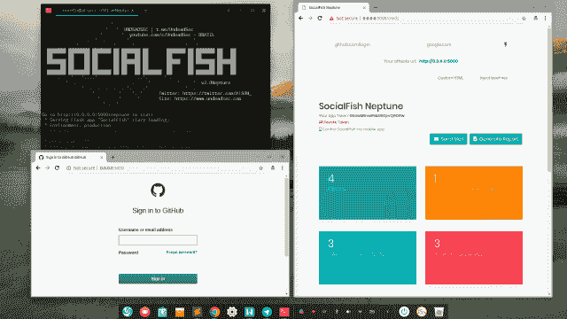

# SocialFish:教育钓鱼工具和信息收集器

> 原文：<https://kalilinuxtutorials.com/socialfish-phishing-tool/>

一款遥控 SocialFish 的应用。这个应用程序是一个远程控制应用程序的开源项目，它不独立工作。

**也可阅读—[PFQ:多核架构的功能网络框架](https://kalilinuxtutorials.com/pfq-functional-network-framework/)**

**设置**

费尔南多·h·e·贝林坎塔在 16 小时前编辑了这一页 8 次修改

**先决条件**

Python 3.6 或>
pip3

**PYTHON 3 先决条件**

*   瓶
*   彩色光
*   sqlite3
*   flask _ 登录
*   shutil
*   关于
*   操作系统（Operating System）
*   秘密
*   python-nmap
*   smtplib
*   电子邮件
*   playtex
*   qrc 码

**克隆**

$ git 克隆 https://github.com/UndeadSec/SocialFish.git

**设置 PYTHON3 & PIP3**

$ sudo apt-get 安装 python 3 python 3-pip python 3-dev-y

*   阅读更多关于 Python 3:https://www.python.org 的内容
*   阅读更多关于 Python 包安装程序(PIP):https://pip.pypa.io/en/stable/

**设置 PYTHON3 要求**

$ cd SocialFish
$ python3 -m pip 安装要求. txt

**更改应用密钥**

文件:SocialFish/core/config.py

应用程序密钥= "

**用途**

运行 SF **和**设置您的网络登录

$ CD social fish
$ python 3 social fish . py 您的用户您的密码

##### 浏览到 [http://0.0.0.0:5000](http://0.0.0.0:5000)

**免责声明**

仅用于教育目的

it 的使用完全是最终用户的责任。开发人员不承担任何责任，也不对本程序造成的任何误用或损坏负责。

“否认。在任何情况下，版权所有者或贡献者都不对任何直接、间接、附带、特殊、惩戒性或后果性损害(包括但不限于替代商品或服务的采购；用途、数据或利润的损失；或业务中断)以及任何责任理论，无论是合同责任、严格责任还是因使用本软件而产生的侵权行为(包括疏忽或其他)，即使已被告知可能发生此类损害。”取自[牌照](https://github.com/UndeadSec/SocialFish/blob/master/LICENSE)。

[**Download**](https://github.com/UndeadSec/SocialFish/wiki)