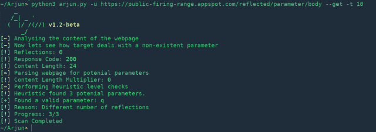
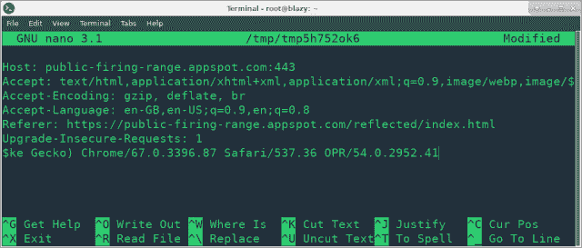

# Arjun : HTTP 参数发现套件

> 原文：<https://kalilinuxtutorials.com/arjun-http-parameter/>



**也可阅读—[PFQ:多核架构的功能网络框架](https://kalilinuxtutorials.com/pfq-functional-network-framework/)**

**用途**

```
Note: Arjun doesn't work with python < 3.4
```

**发现参数**

要查找 GET 参数，只需执行以下操作:

python 3 Arjun . py-u https://api.example.com/endpoint–获取

类似地，使用–post 来查找 POST 参数。

**多线程**

Arjun 默认使用 2 个线程，但是你可以根据你的网络连接来调整它的性能。

python 3 Arjun . py-u https://api.example.com/endpoint–get-t 22

**请求之间的延迟**

您可以使用-d 选项延迟请求，如下所示:

python 3 Arjun . py-u https://api.example.com/endpoint–get-d 2

**包括已有的数据**

假设您有一个 API 密匙，需要在每个请求中发送，告诉 Arjun 您可以使用–include 选项，如下所示:

python 3 Arjun . py-u https://api.example.com/endpoint–get–include ' API _ key = xxxxx '
或
python 3 Arjun . py-u https://api.example.com/endpoint–get–include ' { " API _ key ":" xxxxx " } '

要包含多个参数，请使用&分隔它们，或者将它们作为有效的 json 对象传递。

**JSON 输出**

您可以使用-o 将结果保存为 JSON 格式，如下所示:

python 3 Arjun . py-u https://api.example.com/endpoint–get-o result . JSON

**添加 HTTP 头**

使用–headers 开关将打开一个交互式提示，您可以在其中粘贴标题。按 Ctrl + S 保存，按 Ctrl + X 继续。



信用: [@SecLists](https://github.com/danielmiessler/SecLists)

[**Download**](https://github.com/s0md3v/Arjun/)