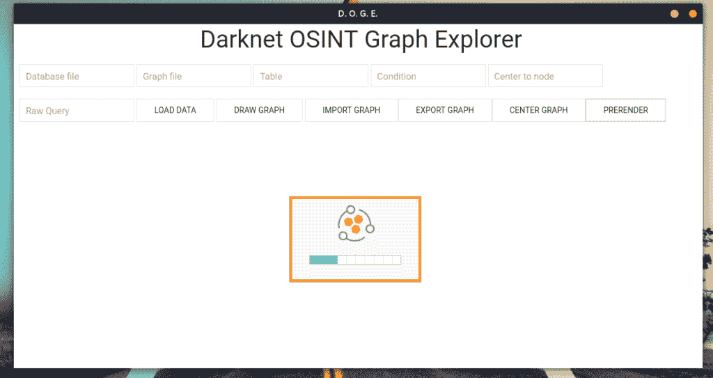
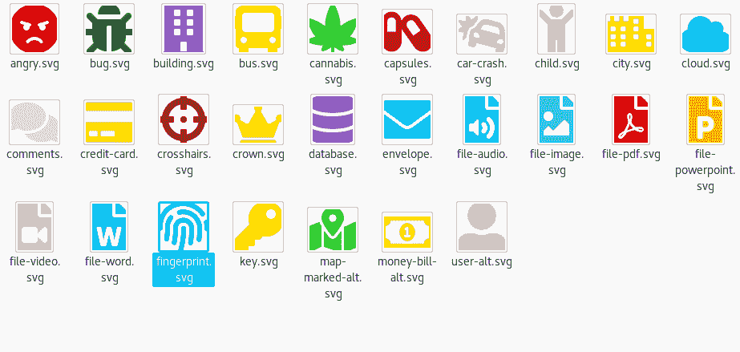
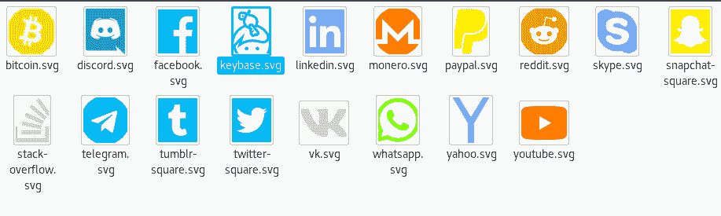
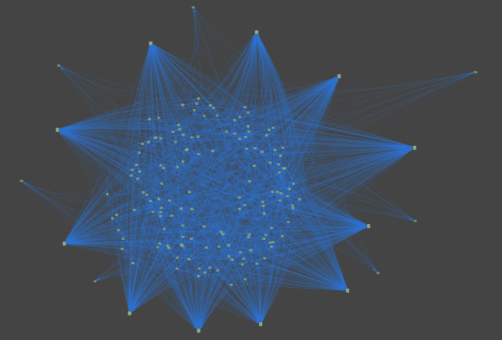
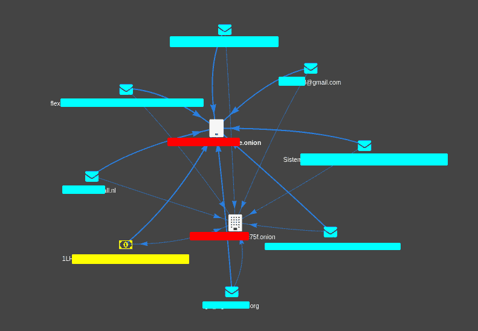
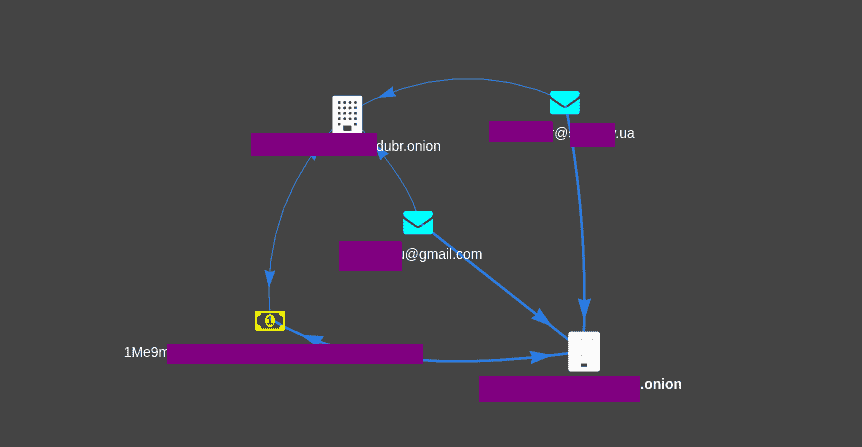
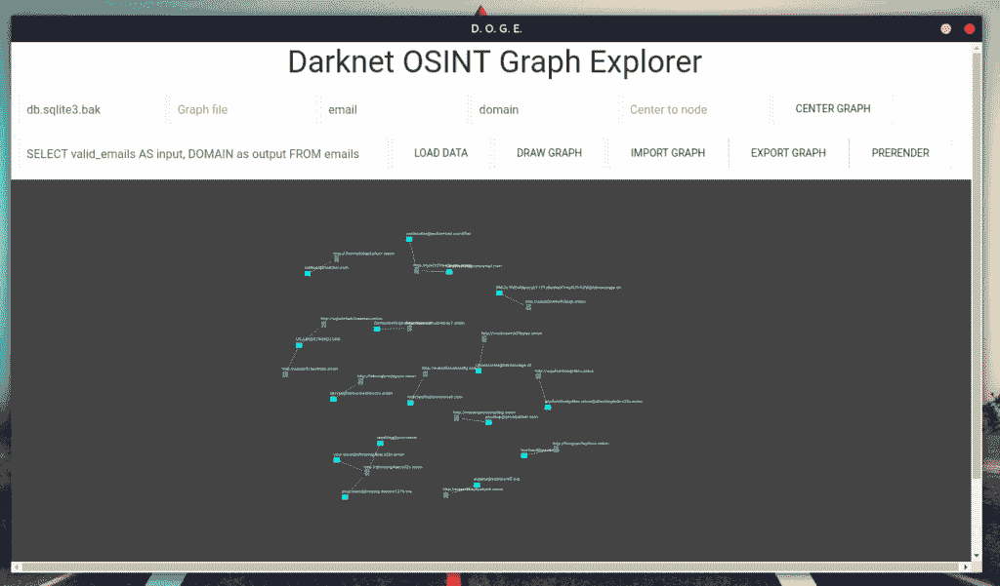

# dogue:dark net osint 图形浏览器

> 原文：<https://kalilinuxtutorials.com/doge-darknet-osint/>

DOGE 是一个 darknet Osint 图形浏览器，它仍处于开发阶段，你应该将它用于 Darknet OSINT 转换。

查询原型:从 some_table 中选择 DISTINCT custom_column_name 作为输入，another_custom_name 作为输出，显然可以添加 WHERE、ORDER BY 等其他选项。

**也可阅读-[Metaforge:一个通过标签过滤的 OSINT 元数据分析工具&创建报告](https://kalilinuxtutorials.com/metaforge/)**

**操作指南**

*   `**Database file**`:数据库的文件名(sqlite3)，例如:db.sqlite3
*   `**Graph file**`:没用(现在跟现在一样)
*   `**Icon From**`:“发件人”实体的类型(email - >域，email 是“发件人”，域是“收件人”)，所以同`**Icon To**`
*   `**Center to node**`:将节点 id 放在这里，然后点击`**Center Graph**`将图表居中到该特定节点 id
*   按照上面的原型，在这里写下你将用来从数据库中检索数据的查询
*   添加数据，但不要画图，你可以用它从各种数据库导入数据，当所有数据都导入后，再画图
*   `**Draw Graph**`:绘制带边的节点
*   `**Import Graph**`:没用(现在跟现在一样)
*   `**Export Graph**`:没用(现在跟现在一样)
*   `**Prerender**`:在“预渲染”过程完成之前不显示图形，这应该在需要绘制 100 个节点的图形时使用，可以随意更改参数:
    *   第一个参数，`**precomputeGraph()**`，在`**pages/graph_1.html**`中；
    *   在同一文件中，第 246 行和第 247 行。

**自定义图标**

每个图标都来自字体牛逼，我只是换了颜色。

**截图**

*   
*   
*   
*   

[**Download**](https://github.com/pielco11/DOGE)