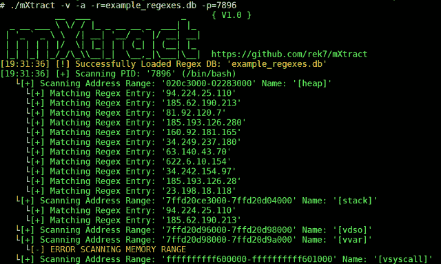
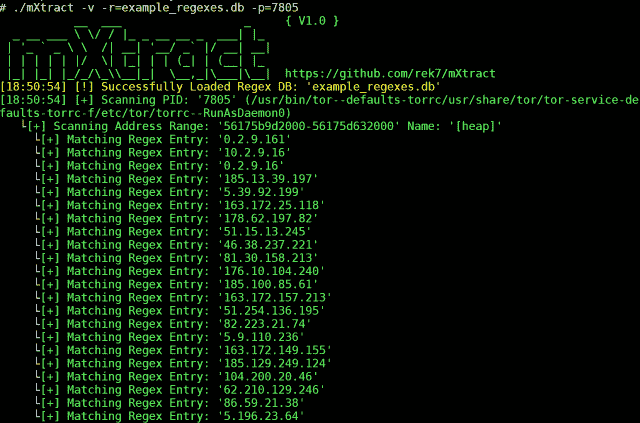
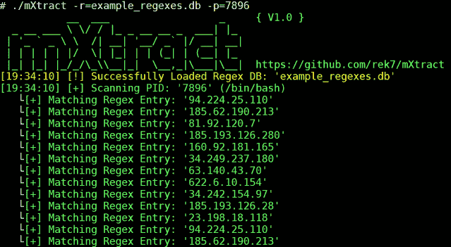

# m xtract–内存提取器和分析器

> 原文：<https://kalilinuxtutorials.com/mxtract-memory-extractor-analyser/>

MXtract 是一个基于开源 Linux 的工具，用于分析和转储内存。它是作为一种攻击性的渗透测试工具开发的，可以用来使用正则表达式扫描内存中的私钥、IP 和密码。记住你的结果和你的正则表达式一样好。

在大多数 Linux 环境中，用户可以访问进程的内存，这使得攻击者能够获取凭证、私钥或任何不应该看到但正由程序以明文处理的内容。

**也读作-[DNSDmpstr:DnsDumpster&黑客目标](https://kalilinuxtutorials.com/dnsdmpstr-dnsdumpster-hackertarget/)的非官方 API &客户端**

**特性**

*   能够输入正则表达式列表
*   清晰易读的显示
*   能够大量扫描每个进程或特定的 PID
*   能够选择要扫描的内存部分
*   内存转储会自动删除 unicode 字符，以便使用其他工具或手动进行处理

**入门**

编译:g++-STD = c++ 11-O2 src/main . CPP-o m xtract

**命令**

**-v 启用详细输出
-s 抑制横幅
-h 帮助
-c 抑制彩色输出
-r= Regex DB
-a 扫描所有内存范围而不仅仅是堆/栈
-w 将原始内存写入文件默认目录是 pid/
-o 将 Regex 输出写入文件
-d=自定义输出目录
-p=指定单个 pid 来扫描
-r =或-w 需要**

**截图**

使用 verbose 和简单的 IP regex 扫描，扫描每个数据段。

使用 verbose 和简单的 IP regex 进行扫描，仅扫描堆和堆栈。

扫描没有冗长，并与一个简单的 IP 正则表达式。

[**Download**](https://github.com/rek7/mXtract)