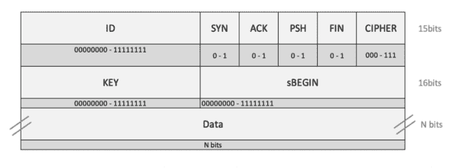
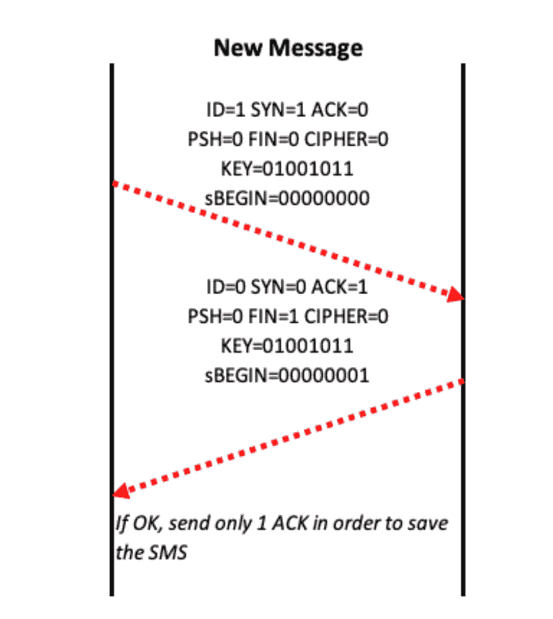

# SDK-SMS-Stack:具有基于 TPC/IP 特性的 GSM 短消息服务

> 原文：<https://kalilinuxtutorials.com/sdk-sms-stack/>

SDK-SMS-Stack 是向 GSM 短消息服务提供基于 TPC/IP 的特征的框架。

该框架可在多种环境中工作，以在服务中提供完整的堆栈集成。

主层具有控制给定流的 sms 的顺序和数量的技术，以及具有 AES + CTR 密码的安全层。

您可以轻松地在 Sms 堆栈的顶部实现自己的协议，并为设备之间基于 Sms 的通信添加新功能。

**先决条件**

**打字稿**

*   [Npm](https://www.npmjs.com)
*   [节点 j](https://nodejs.org/en/)
*   [打字稿](https://www.typescriptlang.org/#download-links)

**Python**

*   [Python 3.4 或更高版本](https://www.python.org/downloads/)
*   [Pip](https://pypi.org/project/pip/)

**安卓**

*   [Android API 23 (6.0)或更高版本](https://developer.android.com/about/versions/marshmallow/android-6.0)
*   [Android Studio + Gradle(带 JUnit)](https://developer.android.com/studio/install)

**也读作-[DNSDmpstr:DnsDumpster&黑客目标](https://kalilinuxtutorials.com/dnsdmpstr-dnsdumpster-hackertarget/)的非官方 API &客户端**

**用途**

只需将框架添加到您的存储库中给定的每个存储库中。

**打字稿**

npm 安装 sms 堆栈 1.x.x

**Python**

pip 安装 sms 堆栈 0.x.x

**安卓**

在 gradle 应用程序文件实现中添加“com . example . smstcplibrary:SMS stack:0 . x . x

**短信堆栈方案**

*   
*   

**免责声明**

本软件按“原样”提供，不含任何明示或暗示的担保，包括但不限于对适销性、特定用途适用性和不侵权的担保。在任何情况下，作者或版权所有者都不对任何索赔、损害或其他责任负责，无论是在合同诉讼、侵权诉讼或其他诉讼中，还是在与软件或软件的使用或其他交易相关的诉讼中。

[**Download**](https://github.com/ElevenPaths/SDK-SMS-Stack#prerequisities)