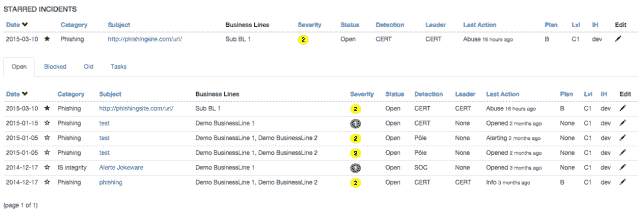
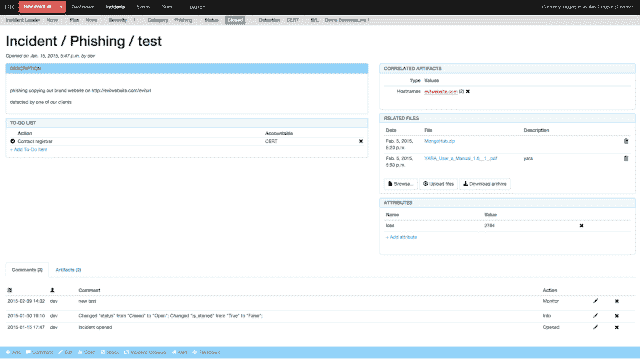

# 快速事件响应

> 原文：<https://kalilinuxtutorials.com/fir-fast-incident-response/>

**FIR(快速事件响应)**是一个网络安全事件管理平台，旨在实现敏捷性和速度。它允许轻松创建、跟踪和报告网络安全事件。

FIR 适用于需要跟踪网络安全事件(CSIRTs、CERTs、SOC 等)的任何人。).

它是为满足我们的需求和我们团队的习惯而定制的，但我们在发布它之前尽了很大努力使它尽可能通用，以便世界各地的其他团队也可以使用它，并根据他们的需要定制它。

**也可理解为-[SDK-SMS-Stack:提供基于 TPC/IP 特性的 GSM 短消息服务](https://kalilinuxtutorials.com/sdk-sms-stack/)**

*   
*   

**安装**

安装 FIR 有两种方法。如果你想试一试，只需按照 Wiki 中[设置开发环境](https://github.com/certsocietegenerale/FIR/wiki/Setting-up-a-development-environment)的说明进行操作。

如果你喜欢它，并想为生产做准备，[下面是如何做的](https://github.com/certsocietegenerale/FIR/wiki/Installation-on-a-production-environment)。

在 [docker/Dockerfile](https://github.com/certsocietegenerale/FIR/blob/master/docker/Dockerfile) 中还提供了一个用于运行开发质量 FIR 设置的 dockerfile。

通过 fir/heroku_settings.py 部署到 [Heroku](https://heroku.com)

**技术规格**

FIR 是用 Python 写的(但你可能已经知道了)，用的是 Django 1.9。它使用 Bootstrap 3 和一些 Ajax 和 d3js 来美化它。

我们将它与 MySQL 后端一起使用，但也可以随意使用您可能想要的任何其他 DB 适配器——只要它与 Django 兼容，您应该不会遇到任何大问题。

FIR 对性能并不贪婪。它将在 Ubuntu 14.04 虚拟机上流畅运行，该虚拟机具有 1 个内核、40 GB 磁盘和 1 GB RAM。

**路线图**

*   嵌套的 Todos
*   REST API
*   邮递员

[**Download**](https://github.com/certsocietegenerale/FIR)