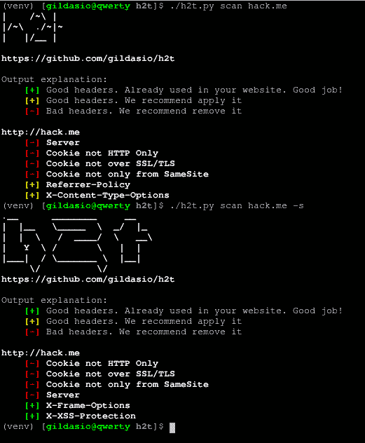
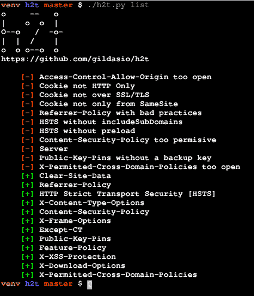
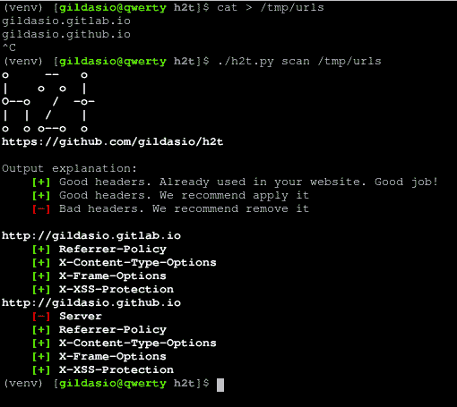
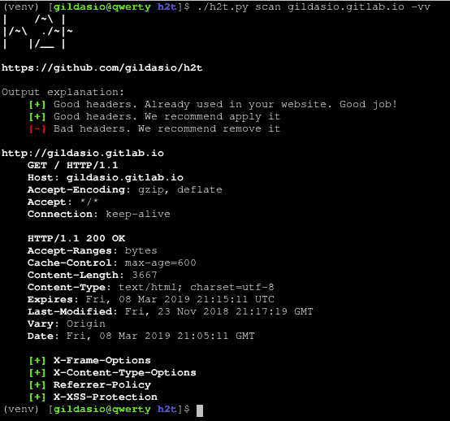
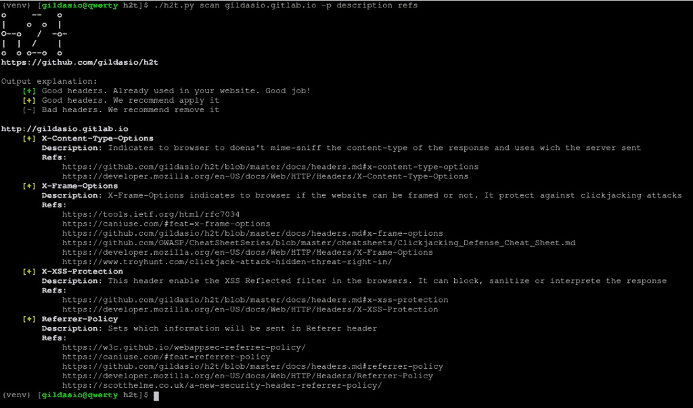

# H2T : HTTP 强化工具扫描网站并建议应用安全标头

> 原文：<https://kalilinuxtutorials.com/h2t-http-hardening/>

H2T 是一个简单的工具，帮助系统管理员加强他们的网站。到目前为止，h2t 检查网站标题，并建议如何改进。

**依赖性**

*   python3
*   彩色光
*   要求

**也可阅读-[Android warn:针对恶意 Android 应用的静态代码分析器](https://kalilinuxtutorials.com/androwarn-static-code-analyzer/)**

**安装**

**$ git 克隆 https://github.com/gildasio/h2t
$ CD h2t
$ pip install-r requirements . txt
$。/h2t.py -h**

**用途**

h2t 有子命令:list 和 scan。
$。/h2t.py -h
用法:h2t.py [-h] {list，l，scan，s}…
h2t–HTTP 硬化工具
位置参数:
{list，l，scan，s }子命令帮助
list (l)显示 h2t 目录中可用头的列表(可以
在 scan 子命令-h 选项中使用)
scan (s)扫描 url 以硬化头
可选参数:
-h，–帮助显示

**列表子命令**

list 子命令列出了 h2t 中的所有标题，并可以显示关于它的描述信息，以及更多信息和操作方法的链接。

**$。/h2t.py list -h
用法:h2t . py list[-H][-p PRINT[PRINT…]][-B][-a |-H HEADERS[HEADERS…]]
可选参数:
-h，–help 显示此帮助消息并退出
-p PRINT [PRINT …]，–PRINT PRINT[PRINT…]
将头的附加信息列表到
print。现在有两个选项:description 和
refs(您可以使用其中一个或两个)
-B，–no-banner 不要打印 h2t banner
-a，–all 列出所有可用的标题[默认值]
-H HEADERS [HEADERS …]，–HEADERS[HEADERS…]
要在 h2t 目录中查找的标题列表**

**扫描子命令**

scan 子命令在网站中执行扫描，查找它们的标题。

**$。/h2t.py scan -h
用法:h2t . py scan[-H][-v][-a][-g][-B][-H HEADERS[HEADERS…]]
[-p PRINT[PRINT…]]
[-I IGNORE _ HEADERS[IGNORE _ HEADERS…]][-B][-E][-n][-u USER _ AGENT][-r |-s]
URL
位置参数:
要查找的 URL
–all scan all cataloged HEADERS[default]
-g，–good scan good HEADERS only
-b，–bad scan bad HEADERS only
-H HEADERS[HEADERS…]，–HEADERS[HEADERS…]
仅扫描这些标题(参见 list sub-
命令中的可用内容)
-p PRINT [PRINT …]，–PRINT[PRINT…]
打印有关标题的附加信息列表。 现在有两个选项:描述和
引用(可以使用其中一个或两个)
-I IGNORE _ HEADERS[IGNORE _ HEADERS…]，–IGNORE-HEADERS IGNORE _ HEADERS[IGNORE _ HEADERS…]
结果中要忽略的标题列表
-B，–no-banner 不要打印 h2t 标题
-E，–no-explain 不要打印 h2t 输出说明
-o {normal，csv，json}，–output { normal，csv –用户代理 USER_AGENT
将用户代理设置为扫描请求
-k，–不安全不验证 SSL 证书是否有效
-r，–仅建议输出建议[默认]
-s，–状态输出实际状态(例如:仅存在的标头)**

**输出**

目前，输出仅处于正常模式。理解如下:

*   [+]红色标题是不好的标题，会破坏你的网站，或者可能会显示很多信息。我们建议修复它。
*   [+]黄色标题是不适合你的网站的好标题。我们建议应用它们。
*   [-]绿色标题是已经在你的网站上使用的好标题。使用`-s`标志时显示。

*   只有 Cookie HTTP 才适合应用
*   SSL/TLS 上的 Cookie 很适合应用
*   服务器头最好被删除
*   推荐人-政策将是很好的应用
*   X-Frame-Options 已经在使用中，在这里不做任何事情
*   x-XSS-保护已经在使用中，这里没有做什么

**截图**

**列出 h2t 目录**

**从文件扫描**

扫描 url

**详细扫描**

**标题信息**

[**Download**](https://github.com/gildasio/h2t)