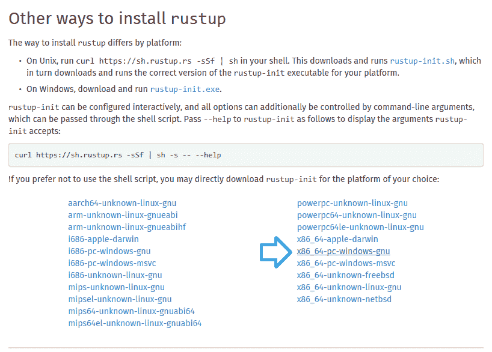
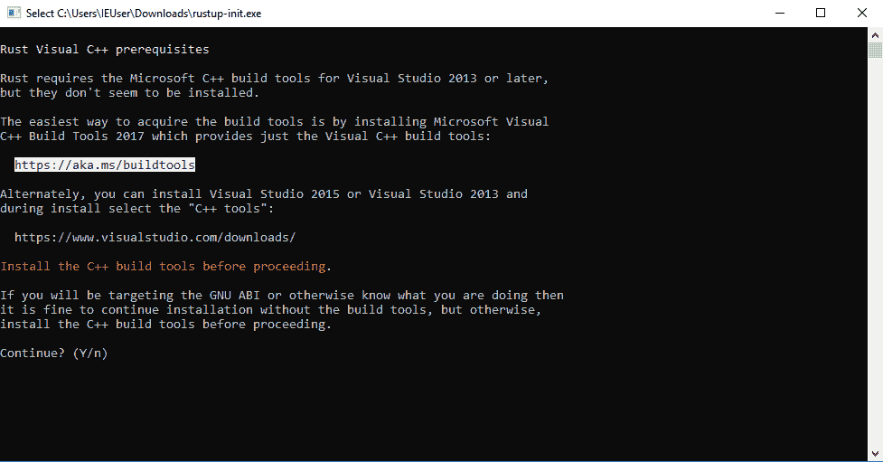
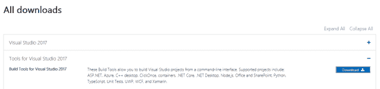
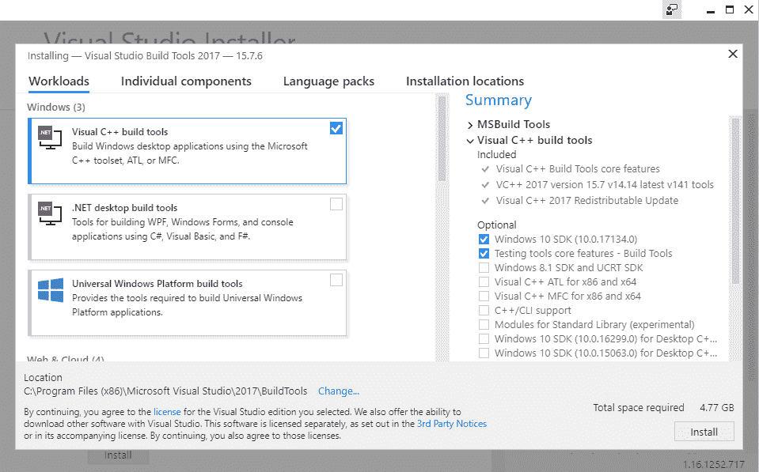
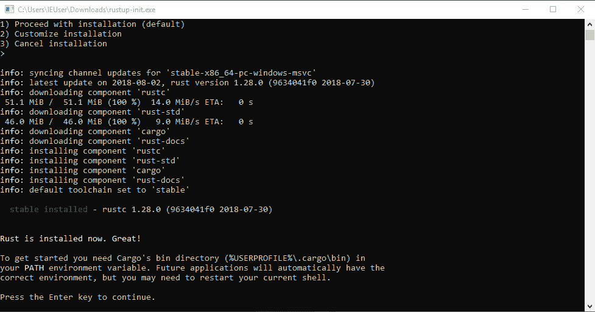

# Xori:一个自动化反汇编和静态分析库

> 原文：<https://kalilinuxtutorials.com/xori/>

Xori 是一个自动化反汇编和静态分析库，它使用外壳代码或 PE 二进制文件，并提供分类分析数据。

**架构**:

*   i386
*   x86-64

**文件格式**

*   PE, PE+
*   普通外壳代码

**当前特征**

*   输出 1)反汇编、2)函数和 3)导入的 json。
*   管理图像和堆栈内存。
*   两种模式:
    *   光仿真–意味着枚举所有路径(寄存器、堆栈、一些指令)。
    *   完全仿真–仅遵循代码路径(性能缓慢)。
*   模拟 TEB 和 PEB 结构。
*   基于 DLL 导出计算函数。
*   基于引用的内存位置显示字符串。
*   使用调情风格签名(快速库识别和识别技术)。
*   允许您使用自己的导出来模拟 PEB。
*   将在非返回调用后检测填充。
*   将尝试从偏移量中识别函数引用。

**它还没有做什么:**

*   引擎是交互式的。
*   不转储字符串。
*   不处理不可执行的部分。
*   TEB 和 peB 不支持非 PE 文件。
*   仅模拟部分 x86 指令，而不是全部。
*   修补和组装。
*   没有插件或脚本。

**也可以理解为—[BoNeSi—DDoS 僵尸网络模拟器](https://kalilinuxtutorials.com/bonesi-ddos-botnet-simulator/)**

**为 OSX & Linux 发行版**安装 rust

**curl https://sh . rusup . RS-SSF | sh**

**给窗户安装铁锈**

首先从[这里](https://forge.rust-lang.org/other-installation-methods.html#other-ways-to-install-rustup)获取 rustup.exe(防锈工具链安装程序)。

这个工具将安装 rust 编译器 **rustc** ，rust 包管理器 **cargo** 和其他有用的 rust 开发工具。

*   运行

 ****安装防锈先决条件**

如果您看到这个输出，那么您的 Windows 环境缺少 Visual Studio 的**构建工具**，所以请继续阅读，否则请点击[这里](https://github.com/endgameinc/xori#install-rust-toolchain)

*   跟随输出中的链接，或者点击[这里](https://aka.ms/buildtools)
*   取消*rustup-init.exe*
*   回到浏览器，向下滚动，展开选项卡**Visual Studio 2017 工具** &下载**Visual Studio 2017 构建工具**

*   运行可执行文件

选择 **Visual C++构建工具** &点击【安装】，安装完毕后关闭【Visual Studio 安装程序】

**安装防锈工具链**

运行*rustup.exe*T2【你会看到下面的输出

安装成功后，你可以看到 rust 编译器 **rustc** ，rust 包管理器 **cargo** 等工具被安装(在`**C:\Users\%username%\.cargo**` **&** `**C:\Users\%username%\.rustup**`下)

*   打开一个新的“命令提示符”&按照 **xori** 构建步骤[这里](https://github.com/endgameinc/xori#1-build-xori)

**安装**

**构建 Xori**

该命令还将创建其他二进制文件，如 pesymbols ans peinfo。

**git 克隆 https://github.com/endgameinc/xori.git
CD xori
货物建造-发布**

**创建 xori.json 配置文件**

**CP xori . JSON . example xori . JSON
【根据需要编辑】**

**(可选)构建符号文件**

如果要创建自己的符号文件，需要将 dll 文件夹设置为存储 windows dlls 的位置。

**"function_symbol32 ":"。/src/analysis/symbols/generated _ user _ sys wow 64 . JSON "，
"function_symbol64 ":"。/src/analysis/symbols/generated _ user _ system32 . JSON "，
" symbol _ server ":{
" dll _ folder 32 ":"。/dll/32 bit "，
"dll_folder64 ":"。/dll/64 bit "**

运行 pesymbols 来覆盖 function_symbol json

**。/target/release/pesymbols**

**运行**

**。/target/release/xori-f test.exe**

**运行所有测试**

**货物测试**

**浏览器 GUI**

| 铬 | 火狐浏览器 | 旅行队 | 工业管理学(Industrial Engineering) | 歌剧 |
| --- | --- | --- | --- | --- |
| Latest ✔ | Latest ✔ | Latest ✔ | x | Latest ✔ |

**要求**

nodejs

纱线(UI 开发可选)

*   在 Ubuntu 18.04 上，你可能需要安装以下软件:**curl git libssl-dev pkg-config build-essential NPM**

**建造**

**cd gui
npm 安装**

**运行**

在一个终端

**cd gui
节点 src/server.js**

在另一个终端

**cd gui
npm 启动**

它将打开您的默认浏览器 http://localhost:3000/。后端 API 正在监听 localhost:5000。

[**Download**](https://github.com/endgameinc/xori)**