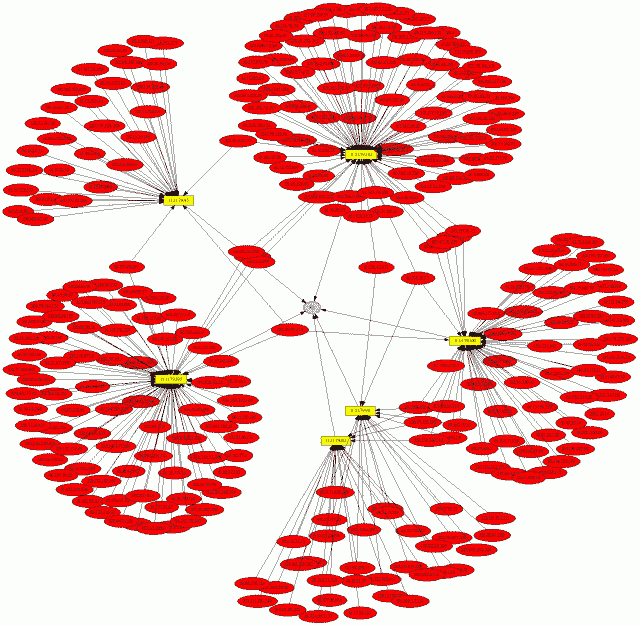
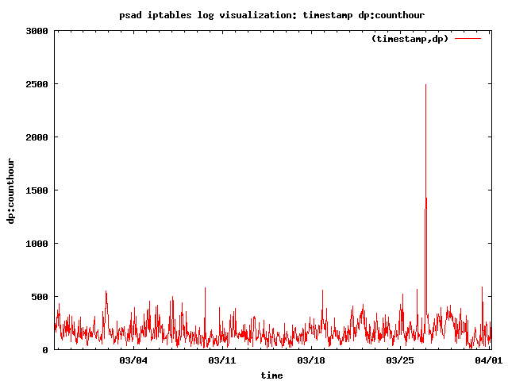

# Psad:使用 IPtables 进行入侵检测和日志分析

> 原文：<https://kalilinuxtutorials.com/psad-detection-analysis-iptables/>

端口扫描攻击检测器`psad`是一个用编写的轻量级系统守护程序，旨在与 Linux iptables/ip6 tables/firewalld 防火墙代码配合使用，以检测可疑流量，如端口扫描和扫描、后门、僵尸网络命令和控制通信等。

它具有一组高度可配置的危险阈值(提供合理的默认值)、详细的警报消息(包括源、目的地、扫描的端口范围、开始和结束时间、TCP 标志和相应的 nmap 选项)、反向 DNS 信息、电子邮件和系统日志警报、通过动态配置 iptables 规则集自动阻止违规 IP 地址、被动操作系统指纹识别和 DShield 报告。

此外，`psad`整合了 Snort 入侵检测系统中包含的许多 TCP、UDP 和 ICMP 签名。检测各种后门程序(如 EvilFTP、女朋友、SubSeven)、DDoS 工具(Mstream、Shaft)和高级端口扫描(SYN、FIN、XMAS)的高度可疑扫描，这些扫描很容易通过 nmap 利用机器。`psad`还可以警告通过 [fwsnort](https://github.com/mrash/fwsnort) 记录的 Snort 签名，它利用 iptables 字符串匹配扩展来检测匹配应用层签名的流量。

自 2.4.4 版本起，`psad`还可以检测 Mirai 未来组合僵尸网络的物联网默认凭据扫描阶段。

**也读-[得到-回应:检测 NBT 的工具-NS & LLMNR 欺骗](https://kalilinuxtutorials.com/got-responded/)**

**特色**

*   检测 TCP SYN、FIN、NULL 和 XMAS 扫描以及 UDP 扫描。
*   支持分别由 iptables 和 ip6tables 生成的 IPv4 和 IPv6 日志。
*   从 Snort 入侵检测系统中检测许多特征规则。
*   取证模式 iptables/ip6tables 日志文件分析(作为取证工具，用于从旧的 iptables/ip6tables 日志文件中提取扫描信息)。
*   通过 TCP syn 数据包进行被动操作系统指纹识别。支持两种不同的指纹策略；p0f 的重新实现严格使用 iptables/ip6tables 日志消息(需要–log-TCP-options 命令行开关)和基于 TOS 的策略。
*   包含 TCP/UDP/ICMP 扫描特征、反向 dns 和 whois 信息、snort 规则匹配、远程操作系统猜测信息等的电子邮件警报。
*   当与 [fwsnort](https://github.com/mrash/fwsnort) 和 iptables 字符串匹配扩展结合使用时，`psad`可以为应用层缓冲区溢出攻击、可疑的应用程序命令和其他可疑的第 7 层流量生成警报。
*   Icmp 类型和代码头字段验证。
*   可配置的扫描阈值和危险等级分配。
*   Iptables 规则集解析验证“默认删除”策略立场。
*   IP/网络危险级别自动分配(可用于忽略或自动提升特定网络的危险级别)。
*   DShield 警报。
*   根据扫描危险级别，通过 iptables/ip6tables 和/或 tcpwrappers 自动阻止扫描 IP 地址。(默认情况下，此功能不启用。)
*   解析 iptables/ip6tables 日志消息并生成 CSV 输出，该输出可用作余辉的输入。这允许可视化 iptables/ip6tables 日志。也支持 Gnuplot。
*   状态模式，显示当前扫描信息的摘要以及相关的数据包计数、iptables/ip6tables 链和危险级别。

**可视化恶意流量**

`**psad**` 提供与`**gnuplot**` 和`**afterglow**` 的整合，生成恶意流量的图形。下面两张图是蜜网 [Scan30](http://old.honeynet.org/scans/scan30/) 挑战赛中的 Nachi 蠕虫。首先，`afterglow`在`psad`分析 iptables 日志数据后生成的链接图:

" Nachi 蠕虫链接图"

第二个显示了 Scan30 iptables 数据中每小时的 Nachi 蠕虫流量:

## 方法学

psad 分析的所有信息都是从 iptables 日志消息中收集的。默认情况下，psad 读取/var/log/messages 文件中的新 iptables 消息，并可以选择将它们写到一个专用文件(/var/log/psad/fwdata)。

然后，psad 负责应用危险阈值和签名逻辑，以确定是否进行了端口扫描，发送适当的警报电子邮件，并(可选)阻止违规的 ip 地址。

psad 包括一个信号处理程序，如果收到 USR1 信号，psad 会将当前扫描哈希数据结构的内容转储到/var/log/psad/scan_hash。$$其中“$$”表示正在运行的 psad 守护程序的 pid。

注意:由于 psad 依赖 iptables 来为未授权的数据包生成适当的日志消息，因此 psad 只能与 iptables 规则集中包含的日志规则一样好。

因此，如果您的防火墙没有配置为记录数据包，那么 psad 将不会检测端口扫描或其他任何东西。通常，设置防火墙的最佳方式是在规则集的末尾使用默认的“丢弃并记录”规则，并在最后一个规则之上包含只允许应该允许通过的流量的规则。

在执行时，psad 守护程序将尝试确定是否存在这样的默认拒绝规则，如果不存在，将警告用户。有关与 psad 兼容的防火墙规则集的示例，请参见 FW_EXAMPLE_RULES 文件。

此外，由 No Starch Press 出版的《Linux 防火墙:攻击检测和响应》一书中包含了对 psad 的广泛报道，并且该书中的支持脚本与 psad 兼容。

**安装**

根据 Linux 发行版的不同，`psad`可能已经存在于默认的包存储库中。例如，在 Debian 或 Ubuntu 系统上，安装是通过一个简单的:

**apt-get 安装 psad**

如果包存储库中没有 psad，可以使用 psad 源代码中捆绑的`install.pl`脚本进行安装。

如果已经安装了 psad，install.pl 脚本也可以处理升级。需要几个 perl 模块，这些模块可能已经安装在您的 Linux 系统上，也可能没有安装。

这些模块包含在 psad 源代码的 deps/目录中，并由 install.pl 脚本自动安装。模块列表如下:

*   比特::矢量
*   日期::计算
*   IPTables::ChainMgr
*   IPTables::Parse
*   网络地址::IP
*   可储存的
*   Unix::Syslog

psad 还包括一个由 Marco d'Itri 编写的 whois 客户端(参见 deps/whois 目录)。在收集给定 IP 地址的正确 whois 信息方面，该客户端比其他客户端做得更好。

**防火墙设置**

iptables 配置与 psad 兼容的主要要求是 iptables 记录数据包。这通常通过向输入和转发链添加规则来实现，如下所示:

**iptables -A 输入-j 日志**
iptables-A 转发-j 日志

上述规则应添加到输入链和转发链的末尾，在所有合法流量的接受规则之后，在相应的策略不允许流量的丢弃规则之前。

请注意，iptables 策略可能非常复杂，包括协议、网络、端口和接口限制、用户定义的链、连接跟踪规则等等。

有许多软件，如 Shorewall 和 Firewall Builder，可以构建 iptables 策略，并利用 iptables 提供的高级过滤和日志记录功能。

通常，由这类软件构建的策略与 psad 兼容，因为它们专门添加了规则，指示 iptables 记录不属于合法流量的数据包。

Psad 可以配置为仅分析那些包含特定日志前缀(通过–log-prefix 选项添加)的 iptables 消息，但默认情况下，psad 会分析所有 iptables 日志消息，以查找端口扫描、后门程序探测和其他可疑流量的证据。

[**Download**](https://github.com/mrash/psad)