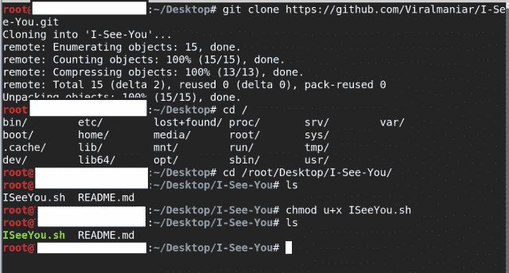
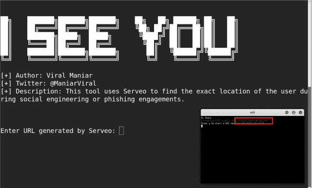
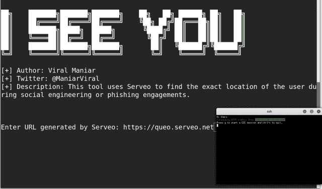
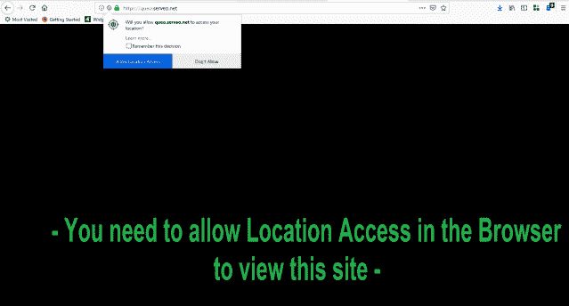
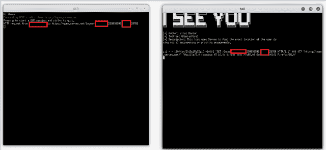
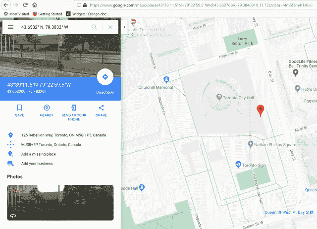

# ISeeYou:在社交工程或网络钓鱼活动中获取用户准确位置的工具

> 原文：<https://kalilinuxtutorials.com/iseeyou-exact-location/>

ISeeYou 是一个 Bash 和 Javascript 工具，用于在社交工程或网络钓鱼活动中找到用户的确切位置。

使用精确的位置坐标，攻击者可以执行初步侦察，这将有助于他们执行进一步的目标攻击。

**注:**

*   该工具不需要任何额外的软件来执行网络钓鱼攻击。
*   用户可以将他们的本地服务器暴露给互联网，并通过查看日志文件来解码位置坐标。

**又读-[Mimikatz:玩 Windows 安全的小工具](https://kalilinuxtutorials.com/mimikatz-windows-security/)**

**安装**

**git 克隆 https://github.com/Viralmaniar/I-See-You.git
CD I-See-You
chmod u+x iseeyou . sh
。/ISeeYou.sh**

**截图**

运行`ISeeYou.sh`后，用户会看到以下屏幕:

在主屏幕上输入高亮显示的网址，要求输入`Enter the URL generated by Serveo`并点击`Enter`:

这个 URL 是为不同的用户随机生成的。但是，它将是 serveo.net 域的一个子域。通过电子邮件或任何其他媒介将此 URL 作为网络钓鱼活动的一部分发送给您的受害者。受害者将看到如下网站:

注意:你可以根据自己的需要，创造性地修改页面的外观和感觉。

一旦目标用户允许定位权限，恶意用户将在尾屏中收到受害者的准确位置。这些数字是用户的。

使用`https://maps.google.com`您可以将`longitude and latitude`转换到一个精确的位置:

**从 Xterm 屏幕复制经度和纬度数字**

在 xterm 和其他程序之间复制–这将允许用户选择要复制到剪贴板的数字。

*   添加到文件~/。Xresources(或 create)

**xterm * selecttoclip board:true**

*   然后运行命令:

**xrdb -merge ~/。Xresources**

*   重新启动 xterm。

跟我说话

这个项目不得用于非法目的跟踪人或侵入系统，你没有得到许可，这是严格的教育目的和人们进行实验。

信用:[货币](https://twitter.com/maniarviral)

[**Download**](https://github.com/Viralmaniar/I-See-You)