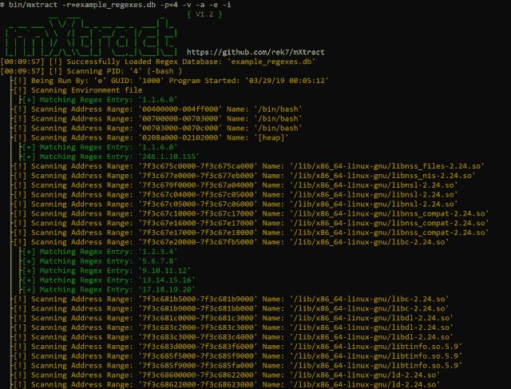
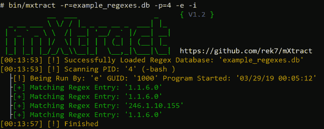

# MXtract:内存提取器和分析器 2019

> 原文：<https://kalilinuxtutorials.com/mxtract-memory-extractor-analyzer/>

MXtract 是一个基于开源 linux 的工具，用于分析和转储内存。它是作为攻击性的渗透测试工具开发的，其主要目的是使用正则表达式扫描内存中的私钥、IP 和密码。

记住，你的结果和你的正则表达式一样好。

**为什么直接从内存转储？**

在大多数 linux 环境中，用户可以访问进程的内存，这使得攻击者能够获取凭证、私钥或任何不应该看到但正由程序以明文处理的内容。

**又读-[Darksplitz:漏洞利用框架](https://kalilinuxtutorials.com/darksplitz/)**

**特性**

*   能够输入正则表达式列表
*   清晰可读的显示
*   检查内存范围在当前权限下是否可写
*   XML 和 HTML 格式的输出以及默认输出(流程名:result)
*   能够大量扫描每个进程或特定的 pid
*   能够选择要扫描的内存部分
*   能够显示详细的流程信息
*   扫描过程环境文件的能力
*   内存转储会自动删除 unicode 字符，以便使用其他工具或手动进行处理

**入门**

**下载:** git 克隆 https://github.com/rek7/mXtract

**命令**

**General:
-v Enable Verbose Output
-s Suppress Banner
-h Help
-c Suppress Colored Output
Target and Regex:
-I Show Detailed Process/User Info
-a Scan all Memory Range not just Heap/Stack
-e Scan Process Environment Files
-w Check Memory Range 是否可写
-r = Regex Database to Use
-p = Specify Single PID to Scan
Output:
-x Format HTML 文档
-wm 将原始内存写入文件默认目录为:' pid/'
-wi 将进程信息写入文件开头(与-wm 一起使用)
-wr 将 Regex 输出写入文件(将出现在输出目录中)
-f= Regex 结果文件名默认为:' regex_results.txt'
-d=自定义输出目录**

**截图**

详细扫描和简单的 IP 正则表达式，扫描每个数据段，显示进程信息和扫描环境文件。

使用 verbose 和简单的 IP regex 进行扫描，仅扫描堆和堆栈，显示进程信息和扫描环境文件。

没有冗长的扫描，用一个简单的 IP 正则表达式，显示进程信息和扫描环境文件。

[Download](https://github.com/rek7/mXtract)