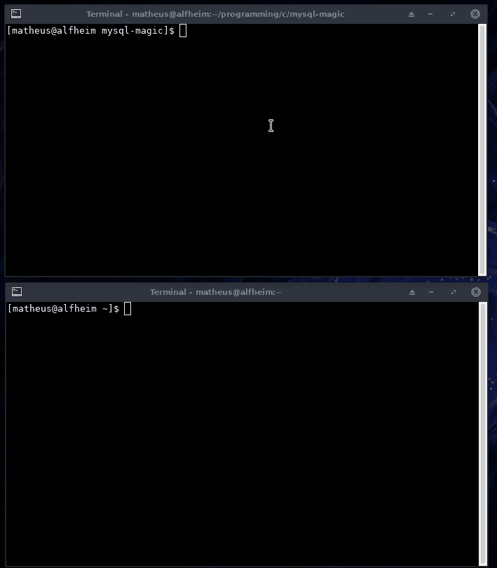

# MySQL 魔术:从内存中转储 MySQL 客户端密码

> 原文：<https://kalilinuxtutorials.com/mysql-magic-dump-mysql/>

我做这个只是为了好玩，不允许用于非法目的。mysql 客户端读取密码，然后将密码写入一些内存，并释放它，但是仅仅因为一个块被释放并不意味着它将被再次使用，为了确保您的程序不会将敏感信息保存在内存中，您必须重写内存。

主要目标是通过 tty 获得密码，但有时它也从命令行(-pxxxxxxx)获得密码。

在**MySQL Ver 15.1 Distrib 10 . 3 . 13-Maria db 中测试，针对 Linux (x86_64)使用 readline 5.1**

**也可阅读-[Pyrit:著名的 WPA 预计算破解程序，从谷歌](https://kalilinuxtutorials.com/pyrit-wpa-precomputed-cracker-google/)T3 迁移而来**

**编译**

对于编译，你只需要运行 make，如果你想添加一些标志，出于任何原因，你可以用 CFLAGS=myflags make 来做。

如果系统 mysql 客户端没有放在 **/usr/bin/mysql** 中，你需要用**CFLAGS =-DMYSQLCLI =/path/to/MySQL**make 编译

**选项**

**mysql-magic【选项】
-o 逗号分隔的偏移量列表
-s 在内存中搜索密码并获取偏移量
-d 将堆写入文件夹
-l 监听模式，等待端口 3306 上传出的 ipv4 连接
-r 睡眠时间(默认:3 秒)
-p 使用 process_vm_readv 而不是/proc/pid/mem**

pass -d 是一件很好的事情，密码和一些像旧的查询一样的信息可以保留在内存中，所以你可以分析它，如果密码不在偏移量中，也许可以基于它建立一个单词表

**演示**

[**Download**](https://github.com/hc0d3r/mysql-magic)