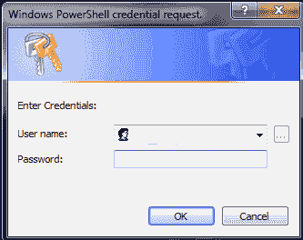
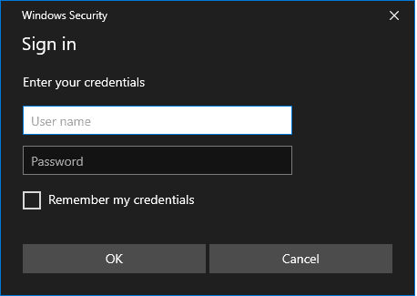
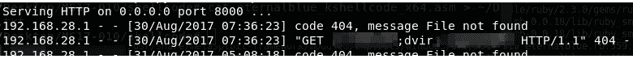

# CredsLeaker:显示 Powershell 凭据框

> 原文：<https://kalilinuxtutorials.com/credsleaker/>

CredsLeaker 脚本用于显示一个 powershell 凭证框，要求用户提供凭证。

然而，这是非常引人注目的。现在是时候利用 Windows 安全弹出窗口了！

和以前一样，盒子不能被关闭(只能通过杀死进程)将根据 DC 不停地检查凭证。通过验证后，它将关闭并泄露给外部的 web 服务器。

**也读-[Chkdfront:检查你的域名前端是否工作](https://kalilinuxtutorials.com/chkdfront-domain-fronting/)**

**如何**

*   启动 web 服务器。
*   在 ps1 脚本中键入您的服务器 IP 和端口。
*   执行批处理文件。

**免责声明**

该软件仅供教育使用(同时也考虑到红队队员)。未经双方同意，不要使用 credsleaker。如果您参与任何非法活动，作者对此不承担任何责任。使用本软件即表示您同意这些条款。

[Download](https://github.com/Dviros/CredsLeaker)