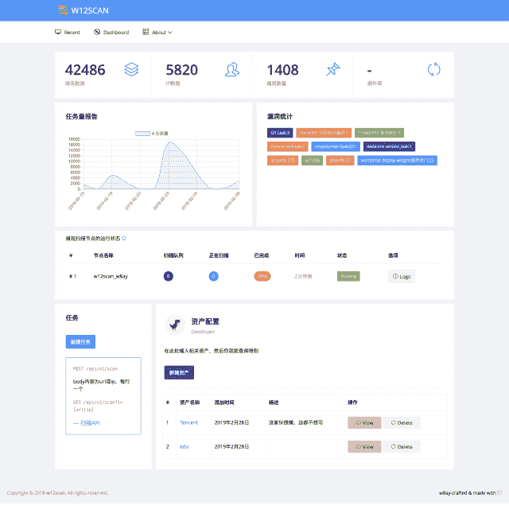
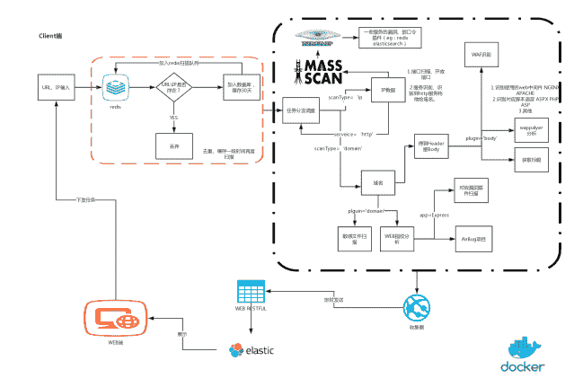

# W12Scan:一个简单的网络安全资产发现引擎

> 原文：<https://kalilinuxtutorials.com/w12scan-discovery-engine-cybersecurity/>

W12Scan 是一个网络资产发现引擎，可以自动聚合相关资产以供分析和使用。W12scan 也是我的毕业设计。🙂

这里是一个 web 源程序，但是扫描端在[w12s scan-client](https://github.com/boy-hack/w12scan-client)

**也可阅读-[GodOfWar:内置有效载荷的恶意 Java WAR Builder](https://kalilinuxtutorials.com/godofwar-malicious-java-war-builder/)**

**思考**

基于 python 3+django+elastic search+redis 并使用 web restful api 添加扫描目标。

**功能**

### 网

*   强大的搜索语法
    *   搜索内容管理系统，服务，标题，国家和地区等。，以快速找到相关目标。
        *   title="abc" #从标题搜索
        *   header="abc" #从 http 头搜索
        *   body="123" #从正文中搜索
        *   url = "*.baidu.com" #搜索 baidu.com 的子域名
        *   ip = '1.1.1.1' #从 ip 中搜索，支持`'192.168.1.0/24'`和`'192.168.1.*'`
        *   port = '80' #搜索表单端口
        *   app = 'nginx' #搜索应用程序
        *   country = 'cn' #从国家搜索
        *   service = 'mysql' #从服务中搜索
        *   bug = 'xx' #从漏洞搜索
*   自定义断言
    *   通过定制一个公司相关的域名或 ip 资产，w12scan 会自动帮你找到对应的资产目标。当你浏览目标时，有一个突出的标志提醒你目标的所有权。
*   自动联想
    *   输入目标详细信息。如果目标是 ip，则自动关联 ip 上的所有域名和 c 类上的所有域名。如果目标是域名，则自动关联相邻站、c 段和子域。
*   多节点管理
    *   WEB 将每隔几分钟检查一次节点的状态，您可以看到节点扫描的次数和节点扫描日志。
*   任务宁静
    *   提供了一个添加任务的界面，你可以在 WEB 端添加，也可以集成到任何软件中。

**扫描结束**

*   验证性测试（Proof of Concept 的缩写）
    *   通过 [airbug](https://github.com/boy-hack/airbug) 在线调用最新的 poco 脚本
*   内置扫描脚本
    *   内置于扫描程序中的常见漏洞验证服务。
*   扫描
    *   使用 masscan、nmap、wappalyzer、w11scan
*   易于分发
    *   在设计程序架构时会考虑到这一点。直接在另一台机器上分发和运行扫描终端是非常容易的。它也可以基于 docker，芹菜服务进行分发。

**安装**

用 docker 快速构建环境

**git 克隆 https://github . com/boy-hack/w12 scan
CD w12 scan
dock—合成 up -d**

等一会儿访问 **http://127.0.0.1:8000**

跟我说话

这个程序主要用于收集网络数据进行分析和研究。使用本程序前，请遵守当地相关法律。

[**Download**](https://github.com/boy-hack/w12scan)