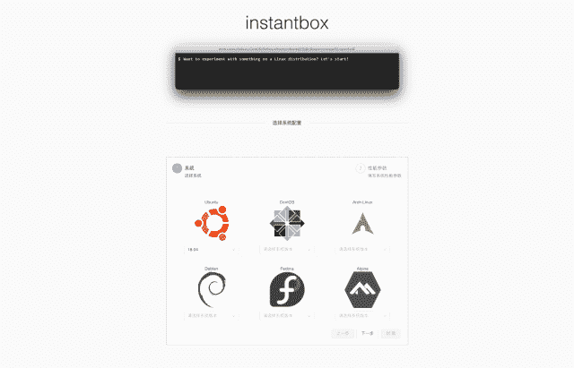

# InstantBox:几秒钟内获得一个干净的、随时可用的 Linux 盒子

> 原文：<https://kalilinuxtutorials.com/instantbox-linux-box/>

InstantBox 是一个可以从任何浏览器即时访问 webshell 的临时 Linux 系统项目。它能做什么？

1.  为演示提供干净的 Linux 环境
2.  让学生在你的学校或下次运动会上体验 Linux 的魅力
3.  在干净的环境中带着灵感跑步
4.  从任何设备管理服务器
5.  尝试一个开源项目
6.  在资源限制下测试软件性能

目前支持各种版本的 Ubuntu，CentOS，Arch Linux，Debian，Fedora 和 Alpine。

**又读-[CredsLeaker:显示一个 Powershell 凭证框](https://kalilinuxtutorials.com/credsleaker/)**

**快速入门**

**展开**

**mkdir instant box&&CD $ _
bash<(curl-sSL https://raw . githubusercontent . com/instant box/instant box/master/init . sh)**

[**Download**](https://github.com/instantbox/instantbox)