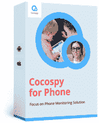
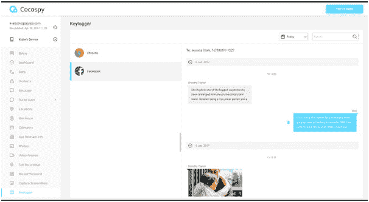
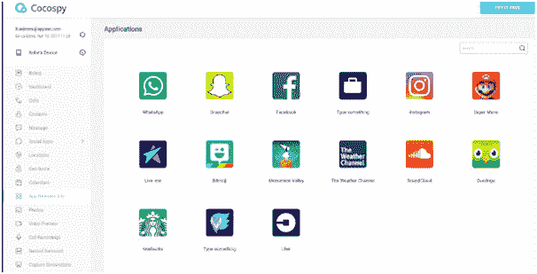

# 用 Cocospy 键盘记录器监控智能手机的使用

> 原文：<https://kalilinuxtutorials.com/monitor-smartphone-usage-with-cocospy-keylogger/>

没有人会怀疑智能手机的优势。对于父母来说，你现在有一个可靠的保姆，带着你的智能设备。虽然有些人可能不赞成这一点，但问问那些需要一个小时来完成某项家务的过度劳累的妈妈，为什么她要依赖智能手机来让孩子们有事可做。

通过下载适合幼儿的内容，或访问带有适合儿童的视频的网站，她可以让孩子在完成任务的同时舒适地观看卡通或教育视频。

然而，监控孩子们在网上看什么并不总是容易的。青少年拥有访问许多不同在线网站的智慧和技能。

这就是为什么 [Cocospy 键盘记录应用](https://www.cocospy.com/android-keylogger.html)是一个很棒的工具，因为它会提供关于孩子们正在看什么样的在线内容的重要信息。与 [Cocospy 免费移动追踪器](https://www.cocospy.com/)合作，您将始终知道孩子们在哪里。

Cocospy 允许你秘密监控智能设备上的活动，包括通话、短信和在线内容。有了 Cocospy，你不需要越狱或 root 你的手机，它非常容易安装和使用。

Cocospy 得到了福布斯、TechRadar、汤姆指南、十大评论、CNET 等媒体的支持；证明它有多好。

你的孩子不应该在网上做什么？

**与陌生人聊天**

当谈到和什么样的人交谈时，孩子们太天真，没有过滤能力。网上有如此多的掠食者，你需要了解孩子们在和谁互动。

**分享个人信息**

向孩子们强调，他们不应该在网上分享任何个人信息。这些信息包括他们住在哪里或者在哪里上学。在线掠夺者寻求快速访问，他们知道该问什么问题，这样孩子们最终会透露太多关于他们自己的信息。

作为父母，如果孩子有社交媒体，你应该教他们如何保持信息的私密性，这样任何不在他们亲密朋友列表中的人都无法访问这些信息。

**下载应用**

密切关注孩子们下载到智能设备上的应用程序类型。其中一些是不合适的，而另一些会让你为你不需要的服务付费。有一个严格的规定，在他们下载任何东西之前，他们必须得到你的允许。

**访问不适当的内容**

有许多网站的内容是儿童不应该访问的。其中包括色情网站和博彩网站。拥有家长控制功能将允许您限制他们可以访问的内容。

**网络欺凌** **和盯梢**

我们可能不愿意相信我们的孩子会这样，但有时你会发现你的孩子可能会欺负或跟踪别人。另一种情况是，他们自己也可能是受害者。通过对智能设备的密切监控，您将能够在此类行为升级之前将其逮捕。

**为什么你需要 Cocospy 键盘记录应用**

Cocospy 键盘记录器应用程序将让您访问社交媒体网络和密码。它很容易安装，你可以看到整个关键的中风发生在目标手机上。

其他关键功能包括 GPS 定位，跟踪图片和图像，跟踪来电和去电；包括联系人详情、地理围栏警报、按键监控、文本消息监控、Snapchat 监控和浏览器历史监控。

安装过程非常容易；注册 Cocospy，安装 Cocospy Android 键盘记录器应用程序，并开始监控过程。

Cocospy Android 键盘记录器的使用超越了父母的监控，作为雇主，你可以使用它来监控员工使用公司电话做什么。在商业间谍的时代，你越小心越好；使用该应用程序捕捉任何可能参与不道德行为的员工。

**最终想法**

Cocospy Android 键盘记录器会让你安心，因为你再也不用担心你的孩子和员工在他们的手机上做什么。询问密码也将成为过去，因为该应用程序将能够为你访问相关信息，即使在手机上有密码。