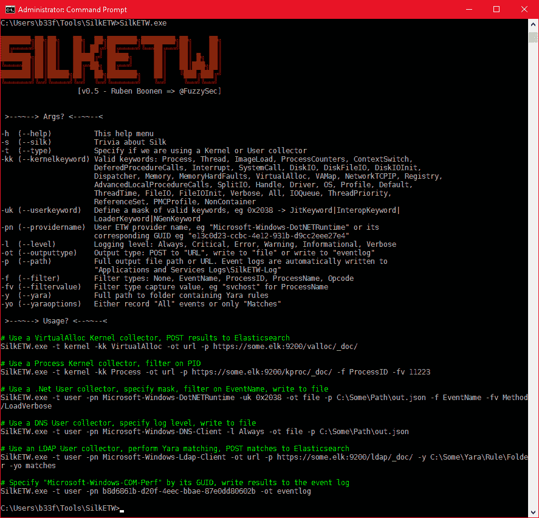
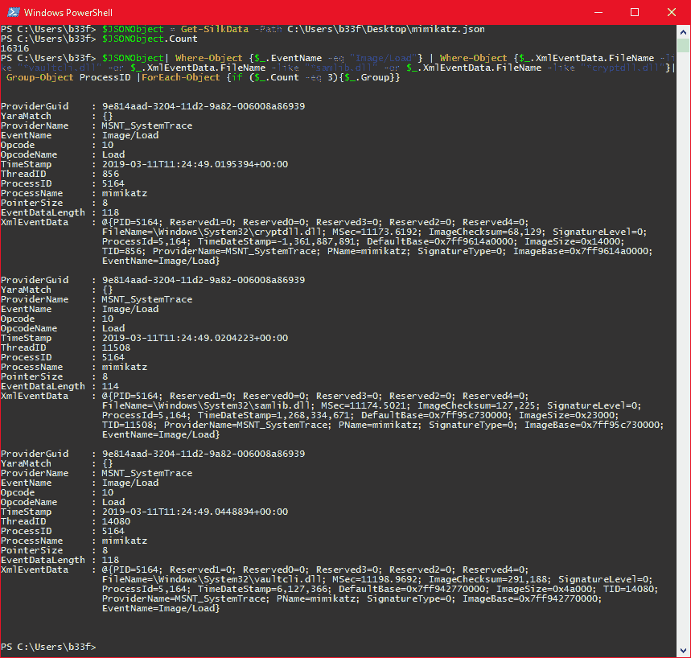
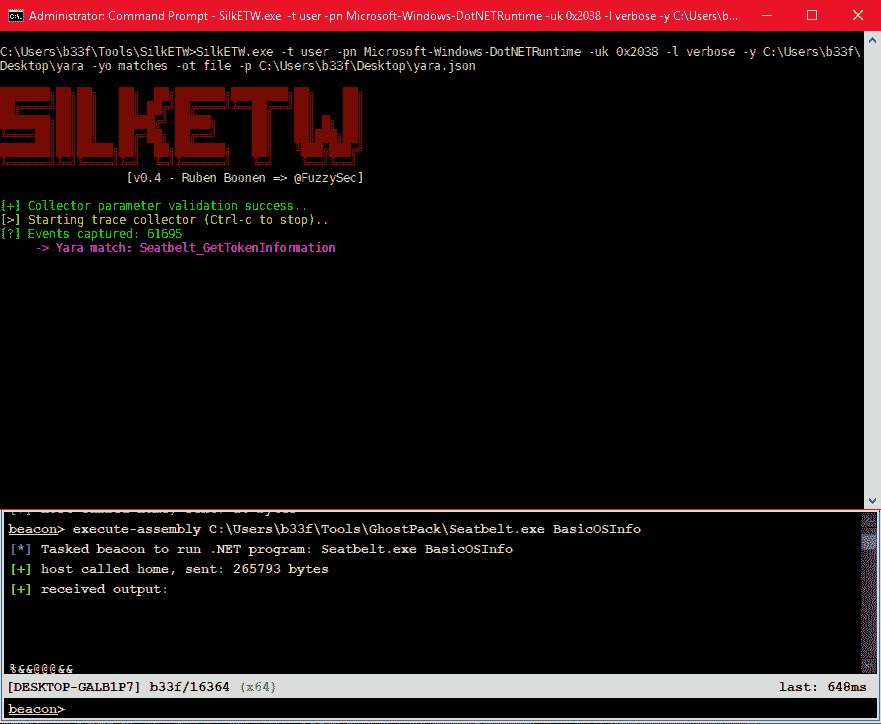

# SilkETW:抽象 ETW 复杂性的工具

> 原文：<https://kalilinuxtutorials.com/silketw-abstract-complexities-etw/>

SilkETW 是 ETW 的一个灵活的 C#包装器，它旨在抽象出 ETW 的复杂性，给人们一个简单的界面来进行研究和反思。

虽然 SilkETW 有明显的防御(和进攻)应用，但它在当前状态下主要是一个研究工具。

为了便于使用，输出数据被序列化为 JSON。JSON 数据既可以使用 PowerShell 在本地进行分析，也可以发送到第三方基础设施，如 Elasticsearch。

**又读-[0d1n:在 HTTP/S](https://kalilinuxtutorials.com/0d1n-web-security-tool/)T3 进行 Fuzzing 的 Web 安全工具】**

**实施细节**

**图书馆**

丝绸之路正在建立。Net v4.5 并使用了许多第三方库，如下所示。请参见[许可-第三方](https://github.com/fireeye/SilkETW/blob/master/LICENSE-3RD-PARTY.txt)了解更多详情。

ModuleId 版本 license URL—————麦克马斯特。https://licenses.nuget.org/Apache-2.0
微软。https://github.com/Microsoft/perfview/blob/master/LICENSE.事件 2.0.36Newtonsoft。JSON 12 . 0 . 1 https://licenses.nuget.org/MIT 系统。value tuple 4 . 4 . 0 https://github.com/dotnet/corefx/blob/master/LICENSE.TXT
YaraSharp 1 . 3 . 1 https://github . com/stellar bear/YaraSharp/blob/master/LICENSE

**命令行选项**

命令行的使用相当直接，用户输入在执行序言中得到验证。更多细节见下图。

**JSON 输出结构**

在序列化之前，JSON 输出根据下面的 C#结构进行格式化。

public struct EventRecordStruct
{
public Guid provider Guid；
公共列表 YaraMatch
公共字符串 ProviderName
公共字符串 EventName
公共 TraceEventOpcode
公共字符串 OpcodeName
公共日期时间时间戳；
public int ThreadID；
public int ProcessID；
公共字符串 ProcessName
public int pointer size；
public int event datalength；
公共哈希表 XmlEventData
}

请注意，根据提供程序和事件类型的不同，XmlEventData 哈希表中会有可变数据。下面可以看到“Microsoft-Windows-Kernel-Process”->“ThreadStop/Stop”的 JSON 输出样例。

{
" provider guid ":" 22 FB 2cd 6-0e7b-422 b-a0c 7-2 fad 1 FD 0e 716",
" YaraMatch ":[
]，
"ProviderName ":"微软-Windows-内核-进程"，
" event name ":" Thread Stop/Stop "，
"Opcode":2，
"OpcodeName":"Stop "，
" TimeStamp ":" 2019-03-019、
" StartAddr ":" 0x 7 fffe 299 a 110"、
"ThreadID":"11，996"、
" UserStackLimit ":" 0x3d 632000"、
" stack limit ":" 0x ffff f 38632d 39000"、
"MSec":"560.5709"、
"TebBase":"0x

**用途**

**在 PowerShell 中过滤数据**

您可以使用下面的简单函数从 PowerShell 中的 SilkETW 导入 JSON 输出。

函数 Get-silk data {
param($ Path)
$ Json Object = @()
Get-Content $ Path | ForEach-Object {
$ Json Object+= $ _ | convert from-Json
}
$ Json Object
}

在下面的例子中，我们将从内核提供者收集进程事件数据，并使用镜像加载来识别 Mimikatz 执行。我们可以用下面的命令收集所需的数据。

**SilkETW.exe-t 内核-kk image load-ot file-p C:\ Users \ b33f \ Desktop \ mimikatz . JSON**

有了手头的数据，我们可以轻松地对感兴趣的属性进行排序、筛选和过滤。

**伤口**

SilkETW 包括 Yara 功能来过滤或标记事件数据。同样，这有明显的防御能力，但它可以很容易地被用来增强你的 ETW 研究。

在本例中，我们将使用以下 Yara 规则，通过 Cobalt Strike 的 execute-assembly 来检测内存中的安全带执行。

rule season _ gettoken INFORMATION
{
strings:
$ S1 = " ManagedInteropMethodName = gettoken INFORMATION " ascii wide nocase
$ S2 = " TOKEN _ INFORMATION _ CLASS " ascii wide nocase
$ S3 =/bool(native int，valuetype \w+。\w+\/\w+，native int，int32，int 32&/
$ S4 = " locals(int 32，int64，int64，int64，int32 & pinned，bool，int 32 "
条件:
all of ($s*)
}

我们可以开始收集了。使用下面的命令来创建. Net ETW 数据。这里的“-yo”选项表示我们应该只将 Yara 匹配写入磁盘！

SilkETW.exe-t user-pn Microsoft-Windows-DotNETRuntime-uk 0x 2038-l verbose-y C:\ Users \ b33f \ Desktop \ yara-yo matches-ot file-p C:\ Users \ b33f \ Desktop \ yara . JSON

我们可以在运行时看到我们的 Yara 规则被违反了。

还要注意，我们只捕获了“Microsoft-Windows-DotNETRuntime”事件(0x2038)的一个子集，具体是:JitKeyword、InteropKeyword、LoaderKeyword 和 NGenKeyword。

[Download](https://github.com/fireeye/SilkETW)